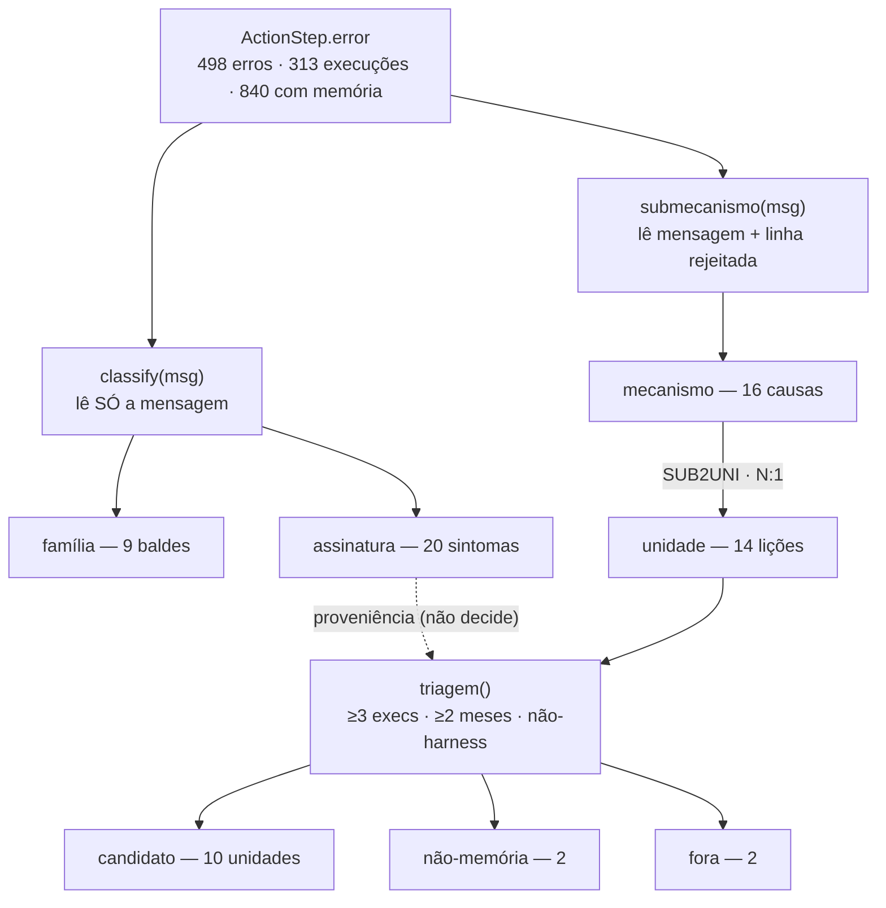
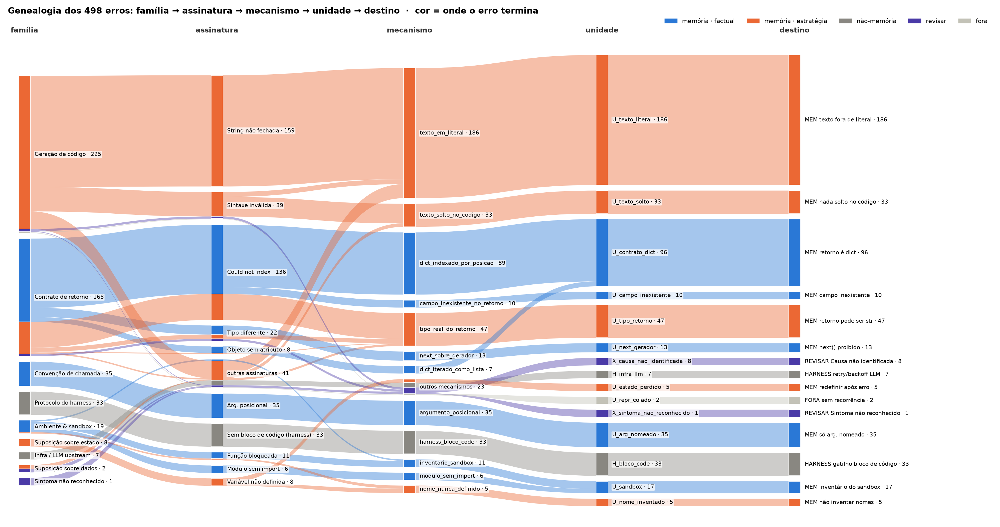
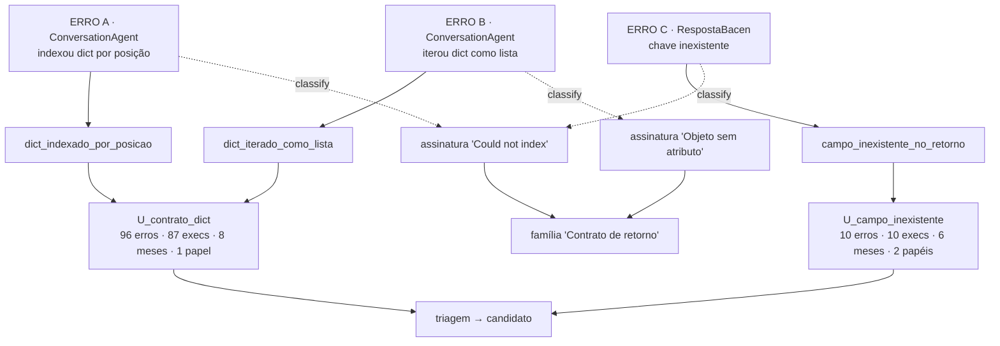

# Metodologia — da mensagem de erro à candidata de memória

Documento-método **desta análise** (este `docs/`, dentro de
`analysis/2026-09-trace-law-flow/`). Explica a cadeia de agregação que transforma
498 erros crus em lições candidatas a memória — e onde cada elo já está
demonstrado em gráfico. É o fundamento da análise atual; o relatório de estudo
(roadmap do doc 08) aprofunda família por família com evidência do cru.

A versão **genérica** (hipótese de método, pré-artigo — os mesmos elos abstraídos
para qualquer trace, com fundamentação e racionais por elo) é
[`general-error-taxonomy-methodology.md`](../../../discussion/hipoteses/trace-error-taxonomy-methodology/general-error-taxonomy-methodology.md).
Este arquivo é a **instanciação** no trace da esteira: números, funções e
cardinalidades verificadas.

## 1. A cadeia completa

```
execução (papel) → ActionStep com error
   │
   ├─ classify(error.message)        → (família, assinatura)   eixo SINTOMA
   │      "o que o Python reclamou"   lê só o texto da mensagem
   │
   └─ submecanismo(error.message)    → mecanismo               eixo MECANISMO
          "o que o agente fez de errado"  lê a mensagem + a linha de código rejeitada
                       │
                 SUB2UNI[mecanismo]  → unidade                a LIÇÃO
          "uma memória só previne todos os mecanismos do grupo?"
                       │
                 triagem(unidade)    → decisão                a PRIORIZAÇÃO
          ≥3 execuções, ≥2 meses, não-harness → candidata / não-memória / fora
```

Cada elo é uma função determinística em `pipeline/base_pipeline.py`. Nenhum passo
usa LLM: são regras sobre o texto da mensagem e da linha rejeitada — toda
classificação é reabível no cru via `exec_id` + `pipeline/drill_down.py`.



### 1.1 A cadeia inteira numa figura — o Sankey da genealogia

Contagem **real por nó e por aresta** (gerada por
[`pipeline/genealogia_sankey.py`](../pipeline/genealogia_sankey.py); arestas
crus em `pipeline/resultados/genealogia_arestas.csv` — granularidade total,
sem agregação). Cada estágio soma os **498 erros** — é uma decomposição de
fluxo completa, não amostra. Para legibilidade a figura mantém explícitas só
as assinaturas e mecanismos maiores/protagonistas e agrega o resto em "outras
assinaturas"/"outros mecanismos". **A cor é onde o erro termina** — a decisão da
triagem, na mesma linguagem do gráfico 9.3: azul = memória factual, laranja =
memória de estratégia, cinza escuro = não-memória, roxo = revisar, cinza claro =
fora. Cada fita leva a cor da decisão dos erros que passam por ela, e um nó que
reúne destinos diferentes aparece em fatias, uma por decisão: cada família mostra
de relance quanto dela vira memória. Família, assinatura e mecanismo são
identificados pelo nome, não pela cor (até 24/09/2026 a cor era a da família,
herdada para a direita, e o agregado cinza passava o cinza a uma memória
candidata; `03-procedimento-validacao.md` §1.14). Cada coluna é ordenada por
baricentro das arestas de entrada, para que o mesmo fluxo não zigue-zague sem
necessidade. Três leituras
de relance, da esquerda para a direita:

1. **divide** — o sintoma abre: "Could not index · 136" parte em
   `dict_indexado_por_posicao` 89 + `tipo_real_do_retorno` 37 +
   `campo_inexistente_no_retorno` 10;
2. **funde** — as causas reconvergem pela lição: 89 + 7
   (`dict_iterado_como_lista`, que nasce de *outro* sintoma) fecham
   `U_contrato_dict · 96`; `inventario_sandbox` 11 + `modulo_sem_import` 6
   fecham `U_sandbox · 17`;
3. **decide** — a última coluna nomeia o destino de cada unidade (1:1, sem
   nova fusão): `MEM <título>` para as 10 unidades que viram candidata a
   memória (447 erros, 90%), `HARNESS <título>` para as 2 que apontam
   correção de harness/infra (40 erros), `FORA <motivo>` para as 2
   descartadas por falta de recorrência ou de conteúdo único (11 erros). O
   título de cada `MEM`/`HARNESS` é a mesma lição de `UNI` em
   `base_pipeline.py` que preenche `candidatos_memoria.csv` — a figura não
   inventa texto novo, só nomeia o que a triagem já decide.

Ressalva: a figura conta **erros**; a `triagem()` decide sobre **ocorrências**
(437, dedup de cascata) — os thresholds são aplicados lá, não aqui.



*(figura gerada por `pipeline/genealogia_sankey.py` — regenerar após qualquer
mudança em `base_pipeline.py` que altere `classify`/`submecanismo`/`SUB2UNI`/`UNI`,
ou em `KEEP_SIG`/`KEEP_MEC`/`CURTO_MEM` no próprio script.)*

## 2. Dois eixos paralelos, não uma árvore

`classify()` e `submecanismo()` são **duas leituras independentes da mesma
mensagem** — um não chama o outro (a única combinação está no fim desta seção). A razão: a relação sintoma↔mecanismo é
muitos-para-muitos nos dois sentidos, o que uma árvore não representaria:

- **Mesmo sintoma → mecanismos diferentes**: a assinatura `"Could not index"`
  (136 erros) se divide em três mecanismos → três unidades diferentes (§4).
  Sintoma não determina causa — só a linha rejeitada separa.
- **Mecanismos diferentes → mesma lição**: `U_sandbox` junta
  `inventario_sandbox` (usou função proibida: `dir`, `globals`, `openpyxl`
  ausente) e `modulo_sem_import` (usou `json`/`datetime` sem importar). Erros
  distintos na superfície, mesma lacuna: o agente não conhece o inventário do
  sandbox — um único card de memória previne os dois.

`classify()` **não decide candidatas**: a lista de candidatas seria idêntica sem
ele. Seu papel é a camada de **descrição, proveniência e descoberta** — o censo dos
sintomas (§8.1), a coluna "assinaturas de origem" da triagem, e a rede que flaga
erro novo ("Sintoma não reconhecido") na extração maior.

Na prática, as duas leituras se combinam **num só ponto** — `montar_unidades()` — e **só para o resíduo**:

| O sintoma foi reconhecido? (`classify()`) | A causa foi identificada? (`submecanismo()`) | Vai para |
|---|---|---|
| sim | sim | uma unidade normal (ex.: `U_contrato_dict`) |
| sim | não | **Causa não identificada** — classe *Código Python mal escrito* (erro de sintaxe) ou *Erro conhecido, causa sem regra* |
| não | não | **Sintoma não reconhecido** — classe *Erro que a taxonomia não conhece* |
| não | sim | uma unidade normal; só a coluna de família fica "Sintoma não reconhecido" (raro; 0 casos na base 1) |

**Não há sobreposição:** cada erro vai para exatamente uma unidade; um erro nunca está nos dois baldes. "Sintoma
não reconhecido" aparece em dois lugares — como **família** (coluna do `classify()`) e como **unidade** — e quase
sempre coincidem (base 1: 1 = 1); divergem só na última linha da tabela.

**Esta é a única exceção à regra "o sintoma não decide".** O `submecanismo()` continua sem ler o `classify()`; é o
`montar_unidades()` que usa a família, e apenas para separar os dois baldes, que nunca viram memória. Nenhuma
candidata depende disso — testado: as 10 candidatas da base 1 saem idênticas com ou sem a separação.

Na triagem, os dois baldes vão para **revisar** (a fila de trabalho da taxonomia, não não-memória): com
**prioridade** se algum padrão de erro recorre, contado por padrão e não pelo balde (`01-racionais.md` §7 Passo 5).
O que cada balde pede quando cresce está em `analysis/README.md` (intake) e o racional em `01-racionais.md` §7
Passo 2.

## 3. As relações de cardinalidade — verificadas no EU

| relação | cardinalidade | verificado nos 498 erros |
|---|---|---|
| assinatura → família | **N:1** | 0 exceções — cada assinatura mora numa única família (por construção do `classify`) |
| assinatura → mecanismo | **1:N** | sintoma pode ter causas diferentes — "Could not index" → 3 mecanismos |
| mecanismo → unidade | **N:1** | 0 mecanismos → >1 unidade (SUB2UNI é função); U_contrato_dict e U_sandbox fundem 2 cada |
| unidade → decisão | **N:1** | `triagem()` decide por unidade **global** — não por (papel × unidade) |

O desenho é **dividir, depois fundir**: o sintoma se divide em mecanismos
(mesma reclamação, causas diferentes), os mecanismos se fundem em unidades
(causas diferentes, mesma cura). A unidade é onde os erros reconvergem pelo
critério "uma memória só resolveria?".

## 4. Exemplo trabalhado — a assinatura "Could not index"

136 erros, todos na família "Contrato de retorno da ferramenta":

| mecanismo | unidade | erros | o que o agente fez |
|---|---|---:|---|
| `dict_indexado_por_posicao` | U_contrato_dict | 89 | `doc[0]` num retorno que é dict — tratou dict como lista |
| `tipo_real_do_retorno` | U_tipo_retorno | 37 | indexou algo que era string (`string indices must be integers`) |
| `campo_inexistente_no_retorno` | U_campo_inexistente | 10 | `KeyError 'campo'` — a chave não existia no retorno |

O mesmo sintoma cobre o `doc[0]` em dict **e** o campo inexistente — e viram
lições diferentes. Complementarmente, `dict_iterado_como_lista` (7 erros,
assinatura "Objeto sem o atributo esperado") funde-se na mesma
U_contrato_dict: a lição "ferramentas de documento retornam
`{'result': [[...]]}` — acesse `r['result'][0]`" previne os dois.

## 5. Rastreio ponta a ponta — três erros reais

Três `ActionStep.error` de verdade, passando por cada função. Escolhidos para
mostrar os dois fenômenos do muitos-para-muitos num exemplo só:

```
ERRO A  exec 008d142f  ConversationAgent  2026-03
        "Could not index {'result': [[{'hashDocumento': '05683f34…'…"   ← indexou dict por posição
ERRO B  exec 3f44a68b  ConversationAgent  2026-06
        "Object hashDocumento has no attribute get"                     ← iterou o dict, pegou chave-string
ERRO C  exec 1be966e7  RespostaBacen      2026-05
        "Could not index {'vazamento_sigilo': 'NAO', 'justificativa'…"  ← KeyError num campo inexistente
```

| passo | ERRO A | ERRO B | ERRO C |
|---|---|---|---|
| `classify()` → família | Contrato de retorno | Contrato de retorno | Contrato de retorno |
| `classify()` → assinatura | "Could not index" | "Objeto sem o atributo esperado" | "Could not index" |
| `submecanismo()` | `dict_indexado_por_posicao` | `dict_iterado_como_lista` | `campo_inexistente_no_retorno` |
| `SUB2UNI` → unidade | **U_contrato_dict** | **U_contrato_dict** | **U_campo_inexistente** |

- **A e C saem idênticos do `classify()`** — o sintoma não os separa. Quem separa
  é o `submecanismo()` lendo a linha rejeitada.
- **A e B convergem na unidade** — sintomas diferentes, mesma cura.
- **A e C divergem na unidade** — mesmo sintoma, curas diferentes.



Monitoramento acumulado (saída real da `triagem()`):

| | U_contrato_dict | U_campo_inexistente |
|---|---:|---:|
| erros | 96 | 10 |
| execuções (dedup cascata) | 87 | 10 |
| meses | 8 (dez/25 → jul/26) | 6 |
| papéis | 1 — só ConversationAgent | 2 — RespostaBacen 8, ConversationAgent 2 |
| tokens desperdiçados | 2,99M | 0,19M |
| assinaturas de origem | "Could not index" + "Objeto sem atributo" | "Could not index" |
| decisão | **candidato** | **candidato** |

## 6. Por que a memória vive no nível unidade, não na assinatura

Contra-exemplo direto: se a memória fosse escrita **por assinatura**, os três
erros acima produziriam dois cards — um para "Could not index" (A+C) e um para
"Objeto sem atributo" (B). Os dois falham, em sentidos opostos:

1. **O card "Could not index" é ambíguo e diluído.** A mesma assinatura aponta
   para três mecanismos com três consertos diferentes — o card viraria um
   checklist ("pode ser dict indexado errado, ou o retorno era string, ou a
   chave não existe") em vez de um fato ensinável. Pior: a chave é
   **não-injetiva** — "Could not index" → 3 unidades — então nem roteamento
   determinístico seria possível sem ler a linha rejeitada, o que equivale a
   rodar o `submecanismo()` de qualquer jeito.
2. **O card "Objeto sem atributo" duplica conteúdo.** O conserto de B é o mesmo
   de A ("retorno é dict, acesse `r['result'][0]`") — a mesma lição ficaria
   escrita em dois cards, com custo dobrado de manutenção e risco de divergirem.

A objeção honesta: um card genérico "inspecione tipo e chaves antes de indexar"
*preveniria* A, B e C. Mas perde exatamente o que dá valor às unidades factuais —
os fatos específicos do ambiente (o contrato `{'result': [[...]]}`, os nomes de
chave reais como `vazamento_sigilo`). Conselho genérico é o que a memória já dá
sem dados; o trace fornece o contrato concreto.

A divisão de trabalho correta é a que o pipeline encarna:

| nível | papel na memória |
|---|---|
| assinatura | **chave de proveniência/busca** — "quais sintomas alimentam esta lição" |
| mecanismo | **diagnóstico** — desambigua o sintoma |
| unidade | **conteúdo** — o card em si, um fato/conserto por unidade |

## 7. O que cada gráfico demonstra (e o que falta)

| elo da cadeia | gráfico | medida |
|---|---|---|
| papel → erro (granularidade) | §8.0 funil + classes de step | contagens |
| erro → sintoma (classify) | §8.1 Pareto de assinaturas | contagens |
| papel × lição (quem erra o quê) | §8.8 | % dos erros do papel (contagem) |
| priorização por custo | §8.5 | tokens desperdiçados |
| unidade → decisão | §9.3 | tokens + veredito da triagem |
| **a cadeia inteira numa figura** | **§1.1 Sankey da genealogia** (contagem real por nó e por aresta) | contagens |

Duas medidas convivem e não se confundem: **contagem de erros** (frequência —
"o que mais ocorre") × **soma de tokens** (custo — "o que mais dói").
`U_texto_solto`: 33 erros (frequência média) mas 1,39M tokens (3º mais caro).

## 8. Terminologia fixada

| termo | o que é | não é |
|---|---|---|
| família / assinatura | saída do `classify()` — o sintoma | não decide candidatas (só separa os dois baldes de resíduo, §2) |
| mecanismo | saída do `submecanismo()` — a causa | ainda não é a lição |
| unidade | agrupamento de mecanismos por lição comum | **não é automaticamente candidata** |
| candidata | unidade que passou no threshold da triagem | é uma **decisão**, não um nível da taxonomia |

Armadilha a evitar: "unidade de memória" no pipeline inclui `H_*`
(harness/infra) e os dois baldes de resíduo, `X_causa_nao_identificada` e
`X_sintoma_nao_reconhecido` — agrupamentos que por construção nunca viram
memória. Em contexto descritivo, ler "unidade" como "tipo de erro agrupado".
