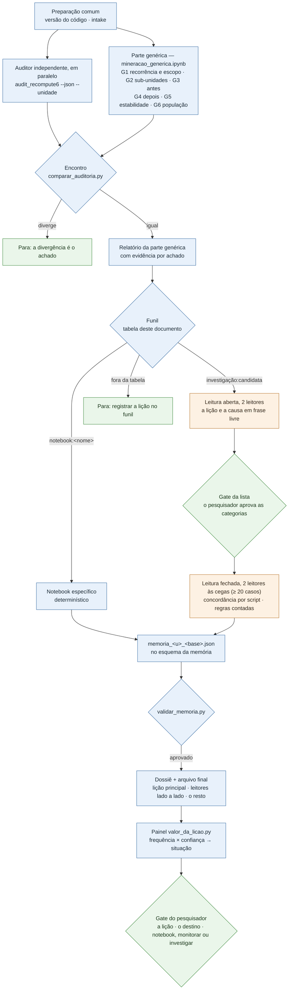
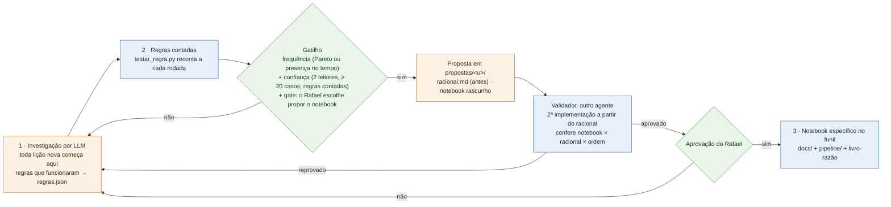

# Procedimento — minerar uma candidata a memória numa base

> **Códigos e siglas** (M1–M6, [1]–[4], `U_…`/`H_…`, Ajuste N, roadmap #N, [conferido]/[assistido]): o que cada um quer dizer está no [glossário](../../glossario.md).

**Para que serve este documento:** o roteiro para minerar **qualquer** lição (unidade) que passou na triagem. Minerar
é transformar a lição numa memória proposta: o fato ou o hábito, o escopo, a evidência e o destino (memória × sinal de
harness), num arquivo final com estrutura fixa. O **porquê** dos passos está no
[`06-racionais-mineracao-unidades-n2-n10.md`](06-racionais-mineracao-unidades-n2-n10.md) §9, escrito para a nº2/nº10 e
aqui aplicado na forma genérica. É o mesmo papel do `12` e do `15`.

**Regra de ouro:** o LLM propõe, o script conta. Nenhum número da mineração sai da leitura de um modelo, e o destino é
decisão do pesquisador. Desenho decidido com o Rafael em 05/10/2026 (`plano-atual.md`, "O que vale").

## Como funciona

A mineração tem duas partes:
- **a genérica**, igual para todas as lições;
- **a específica**, que é a de cada lição.

Um **funil** liga as duas: uma tabela, mais abaixo, diz qual parte específica cada lição usa. Não há grupos de lições.
Duas lições que se mineram do mesmo jeito compartilham a parte específica.

### Uma rodada



Legenda: azul = determinístico (`[conferido]`); laranja = LLM (`[assistido]`, vale como hipótese); verde = decisão do
pesquisador.

### O ciclo de vida da parte específica



## 0 · Pré-condições e o que sai da máquina

- **A lição precisa estar no `candidatos_memoria.csv` da base** (a triagem). Os notebooks da esteira, das falhas
  silenciosas e da consolidação já rodaram nessa base.
- **Rodar de dentro de `pipeline/`**, com `uv run` na frente.
- **Sai da máquina:** contagens, nomes de papel, ferramenta, modelo e unidade, meses, a versão do esquema e o arquivo
  final na versão que sai.
- **Não sai:** `exec_id`, texto de caso, código do agente, prompt. `resultados/mineracao/` é git-ignored.

## Parte genérica — `mineracao_generica.ipynb`

```
UNIDADE=<unidade> uv run jupyter nbconvert --to notebook --execute --ExecutePreprocessor.timeout=-1 --output-dir resultados/mineracao/<unidade> --output mineracao_generica_<unidade> mineracao_generica.ipynb
```

O notebook grava em `resultados/mineracao/<unidade>/`:

| Seção | O que mede | Por quê (`06` §9) | Grava |
|---|---|---|---|
| G1 · Recorrência e escopo | erros, ocorrências (visíveis e silenciosas), execuções, meses, papéis; modelos e ferramentas no step do erro | a régua da triagem; o escopo da memória | `perfil.csv` |
| G2 · Sub-unidades | a régua da triagem por papel e por ferramenta chamada no step do erro | Passo 1: a lição esconde partes diferentes? | `sub_unidades.csv` |
| G3 · Antes | step anterior com erro (de qual lição), falha silenciosa antes, erro fora da 1ª chamada | a lição é efeito de outra? | `antes.csv` |
| G4 · Depois | o step seguinte (sem erro · a mesma lição · outra), o papel entregou resposta, a execução terminou com resposta | Passo 3: o agente se corrige? | `depois.csv` |
| G5 · Estabilidade | por mês, por versão do formato do prompt, por modelo, e a concentração | Passo 4: estável ou incidente? | `estabilidade.csv` |
| G6 · População | uma linha por erro ou ocorrência, com as colunas acima | entrada da parte específica e da evidência | `casos.csv` |

**Duas limitações declaradas:**
- **A ferramenta do G2 é a chamada no step do erro, e não a origem do valor.** Num erro de contrato de retorno, o
  agente usa um valor que veio de uma chamada anterior. Na base 1, a nº2 tem a origem rastreada na
  `get_available_documents` (91/96, §11.1 do notebook específico), e no step do erro a ferramenta mais chamada é outra.
  Rastrear a origem é papel da parte específica.
- **A parte genérica não extrai o fato nem o hábito:** ela descreve a lição; não a escreve.

**Conferências:**
- O `perfil.csv` bate com o `candidatos_memoria.csv` da base em erros, ocorrências (visíveis e silenciosas),
  execuções, meses e papéis. Na base 1: 11 de 11 lições, 0 divergências (05/10).
- O encontro com a auditoria (`audit_recompute6.py --json --unidade <u>` e o `comparar_auditoria.py` da skill) dá
  tudo igual.

## O funil — a parte específica de cada lição

<!-- funil: a skill mineracao-candidata lê esta tabela. Uma linha por lição; parte específica = notebook:<arquivo em pipeline/> | investigação:<roteiro do kit> -->

| Lição | Parte específica | Estágio | Desde | Frequência (base 1, 05/10) | Confiança | Situação | Decisão |
|---|---|---|---|---|---|---|---|
| `U_contrato_dict` | `notebook:mineracao_unidades_n2_n10` | 3 · notebook | 16/09/2026 (pré-registro `06` §9) | Pareto + presença | confirmada (notebook) | notebook | — |
| `U_campo_inexistente` | `notebook:mineracao_unidades_n2_n10` | 3 · notebook | 16/09/2026 (pré-registro `06` §9) | — (sinal de harness) | confirmada (notebook) | notebook | — |
| `U_texto_literal` | `investigação:candidata` | 1 · investigação | 05/10/2026 | Pareto + presença | poucos casos (2º leitor 8 de 20, 06/10) | prioridade de investigação | — |
| `U_tipo_retorno` | `investigação:candidata` | 1 · investigação | 05/10/2026 | Pareto + presença | não avaliada | prioridade de investigação | — |
| `U_arg_nomeado` | `investigação:candidata` | 1 · investigação | 05/10/2026 | Pareto + presença | não avaliada | prioridade de investigação | — |
| `U_sandbox` | `investigação:candidata` | 1 · investigação | 05/10/2026 | presença | não avaliada | prioridade de investigação | — |
| `U_next_gerador` | `investigação:candidata` | 1 · investigação | 05/10/2026 | presença | não avaliada | prioridade de investigação | — |
| `U_nome_inventado` | `investigação:candidata` | 1 · investigação | 05/10/2026 | não | confirmada (5 de 5 casos) | certa, mas rara: monitorar | monitorar (06/10; `monitoramento.json`) |
| `U_texto_solto` | `investigação:candidata` | 1 · investigação | 05/10/2026 | não | não avaliada | baixa prioridade | — |
| `U_repr_colado` | `investigação:candidata` | 1 · investigação | 05/10/2026 | não | não avaliada | baixa prioridade | — |
| `U_estado_perdido` | `investigação:candidata` | 1 · investigação | 05/10/2026 | não | não avaliada | baixa prioridade | — |

<!-- /funil -->

- **As quatro últimas colunas são o marcador de cada lição.** Elas saem do painel
  (`uv run python <skill mineracao-candidata>/scripts/valor_da_licao.py <pasta-da-analise> [<unidade>]`), e a skill as
  atualiza ao fim de cada rodada. A confiança separa as perguntas que antes ficavam juntas num "falhou":

  | Confiança | Quando | O que quer dizer |
  |---|---|---|
  | **confirmada** | regras com concordância ≥ 90% e "pega a mais" ≤ 10%, e leitores com kappa ≥ 0,6 | o padrão existe e a lição está escrita de um jeito que duas pessoas aplicam igual |
  | **redação em aberto** | as regras passam, os leitores discordam | **a lição existe** (a regra contada sustenta o padrão); o que está em aberto é a redação dela |
  | **várias causas** | um dos leitores pôs metade ou mais dos casos em "não há uma lição única" | volume sem lição comum: provavelmente várias causas dentro da unidade |
  | **padrão não confirmado** | alguma regra abaixo dos limiares | nem o padrão está contado |
  | **poucos casos** | a leitura dupla tem menos de 20 casos (ou menos que a população, se ela é menor) | não dá para concluir nada, nem a favor nem contra |
  | **não avaliada** | sem leitura dupla ou sem regra contada | ainda não investigada |

  Situação e gate:

  | Frequência | Confiança | Situação | Gate do pesquisador: as opções |
  |---|---|---|---|
  | sim | confirmada | **pronta para notebook** | propor o notebook (`propor-notebook`) · esperar a próxima partição |
  | sim | redação em aberto | **lição existe, redação em aberto** | aprovar a lição de um dos leitores · escrever uma lição geral que cubra as duas · investigar mais a fundo (várias causas; dividir a lição) |
  | sim | várias causas | **várias causas: investigar a fundo** | dividir a lição por causa · investigar mais a fundo |
  | sim | padrão não confirmado | **importante e mal entendida** | sem gate: a investigação continua (rever a regra) |
  | sim | poucos casos ou não avaliada | **prioridade de investigação** | sem gate: é onde investigar rende mais |
  | não | confirmada | **certa, mas rara: monitorar** | monitorar (reconferir a cada partição nova: ela reaparece?) · descartar |
  | não | as outras | **baixa prioridade** | sem gate: só registro |

  A confiança é lida do `resultados/mineracao/<u>/confianca.json`, que o `concordancia.py` e o `testar_regra.py` gravam
  com `--registrar` (ninguém transcreve número). Vale a **última** medida de cada pergunta dos leitores e de cada regra
  (o mesmo rótulo, alvo e local): as versões de uma regra que o investigador testou antes e abandonou ficam no
  histórico do arquivo, mas não decidem. Uma partição nova é outro local, e por isso a confirmação nela conta à parte.
  A **decisão** é lida do `resultados/mineracao/<u>/decisoes.json`, que o `registrar_decisao.py` grava com as palavras
  do pesquisador; até ela existir para a situação atual, o painel mostra "aguardando".
- **Lição fora da tabela:** a skill para e pede ao pesquisador que a registre aqui.
- **Mudar uma lição de linha** (por exemplo, do estágio 1 para o 3) só pelo ciclo de vida abaixo, com uma entrada no
  livro-razão.
- **A nº2/nº10 no notebook específico:**
  `uv run jupyter nbconvert --to notebook --execute --inplace mineracao_unidades_n2_n10.ipynb`. O arquivo final sai do
  `resultados/unidades_memoria.json` pelo conversor do `validar_memoria.py`.

## O monitoramento (decidido com o Rafael em 06/10/2026)

"Monitorar" não é uma nota para alguém lembrar: é um registro versionado e um script que para a rodada.
- **O registro:** [`../../monitoramento.json`](../../monitoramento.json), em `analysis/`, **um só para as pastas de
  todas as bases** (cada base tem a sua pasta de análise, e o monitoramento compara bases; versionado; só decisões,
  contagens e regras, nenhum dado de caso). Uma decisão de monitorar tomada na máquina de compliance volta para este
  arquivo, depois do `varrer_pii.py`. Cada item tem: o que é, o tipo (memória rara · sinal de harness), quando e
  onde foi decidido, a população (uma tabela derivada e o filtro), a **linha de base** (a base onde se decidiu, com as
  contagens), as **regras contadas** que separam as sub-lições, e os **gatilhos**.
- **O script:** `monitorar.py` (skill `mineracao-base`), no passo 0 de toda mineração. Na própria base da linha de base,
  ele só confere que a contagem reproduz. Numa base ou partição nova, ele conta, compara e dispara:

  | Gatilho | Dispara quando | Para que tipo |
  |---|---|---|
  | régua | a população passa na régua da triagem (≥ 3 execuções, ≥ 2 meses) | memória rara: reapareceu com recorrência |
  | frequência | Pareto das ocorrências ou presença na maior parte dos meses | memória rara: virou prioridade |
  | cresce | erros ≥ fator × os da linha de base | os dois |
  | sub-lição muda | o peso de uma sub-lição mudou mais que `delta` (com 10 erros ou mais) | lição com sub-lições |
  | sem regra | mais de `fracao` dos erros fora de todas as regras (com 10 erros ou mais) | algo novo dentro da unidade |
  | some | nenhum erro | sinal de harness: o conserto pode ter entrado |
  | aparece desde | algum erro a partir de um mês | sinal dado como consertado: voltou |

  Saída 1 = alerta: a skill para e leva ao pesquisador, e a lição volta ao gate. Saída 2 = falta uma tabela (o script
  diz o comando que a gera).
- **Monitorado hoje:** a `U_nome_inventado` (memória rara, 06/10), o `U_campo_inexistente` (sinal de harness, Ajustes 5
  e 13) e a ferramenta que concorre com o `final_answer` (sinal de harness, "monitorar, não dar como corrigido",
  02/10).
- **Validação (base 1, 06/10):**
  - na base inteira, os três itens reproduzem a linha de base (saída 0);
  - partição simulada de jan a jul/2026: a `U_nome_inventado` passa na régua (4 execuções, 3 meses) → alerta; a
    ferramenta concorrente não volta (0) → sem alerta;
  - partição simulada de out a dez/2025: o `U_campo_inexistente` some (0) → alerta "sumiu";
  - controles positivos (uma linha de base de uma base menor, simulada): todos os gatilhos disparam como esperado;
  - um ruído corrigido: com 1 erro, o peso das sub-lições mudava "100%"; os gatilhos de proporção pedem 10 erros.
- **Esperado na base 2:** a `U_nome_inventado` com 118 erros (régua, cresce e, provavelmente, frequência → alerta, com
  as duas sub-lições contadas pelas regras); o `U_campo_inexistente` com 38 (cresce, 38 ≥ 3 × 10 → alerta); a
  ferramenta concorrente só em dez/2025 (sem alerta).

## O arquivo final — o esquema da memória

- **A estrutura** está em [`../../esquema-memoria.json`](../../esquema-memoria.json): versão 0.1, provisória. Os
  campos do `06` §9 Passo 8 vêm do TRAIL (`location`, `evidence`, `impact`), do AgentDebug (`description`,
  `correction_guidance`) e da produção própria do projeto (`category`, `scope`, `occurrences`, `status`, `validation`);
  a comparação está no `01` §8.
- **O arquivo final** é `resultados/mineracao/<u>/memoria_<u>_<BASE_ID>.json`. Ele leva a versão do esquema, e a
  origem de cada campo: `checado` (com o comando que o reproduz), `hipotese` (saiu de leitura) ou `pendente` (o
  `impact` fica `null` por decisão, pendente do juiz calibrado).
- **`validar_memoria.py`** (skill `mineracao-candidata`) confere o arquivo contra o esquema. A skill não entrega sem
  ele aprovar.
- **Quando a estrutura for fechada, muda só o esquema** (versão nova e uma entrada no livro-razão). Um campo novo não
  obrigatório aparece como pendência na próxima mineração; um obrigatório reprova até ser preenchido.

## O ciclo de vida da parte específica

| Estágio | Parte específica | Quem faz |
|---|---|---|
| **1 · Investigação** (toda lição nova começa aqui) | roteiro `candidata` do kit: hipóteses antes de ler, amostra por regra, leitura em duas etapas (aberta → gate da lista → fechada, abaixo), regras contadas. Saem o dossiê, o arquivo final (com campos `hipotese`) e `resultados/mineracao/<u>/regras.json` (as regras que funcionaram: regex ou condição, campo, população, contagens) | `investigador` + `segundo-leitor` |
| **2 · Regras contadas** | a cada rodada, o `testar_regra.py` reconta as regras do `regras.json`, sem LLM. Os campos que elas sustentam passam a `checado` | a skill |
| **3 · Notebook específico** | um notebook determinístico, aprovado, no funil | ver a regra de criação |

### A leitura em duas etapas e o gate do pesquisador (decidido com o Rafael em 06/10/2026)

**Por quê.** Na primeira investigação com população grande (a `U_texto_literal`, base 1, 06/10), as lições foram
escritas antes de ver os casos, e cada leitor marcou a mais próxima numa lista fechada, como numa prova de múltipla
escolha. A lista misturava duas perguntas, **o que é o texto** (o relatório final, um documento colado) e **o que
quebrou a string** (a quebra de linha, as aspas), e cada leitor respondeu uma: concordaram em 4 de 8 casos (kappa
0,37). Enquanto isso, uma regra contada achava o mesmo padrão em 132 de 182 erros. A discordância era da lista, não da
lição. Só frase livre também não serve: o script não sabe dizer se duas frases dizem a mesma coisa, e um LLM julgando
isso entraria no caminho da contagem.

**Como fica:**
1. **Amostra** por regra fixa, espalhada pelos papéis (ou pela dimensão do G2 que passa sozinha): até 30 casos; com
   população menor, todos.
2. **Divisão sem sorteio:** os casos de posição ímpar da amostra, até 10, vão para a leitura aberta; os outros, para a
   fechada. Os casos que montam a lista não medem a concordância, senão a lista estaria feita sob medida para eles. Com
   população de menos de 30 casos, as duas etapas usam os mesmos casos, e o dossiê declara que a concordância sai
   otimista.
3. **Leitura aberta:** os dois leitores, cada um sem ver o outro, escrevem a lição e a causa de cada caso em frase
   livre, em termos gerais.
4. **Gate da lista:** a skill põe as frases lado a lado (`concordancia.py --lado-a-lado`), agrupa as parecidas numa
   lista de categorias (em dois eixos quando as frases misturam "o que é" e "o que quebrou") e para. **O pesquisador
   aprova ou edita a lista** (`registrar_decisao.py --etapa lista`).
5. **Leitura fechada:** os dois leitores, às cegas, classificam pelo menos 20 casos (ou todos os que restam) na lista
   aprovada, e escrevem também a lição em frase livre. O script mede a concordância e grava a tabela lado a lado.
6. **Painel e gate da situação:** nas situações com gate (a tabela do funil, acima), a skill para e leva ao
   pesquisador:
   - a **lição principal**, com quanto da unidade ela cobre (a regra contada) e os papéis onde aparece;
   - os **dois leitores lado a lado**, com a lição de cada um nas próprias palavras, as discordâncias primeiro;
   - **o resto**: as causas que não cabem na lição principal, cada uma com a contagem e a dúvida aberta (é do harness?
     é falso positivo da classificação?);
   - as **opções** do gate e a recomendação.

   A decisão fica no `decisoes.json`, com as palavras do pesquisador.

**Dividir a unidade é um resultado normal.** A unidade nasce do **sintoma** (a classificação determinística), e um
sintoma pode ter várias causas. A investigação pode terminar em uma lição; numa **lição geral com variações por papel**
(o mesmo hábito com caras diferentes em papéis diferentes: a lição na `description`, os papéis com um exemplo de cada no
`scope`); ou em várias lições, e aí a proposta de dividir a unidade é um Ajuste de taxonomia, decidido pelo pesquisador.
Nas duas primeiras investigações da base 1, as duas unidades mostraram mais de uma causa dentro.

### A regra de criação de um notebook específico

O agente **só pode propor** um notebook quando valerem a **frequência** e a **confiança**, ou quando o Rafael
decidir. Nunca cria e adota sozinho. A **aprovação final é sempre do Rafael**. Regra revista com o Rafael em 05/10/2026,
sem sorteio: a base 3 é o log inteiro (as bases 1 e 2 são recortes de 1.000 registros), e a base vai receber partições
novas.

**1 · Frequência: a lição vale um notebook?** (pelo menos um)
- **Pareto:** a lição está entre as que, juntas, cobrem 80% das **ocorrências** das candidatas da base. São
  ocorrências, e não erros brutos, porque cascatas inflam os erros.
- **Presença no tempo:** a lição aparece na maior parte dos meses da base. Não basta a régua da triagem (≥ 3
  execuções e ≥ 2 meses), que toda candidata já passou.
- **Calcular:** `uv run python <skill mineracao-candidata>/scripts/valor_da_licao.py <pasta-da-analise> [<unidade>]`.
  Na base 1 (05/10), 6 das 10 candidatas têm: as 4 do Pareto (84% das ocorrências) mais 2 pela presença no tempo. A
  `U_nome_inventado` (5 ocorrências, 4 de 11 meses) não tem.

**2 · Confiança: a regra que vai virar notebook está certa?** (todos)
- **Dois leitores às cegas** na leitura fechada, com **pelo menos 20 casos** (ou todos, se a população é menor) e kappa
  ≥ 0,6 nas categorias da lista aprovada (`concordancia.py`).
- **As regras contadas** contra a leitura (`testar_regra.py`): concordância ≥ 90% e "pega a mais" ≤ 10%, registradas
  no `regras.json`.
- **O laudo "aprovado" do validador**, uma segunda implementação a partir só do racional (abaixo).
- **A decisão do gate** registrada como "propor o notebook" (a situação "pronta para notebook" também para no gate).
- **Limite declarado:** sem sorteio, as regras são escritas e conferidas nos mesmos casos lidos, e a concordância
  tende a sair otimista. Por isso a reconfirmação abaixo.

**3 · Reconfirmação a cada partição nova.** Quando a base receber dados novos:
- os dois leitores (LLM) leem uma amostra da partição nova (até 50 casos, por regra fixa), às cegas;
- as regras do `regras.json` são aplicadas **sem mudança** e comparadas com essa leitura;
- o resultado vai para o `confianca.json` com `--registrar … --local "partição <id>"`.

A partição é dado que ninguém usou para escrever as regras. Ela não bloqueia a criação do notebook, mas vale também para os notebooks já aprovados: se a regra cair
abaixo dos limiares numa partição nova, a lição volta ao estágio 1 (uma entrada no livro-razão). É também o teste de que
a lição continua valendo no tempo.

**Ou a decisão do Rafael**, registrada no `plano-atual.md`.

**Depois do notebook, o LLM continua, com outro papel.** O notebook automatiza a parte repetitiva (reconhecer, contar,
classificar os casos pela regra). A investigação por LLM passa a fazer três outras coisas:
- **ler a amostra de cada partição nova**, para a reconfirmação acima;
- **investigar a sobra que a regra não pega** (os casos "parciais" ou "não lidos" do notebook);
- **investigar quando a regra cai** numa partição nova: algo mudou (modelo, prompt, a própria lição), e a lição volta ao
  estágio 1 até se entender o quê.

Foi o que aconteceu com a nº2/nº10: o notebook existia, e as análises fundas das ferramentas (§11.9 e §11.10) vieram
depois.

**Frequência sozinha não basta:** ela diz que a lição vale um notebook, não que a regra está certa. Uma lição com metade
dos erros e uma regra errada é o pior caso, porque o notebook automatizaria o erro em escala.

**Por que o agente não cria e adota sozinho:**
- seria mudança de método sem aprovação;
- os números ganhariam o selo de "conferido" sem conferência;
- a regra seria escrita depois de ver os dados (o pré-registro do `06` existe para evitar isso);
- a regra nasceria de uma base só (Ajuste 7);
- e voltaria o "um notebook por lição".

### Onde o agente escreve a proposta

Nada vai direto para `docs/` nem para `pipeline/`:

```
analysis/<pasta-da-analise>/propostas/<unidade>/
  racional.md                  o racional curto: a lição, as regras do regras.json em prosa, de onde cada uma veio
                               (base, contagens, concordância dos leitores), o critério de frequência que valeu,
                               o que o notebook mede e o que não mede.
                               Status "proposta". A data e o hash são registrados ANTES de o notebook rodar
  mineracao_<unidade>.ipynb    o rascunho: só as regras do racional; determinístico, sem LLM; funções numa célula
                               própria; saída só de contagens e tabelas; grava o arquivo final no esquema da memória
                               e a pasta de evidência. Salvo sem saídas
  conferencia_independente.py  a segunda implementação, escrita pelo validador
  validacao.md                 o laudo do validador
```

**A pasta é versionada**: o racional, o laudo e a conferência não têm dado de caso, e o notebook vai sem saídas.

### O validador (agente `validador-de-notebook` do kit)

Contexto isolado: ele não participou da investigação nem escreveu o notebook. Ele:
1. **lê só o `racional.md`** e escreve a segunda implementação dos números principais, no padrão dos
   `audit_recompute*` (`csv` + `json` + `re`, sem importar o pipeline), em `conferencia_independente.py`;
2. **roda o notebook e a conferência na base** e compara medida por medida;
3. **confere o notebook contra o racional:** só as regras do racional, nenhuma chamada a LLM, nenhum limiar que não
   esteja no racional, nenhum texto de caso na saída, e o arquivo final aprovado pelo `validar_memoria.py`;
4. **confere a ordem:** a data e o hash do `racional.md` (e do `regras.json`) são anteriores à primeira rodada do
   notebook;
5. **escreve o `validacao.md`**: aprovado ou reprovado, item por item, com os comandos. **Ele não corrige nada.**

**A aprovação final é do Rafael**, depois de um laudo "aprovado". Ao aprovar, no mesmo commit:
- o racional vira `docs/NN-racionais-mineracao-<unidade>.md`;
- o notebook vai para `pipeline/`;
- a conferência vai para `audit/scripts/`;
- a lição muda de linha no funil;
- uma entrada vai para o livro-razão.

## Conferências

- Parte genérica: o perfil igual ao da triagem e o encontro com a auditoria igual (acima).
- Parte específica:
  - **por notebook:** os números do notebook conferem com a sua conferência independente (para a nº2/nº10, os
    `audit_recompute7`/`8`);
  - **por investigação:** a lista aprovada no gate, a concordância entre os leitores medida na leitura fechada
    (`concordancia.py`, com a tabela lado a lado), e regras contadas (`testar_regra.py`) para cada campo marcado
    `checado`.
- O arquivo final aprovado pelo `validar_memoria.py`.
- A versão que sai, gerada pelo `versao_para_sair.py` e limpa no `varrer_pii.py`.
