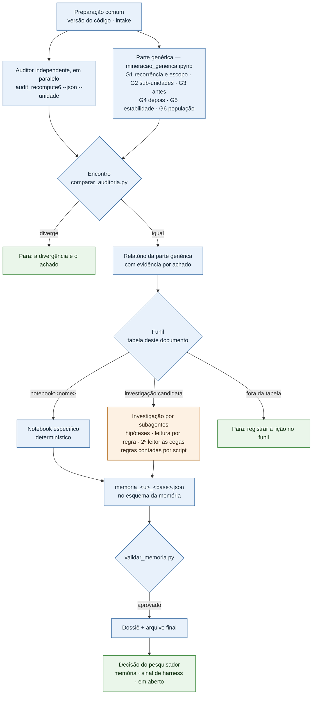
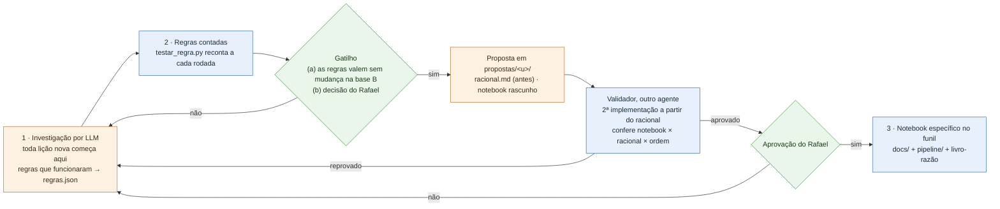

# Procedimento — minerar uma candidata a memória numa base

> **Códigos e siglas** (M1–M6, [1]–[4], `U_…`/`H_…`, Ajuste N, roadmap #N, [conferido]/[assistido]): o que cada um quer dizer está no [glossário](../../glossario.md).

**Para que serve este documento:** o roteiro para minerar **qualquer** lição (unidade) que passou na triagem. Minerar
é transformar a lição numa memória proposta: o fato ou o hábito, o escopo, a evidência e o destino (memória × sinal de
harness), num arquivo final com estrutura fixa. O **porquê** dos passos está no
[`06-racionais-mineracao-unidades-n2-n10.md`](06-racionais-mineracao-unidades-n2-n10.md) §9, escrito para a nº2/nº10 e
aqui aplicado na forma genérica. É o mesmo papel do `12` e do `15`.

**Regra de ouro:** o LLM propõe, o script conta. Nenhum número da mineração sai da leitura de um modelo, e o destino é
decisão do pesquisador. Desenho decidido com o Rafael em 05/10/2026 (`plano-atual.md`, "O que vale").

## Como funciona

A mineração tem duas partes:
- **a genérica**, igual para todas as lições;
- **a específica**, que é a de cada lição.

Um **funil** liga as duas: uma tabela, mais abaixo, diz qual parte específica cada lição usa. Não há grupos de lições.
Duas lições que se mineram do mesmo jeito compartilham a parte específica.

### Uma rodada



Legenda: azul = determinístico (`[conferido]`); laranja = LLM (`[assistido]`, vale como hipótese); verde = decisão do
pesquisador.

### O ciclo de vida da parte específica



## 0 · Pré-condições e o que sai da máquina

- **A lição precisa estar no `candidatos_memoria.csv` da base** (a triagem). Os notebooks da esteira, das falhas
  silenciosas e da consolidação já rodaram nessa base.
- **Rodar de dentro de `pipeline/`**, com `uv run` na frente.
- **Sai da máquina:** contagens, nomes de papel, ferramenta, modelo e unidade, meses, a versão do esquema e o arquivo
  final na versão que sai.
- **Não sai:** `exec_id`, texto de caso, código do agente, prompt. `resultados/mineracao/` é git-ignored.

## Parte genérica — `mineracao_generica.ipynb`

```
UNIDADE=<unidade> uv run jupyter nbconvert --to notebook --execute --inplace --ExecutePreprocessor.timeout=-1 mineracao_generica.ipynb
```

O notebook grava em `resultados/mineracao/<unidade>/`:

| Seção | O que mede | Por quê (`06` §9) | Grava |
|---|---|---|---|
| G1 · Recorrência e escopo | erros, ocorrências (visíveis e silenciosas), execuções, meses, papéis; modelos e ferramentas no step do erro | a régua da triagem; o escopo da memória | `perfil.csv` |
| G2 · Sub-unidades | a régua da triagem por papel e por ferramenta chamada no step do erro | Passo 1: a lição esconde partes diferentes? | `sub_unidades.csv` |
| G3 · Antes | step anterior com erro (de qual lição), falha silenciosa antes, erro fora da 1ª chamada | a lição é efeito de outra? | `antes.csv` |
| G4 · Depois | o step seguinte (sem erro · a mesma lição · outra), o papel entregou resposta, a execução terminou com resposta | Passo 3: o agente se corrige? | `depois.csv` |
| G5 · Estabilidade | por mês, por versão do formato do prompt, por modelo, e a concentração | Passo 4: estável ou incidente? | `estabilidade.csv` |
| G6 · População | uma linha por erro ou ocorrência, com as colunas acima | entrada da parte específica e da evidência | `casos.csv` |

**Duas limitações declaradas:**
- **A ferramenta do G2 é a chamada no step do erro, e não a origem do valor.** Num erro de contrato de retorno, o
  agente usa um valor que veio de uma chamada anterior. Na base 1, a nº2 tem a origem rastreada na
  `get_available_documents` (91/96, §11.1 do notebook específico), e no step do erro a ferramenta mais chamada é outra.
  Rastrear a origem é papel da parte específica.
- **A parte genérica não extrai o fato nem o hábito:** ela descreve a lição; não a escreve.

**Conferências:**
- O `perfil.csv` bate com o `candidatos_memoria.csv` da base em erros, ocorrências (visíveis e silenciosas),
  execuções, meses e papéis. Na base 1: 11 de 11 lições, 0 divergências (05/10).
- O encontro com a auditoria (`audit_recompute6.py --json --unidade <u>` e o `comparar_auditoria.py` da skill) dá
  tudo igual.

## O funil — a parte específica de cada lição

<!-- funil: a skill mineracao-candidata lê esta tabela. Uma linha por lição; parte específica = notebook:<arquivo em pipeline/> | investigação:<roteiro do kit> -->

| Lição | Parte específica | Estágio | Desde |
|---|---|---|---|
| `U_contrato_dict` | `notebook:mineracao_unidades_n2_n10` | 3 · notebook | 16/09/2026 (pré-registro `06` §9) |
| `U_campo_inexistente` | `notebook:mineracao_unidades_n2_n10` | 3 · notebook | 16/09/2026 (pré-registro `06` §9) |
| `U_tipo_retorno` | `investigação:candidata` | 1 · investigação | 05/10/2026 |
| `U_texto_literal` | `investigação:candidata` | 1 · investigação | 05/10/2026 |
| `U_texto_solto` | `investigação:candidata` | 1 · investigação | 05/10/2026 |
| `U_sandbox` | `investigação:candidata` | 1 · investigação | 05/10/2026 |
| `U_arg_nomeado` | `investigação:candidata` | 1 · investigação | 05/10/2026 |
| `U_next_gerador` | `investigação:candidata` | 1 · investigação | 05/10/2026 |
| `U_nome_inventado` | `investigação:candidata` | 1 · investigação | 05/10/2026 |
| `U_estado_perdido` | `investigação:candidata` | 1 · investigação | 05/10/2026 |
| `U_repr_colado` | `investigação:candidata` | 1 · investigação | 05/10/2026 |

<!-- /funil -->

- **Lição fora da tabela:** a skill para e pede ao pesquisador que a registre aqui.
- **Mudar uma lição de linha** (por exemplo, do estágio 1 para o 3) só pelo ciclo de vida abaixo, com uma entrada no
  livro-razão.
- **A nº2/nº10 no notebook específico:**
  `uv run jupyter nbconvert --to notebook --execute --inplace mineracao_unidades_n2_n10.ipynb`. O arquivo final sai do
  `resultados/unidades_memoria.json` pelo conversor do `validar_memoria.py`.

## O arquivo final — o esquema da memória

- **A estrutura** está em [`../../esquema-memoria.json`](../../esquema-memoria.json): versão 0.1, provisória. Os
  campos do `06` §9 Passo 8 vêm do TRAIL (`location`, `evidence`, `impact`), do AgentDebug (`description`,
  `correction_guidance`) e da produção própria do projeto (`category`, `scope`, `occurrences`, `status`, `validation`);
  a comparação está no `01` §8.
- **O arquivo final** é `resultados/mineracao/<u>/memoria_<u>_<BASE_ID>.json`. Ele leva a versão do esquema, e a
  origem de cada campo: `checado` (com o comando que o reproduz), `hipotese` (saiu de leitura) ou `pendente` (o
  `impact` fica `null` por decisão, pendente do juiz calibrado).
- **`validar_memoria.py`** (skill `mineracao-candidata`) confere o arquivo contra o esquema. A skill não entrega sem
  ele aprovar.
- **Quando a estrutura for fechada, muda só o esquema** (versão nova e uma entrada no livro-razão). Um campo novo não
  obrigatório aparece como pendência na próxima mineração; um obrigatório reprova até ser preenchido.

## O ciclo de vida da parte específica

| Estágio | Parte específica | Quem faz |
|---|---|---|
| **1 · Investigação** (toda lição nova começa aqui) | roteiro `candidata` do kit: hipóteses antes de ler, leitura por regra, segundo leitor às cegas, regras contadas. Saem o dossiê, o arquivo final (com campos `hipotese`) e `resultados/mineracao/<u>/regras.json` (as regras que funcionaram: regex ou condição, campo, população, contagens) | `investigador` + `segundo-leitor` |
| **2 · Regras contadas** | a cada rodada, o `testar_regra.py` reconta as regras do `regras.json`, sem LLM. Os campos que elas sustentam passam a `checado` | a skill |
| **3 · Notebook específico** | um notebook determinístico, aprovado, no funil | ver a regra de criação |

### A regra de criação de um notebook específico

O agente **só pode propor** um notebook quando valer (a) ou (b). Nunca cria e adota sozinho.
- **(a) Confirmação em duas bases.** As regras do `regras.json`, escritas com a base A, são aplicadas **sem
  mudança** na base B. Nas duas: concordância com a leitura ≥ 90%, "pega a mais" ≤ 10% e kappa entre os leitores
  ≥ 0,6. Uma regra ajustada depois de ver a base B volta ao estágio 1.
- **(b) Decisão do Rafael**, registrada no `plano-atual.md`.

Volume alto sozinho não basta: ele aumenta a amostra, mas não confirma a regra.

**Por que o agente não cria e adota sozinho:**
- seria mudança de método sem aprovação;
- os números ganhariam o selo de "conferido" sem conferência;
- a regra seria escrita depois de ver os dados (o pré-registro do `06` existe para evitar isso);
- a regra nasceria de uma base só (Ajuste 7);
- e voltaria o "um notebook por lição".

### Onde o agente escreve a proposta

Nada vai direto para `docs/` nem para `pipeline/`:

```
analysis/<pasta-da-analise>/propostas/<unidade>/
  racional.md                  o racional curto: a lição, as regras do regras.json em prosa, de onde cada uma veio
                               (base, rodada, contagens), o que o notebook mede e o que não mede.
                               Status "proposta". A data e o hash são registrados ANTES de o notebook rodar na base B
  mineracao_<unidade>.ipynb    o rascunho: só as regras do racional; determinístico, sem LLM; funções numa célula
                               própria; saída só de contagens e tabelas; grava o arquivo final no esquema da memória
                               e a pasta de evidência. Salvo sem saídas
  conferencia_independente.py  a segunda implementação, escrita pelo validador
  validacao.md                 o laudo do validador
```

**A pasta é versionada**: o racional, o laudo e a conferência não têm dado de caso, e o notebook vai sem saídas.

### O validador (agente `validador-de-notebook` do kit)

Contexto isolado: ele não participou da investigação nem escreveu o notebook. Ele:
1. **lê só o `racional.md`** e escreve a segunda implementação dos números principais, no padrão dos
   `audit_recompute*` (`csv` + `json` + `re`, sem importar o pipeline), em `conferencia_independente.py`;
2. **roda o notebook e a conferência na base** e compara medida por medida;
3. **confere o notebook contra o racional:** só as regras do racional, nenhuma chamada a LLM, nenhum limiar que não
   esteja no racional, nenhum texto de caso na saída, e o arquivo final aprovado pelo `validar_memoria.py`;
4. **confere a ordem:** a data e o hash do `racional.md` são anteriores à primeira rodada do notebook na base B;
5. **escreve o `validacao.md`**: aprovado ou reprovado, item por item, com os comandos. **Ele não corrige nada.**

**A aprovação final é do Rafael**, depois de um laudo "aprovado". Ao aprovar, no mesmo commit:
- o racional vira `docs/NN-racionais-mineracao-<unidade>.md`;
- o notebook vai para `pipeline/`;
- a conferência vai para `audit/scripts/`;
- a lição muda de linha no funil;
- uma entrada vai para o livro-razão.

## Conferências

- Parte genérica: o perfil igual ao da triagem e o encontro com a auditoria igual (acima).
- Parte específica:
  - **por notebook:** os números do notebook conferem com a sua conferência independente (para a nº2/nº10, os
    `audit_recompute7`/`8`);
  - **por investigação:** concordância entre os leitores medida (`concordancia.py`), e regras contadas
    (`testar_regra.py`) para cada campo marcado `checado`.
- O arquivo final aprovado pelo `validar_memoria.py`.
- A versão que sai, gerada pelo `versao_para_sair.py` e limpa no `varrer_pii.py`.
