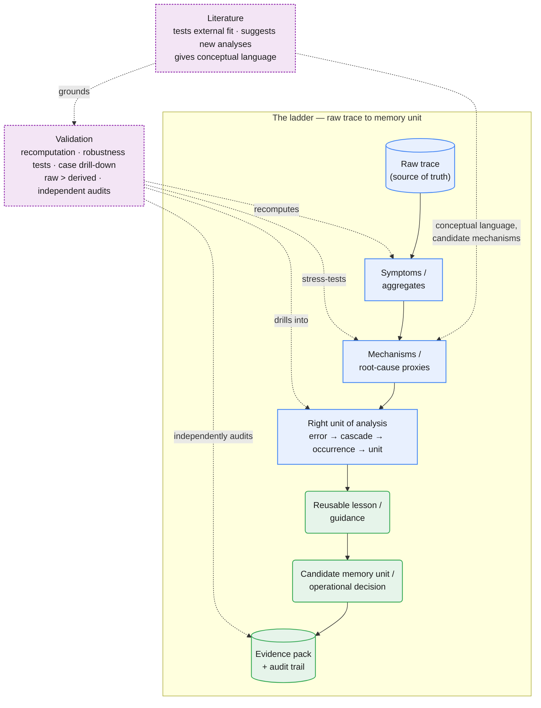

# analysis/

Empirical analyses of raw agent traces from the legal-workflow pipeline (esteira jurídica) —
the "working memory" evidence base for the project's memory-layer hypothesis.

Each analysis lives in its own dated folder (`YYYY-MM-slug/`) containing:

- `pipeline/` — the executed Jupyter notebook(s) (the reproducible pipeline, with outputs embedded), a shared
  `base_pipeline.py` when the folder hosts more than one analysis (trace loading, step explosion, error
  classification — every notebook builds on it instead of copying cells), and any companion scripts (e.g.
  `drill_down.py` for case-level triangulation, `checklist.py` for the intake checks on a new base —
  see below). **One notebook per analysis pass** — a pre-registered method
  applied to a set of objects: the §11 schema-mining pass covers units nº2 and nº10 in a single notebook
  because they share the method; units needing a different method wait for their own pass. Not one notebook
  per object, not one giant notebook — the boundary is the method. Each notebook **owns a section-number
  range** (the mining notebook owns §11.x, the next takes §12.x, and so on — a number is never reused);
- `docs/` — the narrative documents: `01-racionais.md` (the plain-language logic), `02-relatorio-achados.md`
  (the findings report, Portuguese), `03-procedimento-validacao.md` (validation/audit procedure),
  `04-roadmap.md` (what's left), `05-schema.md` (the raw-trace schema). Each analysis pass gets its own
  numbered pair named after the pass — `06-racionais-mineracao-unidades-n2-n10.md` +
  `07-relatorio-mineracao-unidades-n2-n10.md` for the nº2/nº10 mining pass, so the doc slug matches the
  notebook slug (`mineracao_unidades_n2_n10.ipynb`) — keeping the original section numbering so existing
  cross-references still resolve;
- `literature/` — 🔎-level notes on the papers that ground the analysis (full text read by a
  sub-agent, bibliography verified against the PDF). See `papers/reading-queue.md` for what
  🔎 means and why it is not the same as "read";
- `resultados/` — derived CSVs, **git-ignored**: they carry client names, case numbers and
  document excerpts in the clear. Regenerate by running the notebook. Case-level evidence lives in
  `resultados/evidencia/<section>_<analysis>/` — one folder per analysis, prefixed by the section number of
  the notebook that generated it (`11.4_conserto/` = §11.4 of the mining notebook). **Two-stage generation:**
  the notebook writes the structural part (`casos.csv`, `leia-me.md`, `derivados/`); `drill_down.py evidencia
  <folder>` writes `crus/` (the untouched raw-trace row — the source) and the per-case views, checking each
  excerpt against the raw row as it writes. `resultados/unidades_memoria.json` is the **canonical registry**
  of memory-unit records — not per-notebook: each pass reads it and rewrites it with its own records added or
  updated;
- `audit/` (optional) — independent audit reports and recomputation scripts.

Raw trace files (`*.csv.xz` at repo root or elsewhere) must never be committed in the clear
either — they contain unanonymized legal-case data.

## Methodological big picture

`analysis/` is not just a place to count errors or collect charts. The recurring goal is to build an
**empirical bridge** between:

1. the **raw trace** of a real agent system,
2. the **actual mechanisms of failure** visible in that trace,
3. and the smallest reusable **lesson / memory / operational correction** that could prevent the same failure from recurring.

In other words, the analyses try to answer a question of this form:

> What reusable knowledge, extracted from repeated failures in the raw trace, should be persisted,
> operationalized, or explicitly kept out of the agent so that the system stops rediscovering the same lesson in every execution?

### The ladder from trace to memory



Solid arrows are the main pipeline (top to bottom); dashed arrows are the two cross-cutting practices — Literature feeds vocabulary/candidate mechanisms and grounds Validation, while Validation checks back into every stage from symptoms to the final evidence pack, per [validation depth matching claim strength](#5-let-validation-depth-match-claim-strength) below.

### What this means in practice

#### 1. Start from the raw trace

Start from the **raw trace**, not from papers, polished tables, or intuitions. Derived CSVs, notebooks,
and summary tables are for **counting and navigation**; they are not the final authority.

#### 2. Separate symptom from mechanism

A visible exception (`KeyError`, `TypeError`, `SyntaxError`, `Could not index`) is often only a
**surface signature**. If one signature mixes several different phenomena, the analysis should refine it
into a better **mechanism** or **root-cause proxy** that actually matches the research question.

#### 3. Use the right analytical unit

Step-level errors are not always independent events. When repeated failures are really one continuing
underlying problem, the right unit may be a **cascade**, an **occurrence**, or a **role-scoped unit**, not
one count per failing step.

#### 4. Move from "what failed" to "what should be remembered"

The end product is not just a label for an error. The stronger target is the smallest reusable
**lesson/guidance** that could help a future execution avoid the same failure. That lesson may become:

- **factual / environment** knowledge — facts about tools, schemas, documents, sandbox constraints;
- **experiential / strategy** knowledge — rules for how the agent should act;
- **non-memory** operational handling — harness, infra, retry policy, monitoring triggers.

#### 5. Let validation depth match claim strength

Not every claim needs the same evidentiary package.

- **Direct counts** (`n` errors, tokens, executions, durations, monthly totals) are often robust by
  construction -> independent recomputation may be enough.
- **Heuristic-dependent claims** (thresholds, matching rules, inventories, text comparisons) need
  **robustness tests** against plausible alternatives.
- **Prescriptive / memory-bearing / causal claims** ("this is the lesson to write", "this tool really
  returns schema X", "the agent corrected itself by doing Y") deserve the strongest treatment:
  **raw-case evidence packs, rule-based case selection, and independent audit reports**.

#### 6. Treat derived artifacts and evidence packs as different things

A useful default separation is:

- **derived artifacts** = compact views that help navigate and aggregate;
- **evidence packs** = analysis-specific folders that preserve the link back to selected raw cases;
- **independent audit reports** = a second reading that checks whether the analysis claim actually holds
  when reopened from the raw trace.

This matters because code can be wrong in a perfectly consistent way. A notebook can produce the same wrong
number hundreds of times. Evidence packs and independent audits exist so that a human can reopen the claim
without trusting the same computation that first produced it.

### Default rule of thumb for future analyses

If an analysis is mainly **descriptive**, lean on recomputation and selective case illustration.
If it is **heuristic**, add robustness testing.
If it is **prescriptive**, **causal**, or meant to produce a **memory unit**, escalate to the full chain:

```text
aggregate -> selected cases by explicit rule -> raw trace -> derived view -> independent audit
```

That is the default methodological move in `analysis/`: not just "count errors", but move from observed
trace behavior to a reusable, auditable explanation of what should be remembered, changed, monitored, or
kept outside the agent.

## Intake checklist — a new trace base

When a new extraction lands, the folder setup is mechanical: dated `YYYY-MM-slug/` folder, copy
`pipeline/base_pipeline.py` + `drill_down.py` + `checklist.py` + `.gitignore`, drop the dump in
`data/`, point `TRACE` at the new file. Then run `python checklist.py` from `pipeline/` — it bundles
the two non-mechanical checks below plus context (period, agent versions, roles in the JSON). Optional:
`python checklist.py <outra-base.csv>` adds an execution-overlap check (`cod_idef_exeo`) against another
extraction — mandatory before calling two bases independent replicas or pooling them. What it verifies:

1. **Column drift** — `base_pipeline.py` reads six columns by name: `txt_etap_memo`, `cod_idef_exeo`,
   `cod_idef_aget`, `cod_idef_stat_exeo_aget`, `dat_hor_inio_exeo` (→ `mes`, the month the execution
   ran) and `anomesdia` (→ `mes_particao`, the month of the extraction batch — provenance only, **not** the
   execution date: a batch accumulates several months of executions, see
   `2026-09-trace-law-flow/docs/05-schema.md` §Datas). A different extraction can rename or drop them;
   `print(df.columns.tolist())` before anything else. `checklist.py` §5 prints the batch × real-month
   cross-tab — read it before calling a base "one month".
   **Worth having even though nothing reads them yet:** `txt_vrvl_locl` (the interpreter's final
   `locals()` per role — it stores the *real* tool returns, the strongest evidence for
   return-contract claims), `txt_rspa_fina` (persisted final answer), `dat_hor_encm_exeo`
   (real end timestamp), `cod_vers_aget` (agent version —
   separates platform eras).
2. **`error.type` census** — `classify()` was built on the two types seen in the first sample; a new
   base can emit types the taxonomy never saw (the second extraction already added `AgentMaxStepsError`,
   n=1). One `str.findall` + `value_counts` on `"error": {"type": ...}` tells you whether the taxonomy
   covers the base *before* it silently bins unknown errors. The full vocabulary smolagents can emit is
   documented in `schema-e-taxonomia-de-erros.md` §3.1.

`classify()` / `submecanismo()` / `SUB2UNI` are hypotheses mined from the first base — copy them
unchanged and read the **"Sintoma não reconhecido" bucket (unit `X_sintoma_nao_reconhecido`; called "Não classificado" until 2026-09-23) as the coverage signal**: where it grows, the rules
don't reach. Same method + new base = copy the notebook and rerun (outputs recompute on their own; the
markdown prose keeps the old base's numbers until rewritten — that rewrite is where the analysis
actually happens). New method = new notebook with its own § range, per the convention above.

**When a residual bucket grows on a new base.** Two buckets, two different jobs (rationale:
`2026-09-trace-law-flow/docs/01-racionais.md` §7 Passo 2; cases: `03-procedimento-validacao.md` §1.13;
`python drill_down.py residuo` lists them with the exception class and a masked message):

- **Sintoma não reconhecido** (unit `X_sintoma_nao_reconhecido`) — the taxonomy understands *nothing* of the
  error. Read its share of all errors as **coverage**: those results are incomplete by that proportion. Group the
  cases by exception class and open a few with `drill_down.py caso`. For each group that repeats, write a
  **symptom rule first** (`classify()`), then a **cause rule** (`submecanismo()`). If the group is not the agent's
  fault (e.g. `AgentMaxStepsError`, an iteration limit, or infra) it goes to harness/non-memory, not memory.
- **Causa não identificada** (unit `X_causa_nao_identificada`) — the symptom is known, the cause is not. Two
  classes: *Erro conhecido, causa sem regra* is the bucket **closest to new memory** — group by signature, read the
  cases, and where a pattern repeats write a cause rule (it becomes a unit and can pass triage); *Código Python mal
  escrito* is noise while few and scattered — if many, split by kind (unclosed bracket, indentation, invalid
  operator) and see whether one dominates.

Today both buckets leave triage by type, before the recurrence test — a recurrent error there is not surfaced
(`04-roadmap.md`, proposal "a revisar").

## Index

| Folder | What it analyzes |
|---|---|
| [`2026-09-trace-law-flow/`](2026-09-trace-law-flow/) | First raw trace (1,000 executions, Nov 2025 – Aug 2026): root-cause error taxonomy from step-level working memory, token/latency cost of failures, error propagation, cross-execution recurrence, silent-failure detectors, and the resulting memory-unit candidates. Grounded in four full-text-read taxonomy papers (`literature/`). Before presenting: `docs/03-procedimento-validacao.md` — pipeline audit, paper-reading order, and how to triangulate any number against a concrete raw-trace case (`pipeline/drill_down.py`); `docs/01-racionais.md` — the plain-language logic behind the analysis and what a robustness test is, for explaining rather than executing. |

Standalone reference (PT, sits at `analysis/` root rather than inside a dated folder because it's written to
be reusable groundwork for later analyses, not a one-pass deliverable):
[`schema-e-taxonomia-de-erros.md`](schema-e-taxonomia-de-erros.md) — where the error lives in the raw trace
(`ActionStep.error`), the N0→N4 symptom→mechanism→unit taxonomy cascade, and the guideline for the
per-family study report. Its §7 named the genealogy Sankey before it existed; that figure now lives in
`2026-09-trace-law-flow/docs/09-metodologia-erro-a-memoria.md` §1.1.

**Shared code at this level — [`base_utils.py`](base_utils.py).** Generic primitives for any CodeAgent
(smolagents-format) trace analysis, imported from `analysis/` root instead of copied into each dated folder:
grouping steps into ordered `(exec_id, role)` sequences, the authoritative tool inventory (`def name(...)` in
the system prompt), AST helpers over `code_action` (direct calls, names read, call assignments, normalized
call signature), and typed-entity extraction + support check (the caller passes the domain regexes).
Nothing in it knows the legal workflow or the error taxonomy. Created 22/09/2026 ahead of splitting the
silent-failure detectors into their own notebook (`2026-09-trace-law-flow/docs/04-roadmap.md` item 26);
verified to reproduce the §7 detector numbers exactly (inventory 90, Result-Ignore 103/3,053, RAC 125,
Tool-Skip 10/840). The boundary: what is a **hypothesis about one base** (`classify()`, `submecanismo()`,
`SUB2UNI`, `carregar_base()`) stays in that folder's `base_pipeline.py` and is copied per the intake
checklist; what is **mechanics of the trace format** lives here. `drill_down.py` and `checklist.py` stay
per-folder too — they read that folder's `TRACE` and write to its `resultados/`.

**Portable-code watch.** `2026-09-trace-law-flow/pipeline/genealogia_sankey.py` renders that Sankey with a
generic layout engine (barycenter column ordering + minimum node height for legibility — see its own
docstring) that has no dependency on error taxonomy specifically; only the data-prep half of that file is
analysis-specific. Not yet split into its own module — one caller isn't enough to validate the boundary — but
if a future analysis needs a similarly legible many-node Sankey, that's the code to lift out, and `analysis/`
(this level, not inside a dated folder) is the natural home for it.
