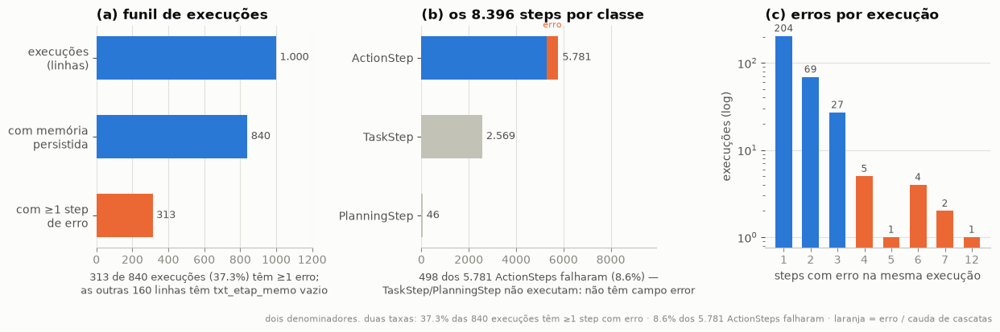
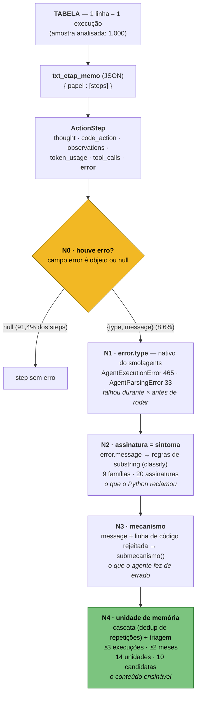

# Schema do trace e taxonomia de erros 

**Propósito:** mostrar onde o erro mora no trace e como a nossa taxonomia se apoia nele — do rótulo mais
genérico ao mais específico. Toda afirmação aqui foi verificada no trace cru via `drill_down.py` /
`base_pipeline.py` sobre a amostra de 1.000 execuções (313 com erro, 498 steps com erro).

## 1. A estrutura: o que é a execução e o que cada campo carrega

**1 linha da tabela = 1 execução de agente.** São 11 colunas; os steps não são colunas — vivem dentro do
JSON de `txt_etap_memo`.

| Coluna | O que é | Relevância |
|---|---|---|
| `cod_idef_exeo` | id da execução | chave de tudo |
| `cod_idef_aget` | id do tipo/papel do agente | análise por papel (168 = `RespostaBacen`…) |
| `cod_idef_stat_exeo_aget` | status (1/2/3/34) | **não** é rótulo de erro — 87% ficam em status 1 sem resposta persistida mesmo com `final_answer()` no trace |
| `cod_idef_cvsa_asnc` | id de conversa/fluxo | pouco usado (nome inferido) |
| `dat_hor_inio_exeo` / `dat_hor_encm_exeo` | início / encerramento | duração |
| `txt_etap_memo` | **JSON das etapas — onde moram os steps e os erros** | o coração da análise |
| `txt_vrvl_locl` | namespace de variáveis locais do interpretador, por papel — o `locals()` final | contexto de estado; guarda os retornos reais das ferramentas |
| `txt_rspa_fina` | resposta final (coluna dedicada, vazia em 87%) | check de sucesso por conteúdo |
| `cod_vers_aget` | versão do agente | ainda não usado |
| `anomesdia` | AAAAMMDD | recorte por mês |

Dentro de `txt_etap_memo`: um dict `{papel: [steps]}` — a working memory estilo smolagents. Cada papel
(`managerAgent`, `RespostaBacen`, `CalculoCivel`…) tem uma lista de steps de **3 classes**:

- **`TaskStep`** — o texto da tarefa recebida (1 por papel)
- **`ActionStep`** — o passo de trabalho: `model_output` (thought), `code_action`, `observations`,
  `tool_calls`, `token_usage`, `timing`, `is_final_answer`, **`error`** ← a unidade da análise
- **`PlanningStep`** — o plano nativo do smolagents (raro: 46 no trace, só `RespostaBacen` e
  `CalculoTrabalhista` emitem)

**O erro não é coluna nem campo da execução — é um campo do `ActionStep`:** `"error": null` quando ok,
`"error": {"type": ..., "message": ...}` quando falhou. 498 dos 5.781 ActionSteps (8,6%) o têm preenchido.

**Overview visual da granularidade** — o mapa da amostra antes de qualquer análise (números medidos no trace
cru; reproduzível na célula §8.0 do notebook `pipeline/analise_trace_esteira_juridica.ipynb`):



Lendo a figura: **1 linha da tabela = 1 execução** (1.000 no total); 840 têm `txt_etap_memo` preenchido —
as outras 160 linhas têm o campo **vazio** (159 são status 1; **0 falhas de JSON** — não é problema de
parse, é dump que não veio na extração). Dessas 840 execuções saem **8.396 steps de 3 classes**: 2.569
`TaskStep` (a tarefa recebida), 46 `PlanningStep` (o plano) e 5.781 `ActionStep` (o trabalho) — só o
`ActionStep` executa código e carrega `error`. **As duas taxas deste relatório medem coisas diferentes e
convivem:** 498 dos 5.781 ActionSteps falharam (**8,6% por step**); esses erros se concentram em 313
execuções — **37,3% das execuções com persistência têm ≥1 step com erro** (a cauda do painel c são as cascatas:
até 12 erros seguidos na mesma execução).

## 2. Evidência no trace cru

Execução `1be966e7-72d9-4e40-ab15-7c5ade91d430` (`cod_idef_aget=168` → `RespostaBacen`,
`cod_idef_stat_exeo_aget=3`, `anomesdia=20260530`; 8 ActionStep + 1 PlanningStep). Reproduzível com:

```bash
cd analysis/2026-09-trace-law-flow/pipeline
python3 drill_down.py caso 1be966e7-72d9-4e40-ab15-7c5ade91d430 RespostaBacen
```

(`--json` no fim imprime cada step inteiro, sem truncar.) Campos longos truncados aqui; PII redigida — o cru
não sai do ambiente local.

**ActionStep sem erro** (step 1) — `error` é `null`:

```json
{
 "step_number": 1,
 "timing": {"duration": 64.3, ...},
 "model_input_messages": "[{role: system, ...declara as ferramentas...}]",
 "tool_calls": [{"function": {"name": "python_interpreter",
     "arguments": "info_evidencias = extrair_evidencias(...)"}}],
 "error": null,
 "model_output": "Thought: Primeiro, extrairei as informações-chave...\n<code>\ninfo_evidencias = ...",
 "code_action": "info_evidencias = extrair_evidencias(evidencias=evidencias, assunto=\"discorda_debito\")",
 "observations": "Execution logs:\n{'dados_evidencias': [{'nome_cliente': '[REDACTED]', ...}]}",
 "token_usage": {"input_tokens": 5278, "output_tokens": 3092, "total_tokens": 8370},
 "is_final_answer": false,
 "__class__": "ActionStep"
}
```

**ActionStep com erro** (step 3 da mesma execução) — `error` é um objeto `{type, message}`:

```json
{
 "step_number": 3,
 "error": {
   "type": "AgentExecutionError",
   "message": "Code execution failed at line 'resposta_org = resposta_orgao_regulador(\n    evidencias_bacen=evidencias,\n    resposta_gerada=draft[\"resposta_cliente\"],\n    ...)' due to: InterpreterError: Could not index Input validation error: [{'nome_cliente': '[REDACTED]', ..."
 },
 "code_action": "# 1. Elaborar resposta ao cliente\ndraft = draft_resposta(...)\n# 2. Redigir resposta ao órgão regulador\nresposta_org = resposta_orgao_regulador(...)",
 "observations": "Execution logs:\nInput validation error: [{'nome_cliente': '[REDACTED]', ...}]",
 "token_usage": {"total_tokens": 15485, ...},
 "__class__": "ActionStep"
}
```

## 3. A taxonomia — do mais genérico ao mais específico



**Racional (uma frase por nível):** a `error.message` diz o *sintoma* (o que o Python reclamou); o sintoma
é causado por *mecanismos* distintos (o que o agente fez de errado — ex.: "indexou dict por posição" vs.
"pediu campo inexistente" geram a mesma mensagem); e mecanismos recorrentes viram *unidades de memória* — o
conteúdo ensinável. A analogia que organiza o trabalho: febre → amigdalite ou pneumonia → qual
micro-organismo. Todos os níveis são **determinísticos** (regra fixa, sem LLM) e auditáveis no cru.

**Consequência para a extração:** o rótulo genérico que captura *todos* os erros numa consulta é o próprio
campo `error` (N0); `error.type` é o primeiro corte (N1); daí para baixo a especificação é a `error.message`
contra as regras da taxonomia.

## 4. Todas as famílias — contagem real na amostra

498 erros, 313 execuções (nov/2025–ago/2026). `classify()` → família + assinatura:

| Família | Erros | Assinaturas |
|---|---:|---|
| Geração de código | 225 | string não fechada em literal (159) · sintaxe inválida (39) · texto de documento colado em literal (20) · data DD/MM como número (5) · indentação (2) |
| Contrato de retorno da ferramenta | 168 | falha ao indexar retorno — `Could not index` (136) · tipo diferente do esperado (22) · objeto sem atributo (8) · retorno não-JSON (2) · retorno vazio indexado — dentro de TypeError |
| Convenção de chamada | 35 | argumento posicional onde só cabe nomeado |
| Protocolo do harness | 33 | resposta sem bloco de código — `[INATIVO desde dez/2025]` |
| Ambiente & sandbox | 19 | função/import bloqueado (11) · módulo sem import (6) · módulo ausente (1) · operação proibida (1) |
| Suposição sobre estado | 8 | variável não definida |
| Infra / LLM upstream | 7 | falha do LLM interno (6) · HTTP 422 (1) |
| Suposição sobre dados | 2 | formato/valor inválido |
| Não classificado | 1 | — |

E o nível mais específico — as **14 unidades de memória** (triagem: conteúdo único + ≥3 execuções +
≥2 meses; cobrem 90% dos erros e 92% dos tokens em steps com erro):

| Unidade | Erros | Execs | Meses | Decisão |
|---|---:|---:|---:|---|
| Texto longo nunca dentro de literal de string | 186 | 149 | 9 | candidato |
| Retorno das ferramentas de documento é dict | 96 | 87 | 6 | candidato |
| Retorno pode chegar como string | 47 | 36 | 7 | candidato |
| Ferramentas só aceitam argumento nomeado | 35 | 22 | 6 | candidato |
| Explicação nunca solta no bloco de código | 33 | 12 | 4 | candidato |
| Inventário do sandbox | 17 | 17 | 6 | candidato |
| next() sobre gerador falha no sandbox | 13 | 11 | 5 | candidato |
| Campo inexistente no retorno estruturado | 10 | 10 | 3 | candidato → destino **harness** |
| Nome usado sem ter sido definido | 5 | 5 | 3 | candidato |
| Após step com erro, o que ele definiria não existe | 5 | 4 | 3 | candidato |
| Protocolo do harness [INATIVO] | 33 | 24 | 3 | não-memória |
| Falha do LLM upstream (retry) | 7 | 7 | 4 | não-memória |
| Não colar retorno impresso no código | 2 | 2 | 1 | fora: sem recorrência |
| Erros pontuais sem conteúdo único | 9 | 9 | 3 | fora: sem conteúdo |

Detalhe completo: `06-racionais-mineracao-unidades-n2-n10.md` · `07-relatorio-mineracao-unidades-n2-n10.md`.
Gráficos já produzidos (notebook §8): overview de granularidade (§8.0), Pareto de assinaturas (§8.1),
assinatura por papel, tokens/chamada, evolução mensal — ver `02-relatorio-achados.md`.

## 5. Campos úteis além do erro

**`txt_vrvl_locl` — estado final das variáveis, por papel.** Na execução `1be966e7`, o namespace de
`RespostaBacen` persistiu exatamente as variáveis que o agente definiu step a step — inclusive o **retorno
real da ferramenta** que motivou o erro:

```
RespostaBacen: {
  __name__, _print_outputs, _operations_count: {counter: 27},     ← internos do executor
  id_reclamacao, evidencias, info_evidencias, reclamacao_texto,
  draft, resposta_org,
  quebra: {"vazamento_sigilo": "NAO", "justificativa": "..."},    ← o campo REAL do contrato
  final_output
}
```


**`token_usage` — o custo do erro.** O erro custa duas vezes: o step que falhou (15.485 tokens no exemplo)
**e** os steps de correção seguintes (o retry no step 4 gastou mais 17.889). Como `model_input_messages`
re-envia o contexto inteiro a cada step, erro no meio da trajetória reprocessa tudo de novo.

**Vizinhança do erro — step antes e depois.** O `error` diz *o que* falhou; os vizinhos dizem *por que* e
*como o agente reagiu*:

- **step n−1**: o que o agente pretendia (thought + código que quebrou);
- **step n+1**: o **autodiagnóstico** — o agente frequentemente já sabe a causa e o conserto, e narra no
  thought. Caso `2a407143…` (`05-schema.md`): o step seguinte ao erro abre com *"Thought: Ocorreu um erro
  porque a resposta anterior não estava dentro de um bloco `<code>`…"* — o self-fix está gravado no trace.

É por isso que a extração vale por **execução inteira** (não só steps com erro): a unidade mais específica
do erro muitas vezes já está narrada pelo próprio agente, e "consertou sozinho no n+1" × "propagou" é o que
separa erro cosmético de erro que corrompe a resposta.

## 6. Ressalvas

- **Amostra ≠ população**: tudo aqui é sobre 1.000 execuções (~1M na base). `error.type` pode ter outros
  valores na base completa — a consulta de extração deve listar os `DISTINCT` antes de assumir o binário.
- **`cod_idef_stat_exeo_aget` não serve como rótulo de erro** (`05-schema.md` §Status).
- **PII**: o dataset extraído contém dados de clientes — mesmas regras do trace original.

## 7. Próximo — relatório de estudo da taxonomia (guideline)

 Um guideline faz necessário para estudar a taxonomia família a família — não só a tabela do §4, mas
cada uma explicada e evidenciada no cru. Estrutura por família:

- **o que é** — uma frase + a regra do `classify()`/`submecanismo()` que a captura;
- **contagens** — erros · execuções · meses · tokens;
- **evidência no cru** — trecho real da `error.message`, a linha de código rejeitada (`linha_rejeitada`)
  e o `observations` do step — anonimizado como no §2;
- **`exec_id`s para investigar** — caso a caso via `drill_down.py caso <id> <papel>`;
- **roteamento** — assinatura → submecanismo → unidade de memória → decisão (candidato / não-memória /
  fora), incluindo as famílias que **não** viram memória e por quê.

**O gráfico-guia — a "genealogia".** O §3 mostra a cascata genérica N0→N4; o estudo a **ramifica por
família**: `error` presente → `error.type` → família → assinatura → submecanismo → unidade → decisão, com
a **contagem real em cada nó** (erros e execuções). É o mapa que responde de uma vez "de onde vem cada
unidade de memória" e "que família ainda não tem roteamento" — hoje essa visão não existe em figura
nenhuma (§8.1 mostra o Pareto de assinaturas, não a árvore).

**Cobertura / erro novo.** Na próxima extração (~1M records): todo erro cuja `error.message` cai no balde
"Não classificado" do `classify()` é candidato a erro novo que a taxonomia ainda não viu — o relatório
ganha uma seção "fora da taxonomia" listando essas mensagens para decidir se viram família nova.
