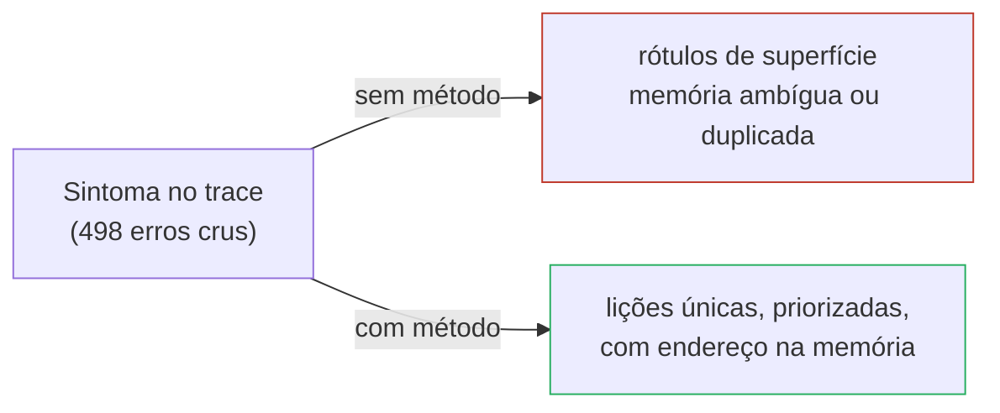
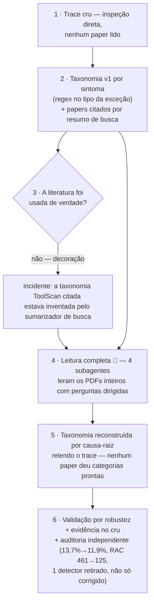
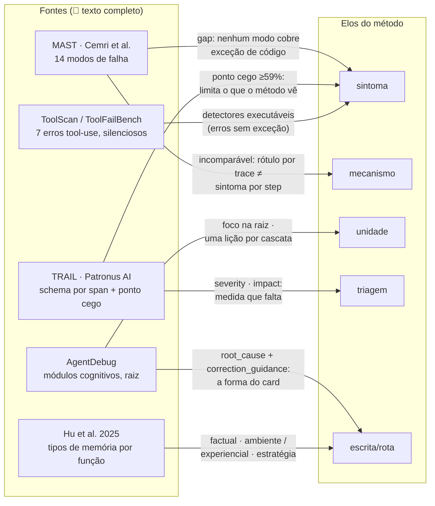
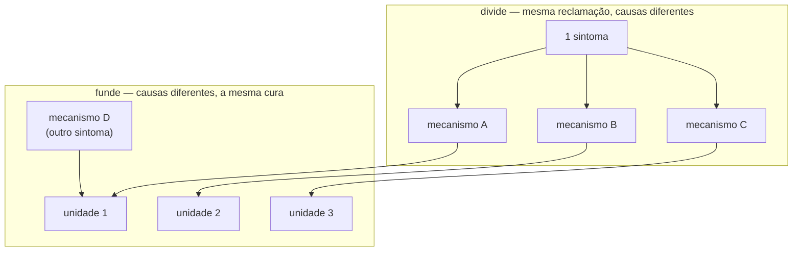
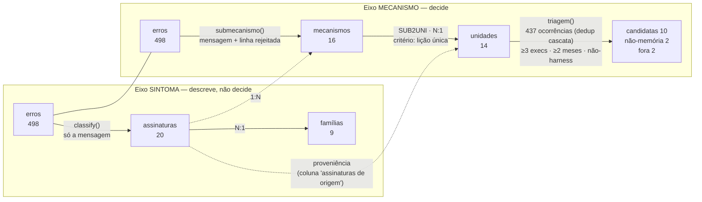
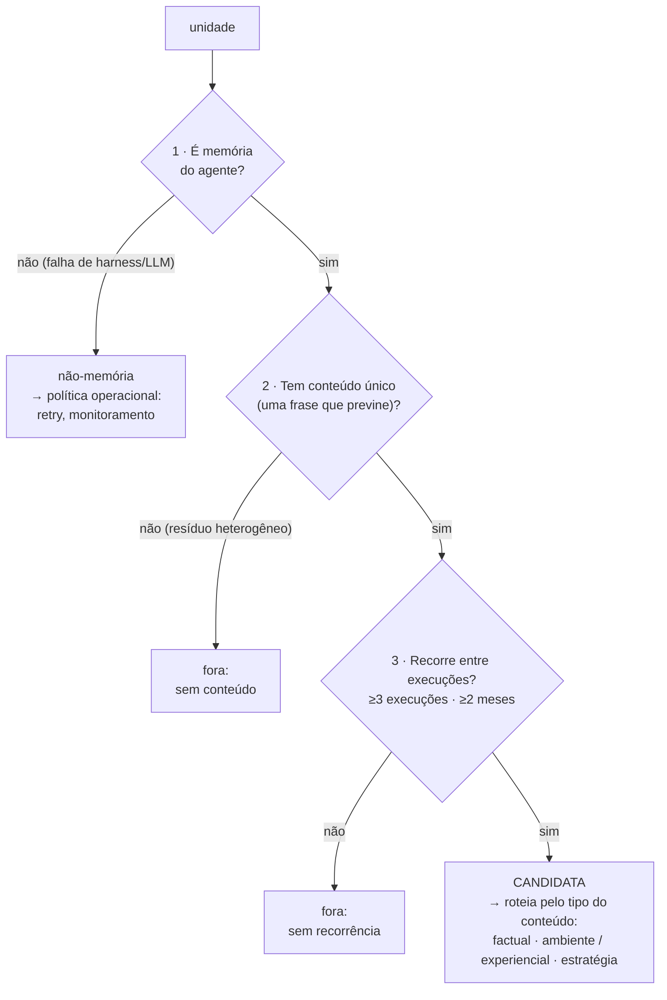
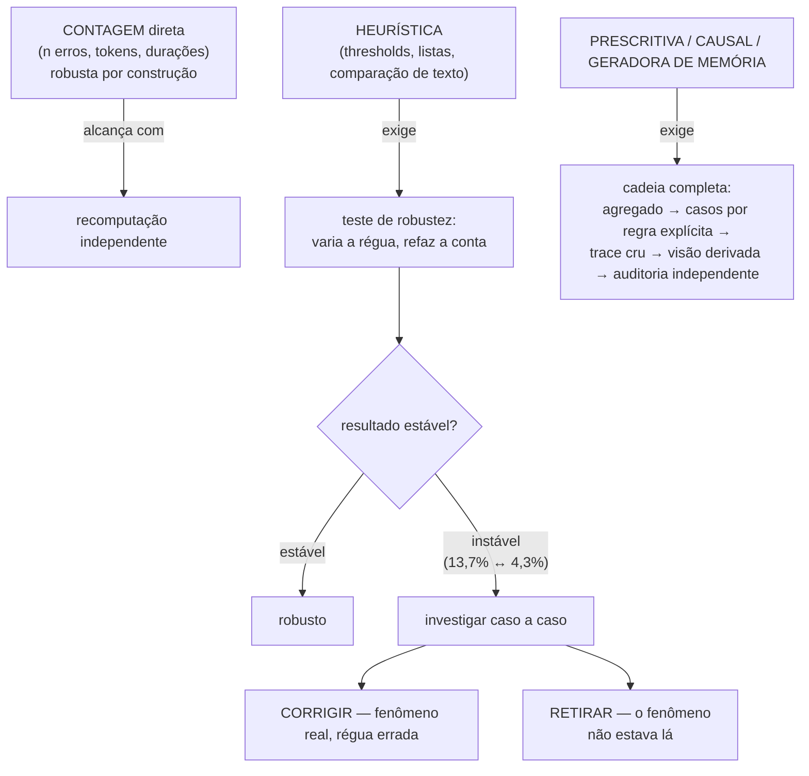
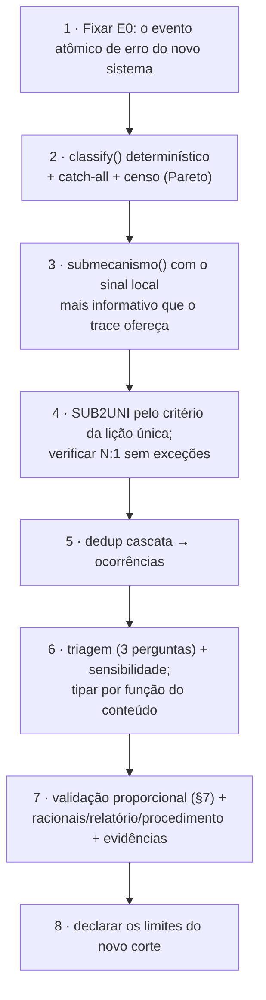

# Metodologia geral — do erro bruto à candidata de memória

**Hipótese de método (big picture).** Este é o documento
*genérico*: abstrai a metodologia de taxonomia de erros em elos, perguntas e
racionais que valem para qualquer análise futura. A *instanciação* concreta no
trace da esteira jurídica (funções, números, gráficos) é o doc 09 da própria
análise:
[`analysis/2026-09-trace-law-flow/docs/09-metodologia-erro-a-memoria.md`](../../../analysis/2026-09-trace-law-flow/docs/09-metodologia-erro-a-memoria.md)
— método aqui, evidência lá.

> **Resumo.** Sistemas de agentes sem memória persistente redescobrem as mesmas
> falhas em cada execução. Transformar falhas registradas em memória útil exige
> uma taxonomia — mas taxonomia boa não é rótulo bonito: é **roteamento**. Este
> documento define um método em cinco elos — granularidade, sintoma, mecanismo,
> unidade, triagem — no qual cada erro bruto é roteado, por regras
> determinísticas e reabíveis no dado cru, até a menor lição reutilizável que o
> evitaria (ou até fora da memória). A contribuição central é a **genealogia de
> erros**: dois eixos paralelos de classificação (o que o sistema reclamou × o
> que o agente fez de errado) que se **dividem** (sintoma 1:N mecanismos) e se
> **fundem** (mecanismos N:1 unidade) até convergir numa decisão de escrita.
> A taxonomia nasce do trace, é testada contra a literatura (não copiada dela),
> e cada afirmação recebe validação proporcional à sua força.

---

## 1. Propósito e pergunta

**Problema.** Um erro bruto (`KeyError: 'quebra_sigilo'`) não é, por si só, uma
lição. Rotular erros pelo que o interpretador reclama produz grupos
heterogêneos que contaminam qualquer memória escrita a partir deles.

**Pergunta-guia** (a mesma do `analysis/README.md`):

> Que conhecimento reutilizável, extraído de falhas repetidas no trace cru,
> deve ser persistido, operacionalizado ou explicitamente mantido fora do
> agente, para que o sistema pare de redescobrir a mesma lição a cada execução?

**Por que isso é hipótese de arquitetura, não só de análise.** A taxonomia é o
elo entre a captura de sinal e a escrita na memória da arquitetura
knowledge-as-infra: é ela que decide **para onde cada falha roteia** (memória
factual, memória experiencial, política de harness, descarte). Sem esse
roteamento, a memória acumula ruído de superfície.

**Motivação empírica** (instanciação): no trace da esteira jurídica, 86,3% das
mensagens de erro comprovadamente chegam ao contexto do passo seguinte — e em
11,9% desses casos o agente reincide na mesma categoria de erro (13,5% por
mecanismo). O feedback dentro da trajetória existe, é lido, e não basta. Nove
meses de dados sem queda de custo por execução completam o argumento: sem
mecanismo ativo de memória, o sistema não melhora sozinho.

---

## 2. Gênese — como a metodologia foi construída, e por que a ordem importa

A ordem real de construção **inverte a ordem que pareceria natural** — e essa
inversão é parte do método, não um acidente:

**O que a literatura de fato fez** — três coisas, nenhuma delas "dar a
taxonomia":

| Papel da literatura | Exemplo real |
|---|---|
| **Testar** o mapeamento contra taxonomias externas (a maioria não se sustentou) | O MAST não tem modo de falha para "o código levantou exceção" — a família dominante do trace cai fora do escopo dele **por construção** |
| **Sugerir** análises ainda não rodadas | AgentDebug → checar se o erro chega ao step seguinte (virou o achado central); TRAIL → detectores de falha silenciosa |
| **Dar vocabulário e princípios** | Hu et al. 2025 §4 → tipagem factual/experiencial; AgentDebug → foco na raiz, não no sintoma de superfície |

**Por que essa ordem é o caminho certo:** uma taxonomia importada por
autoridade esconde o que é específico do sistema estudado (aqui: arquitetura
CodeAgent, ação = código executável). Começar pelo dado e usar a literatura
como bancada de testes permite dizer **onde a taxonomia própria se encaixa, o
que ela expõe que a literatura não previu, e o que falta olhar** — em vez de
forçar o dado em caixinhas alheias.

---

## 3. Fundamentação — o que cada fonte empresta (e o que nenhuma cobre)

Nível de leitura na escala de `papers/reading-queue.md`: **🔎** = texto
completo lido por subagente, extração dirigida, bibliografia conferida contra o
PDF. Não colapsar em "lido" (✅) em nenhum lugar.

| Fonte | Empresta | Não cobre / correção que produziu |
|---|---|---|
| **MAST** (arXiv 2503.13657) | Referência externa de modos de falha multiagente | Sem modo para exceção de código — justifica o eixo de mecanismo próprio |
| **TRAIL** (arXiv 2505.08638) | Schema de anotação (`category/location/evidence/description/impact`); mede o ponto cego: ≥59% dos erros não levantam exceção | Cobertura exaustiva sem hierarquia causal; `impact` revela a lacuna de severidade do nosso método |
| **AgentDebug** (arXiv 2509.25370) | Princípio raiz>não sintoma (confirmado por ablação no paper); política "uma unidade por cascata, na raiz"; Stage 2 = `root_cause` + `correction_guidance` — forma candidata do card de memória | **Não** propõe tipos de memória nem roteamento módulo→tipo (overclaim próprio corrigido em 14/09 em três arquivos — ver `teoria/agentdebug-vs-trail-error-taxonomy.md`) |
| **ToolScan / ToolFailBench** (ICLR 2025 WS / ICML 2026 WS) | 7 erros de tool-use; 4 modos silenciosos; tabela de detectores traduzíveis ao paradigma CodeAgent | Taxonomia citada na v1 **não existe no paper** — lição disciplinar: citação decorativa é pior que nenhuma |
| **Hu et al. 2025** (arXiv 2512.13564, §4) | A régua de **tipagem por função do conteúdo**: factual (*"What does the agent know?"*) × experiencial (*"How does the agent improve?"*) | Classifica memória *do agente* — harness/infra fica fora, virando a categoria não-memória |
| Zhang et al. (survey) | O gap cross-trial ∩ controlled-forgetting que este projeto endereça | Citado via nota própria (`teoria/cross-trial-vs-forgetting-gap.md`), não como leitura direta aqui |

---

## 4. O núcleo — a genealogia de erros

### 4.1 Cinco elos, cinco perguntas

| Elo | Pergunta que responde | Saída | Papel na memória |
|---|---|---|---|
| **E0 · Granularidade** | O que conta como 1 evento de erro? | eventos extraídos do trace | — (define a base de contagem) |
| **E1 · Sintoma** | O que o sistema reclamou? | família + assinatura | **chave de proveniência/busca** — *não decide* |
| **E2 · Mecanismo** | O que o agente fez de errado? | causa, erro a erro | **diagnóstico** — desambigua o sintoma |
| **E3 · Unidade** | Uma lição só previne todos os erros do grupo? | agrupamento de mecanismos | **conteúdo** — o card em si, um fato/regra por unidade |
| **E4 · Triagem** | Merece persistir? Onde a correção vive? | candidata / não-memória / fora | **decisão** — não é um nível da taxonomia |

### 4.2 Dois eixos paralelos, não uma árvore

Sintoma (E1) e mecanismo (E2) têm **papéis independentes — descrever ×
decidir** —, mas não são duas leituras estatisticamente independentes: na
instanciação, compartilham a mesma porta de entrada (o texto da mensagem) e
boa parte do dispatch inicial. O que é genuinamente novo no eixo mecanismo é
o **salto de evidência local**: ele lê um sinal a mais que o sintoma nunca
toca (no CodeAgent: a linha de código que o parser rejeitou). É a
independência de *papel*, não de código, que impede fundir os dois — censo e
custo se perguntam ao sintoma; conteúdo de memória se pergunta ao mecanismo.
A relação entre os pontos de chegada é muitos-para-muitos nos dois sentidos;
uma árvore não a representaria:

- **Mesmo sintoma → mecanismos diferentes** (divide): a mesma reclamação
  esconde causas com consertos diferentes. Só um sinal local mais fino (no
  CodeAgent: a linha de código rejeitada) separa.
- **Mecanismos diferentes → mesma lição** (funde): causas distintas na
  superfície podem denunciar a mesma lacuna — uma memória só previne as duas.

Consequência arquitetural: o eixo sintoma **não alimenta a decisão**. Ele é a
camada de **descrição, proveniência e descoberta** — o censo dos sintomas, a
trilha de auditoria, e o catch-all ("Não classificado") que flaga erro novo
numa extração maior. Quem decide é o eixo mecanismo.

### 4.3 As cardinalidades — o desenho é dividir, depois fundir

| Aresta | Cardinalidade | Por quê |
|---|---|---|
| sintoma → mecanismo | **1:N** | o mesmo sinal de superfície admite causas diferentes; é o ponto onde a taxonomia se **abre** |
| mecanismo → unidade | **N:1** | causas diferentes com a mesma cura convergem; é o ponto onde a taxonomia se **fecha** |
| unidade → decisão | **N:1** | a triagem decide pela unidade **global**, não por (contexto × unidade) |
| assinatura → família | N:1 (por construção) | 0 exceções na instanciação |

A **unidade é o ponto de reconvergência**: o critério de fechamento não é
linguístico nem estatístico — é **operacional** ("uma memória só resolveria
todos?"). É o que torna a taxonomia uma **genealogia** e não uma classificação
ornamental: cada erro tem um caminho único, verificável, até a lição que o
teria evitado.

### 4.4 A genealogia completa, com contagens da instanciação

A versão com **contagem real por nó e por aresta** — o Sankey família →
assinatura → mecanismo → unidade → decisão, cada estágio somando os 498 erros
da instanciação — está no
[doc 09 da análise](../../../analysis/2026-09-trace-law-flow/docs/09-metodologia-erro-a-memoria.md)
(§1.1): esta figura é o *template* dos níveis; aquela é a *evidência* das arestas.

Duas medidas convivem em todos os elos e **não se confundem**: **contagem**
(frequência — o que mais ocorre) × **tokens desperdiçados** (custo — o que mais
dói). Na instanciação: `U_texto_solto` tem 33 erros (frequência média) e 1,39M
tokens (3º mais caro). Falta uma terceira: **severidade da consequência** — o
campo `impact` do TRAIL, lacuna declarada (§8).

---

## 5. Cada elo — operação, racional, alternativa rejeitada

### E0 · Granularidade — "o que conta como um erro"

| | |
|---|---|
| **Operação** | Fixar o evento atômico antes de qualquer contagem (instanciação: um `ActionStep` com `error` preenchido) |
| **Racional** | Step ≠ falha ≠ execução: um evento pode ser repetição em cascata de um problema contínuo (§E4b). Contar antes de definir a unidade de contagem fabrica números |
| **Alternativa rejeitada** | Contar execuções com erro (perde a recorrência dentro da trajetória) ou mensagens distintas (perde propagação) |

### E1 · Sintoma — classificação de superfície, determinística

| | |
|---|---|
| **Operação** | Regras sobre o texto da mensagem (`classify()`), em ordem, com balde catch-all |
| **Racional** | Regra determinística é **reabível**: qualquer rótulo se triangula ao caso cru (`exec_id` + drill-down). Sem LLM: classificador neural seria mais uma afirmação a validar, não uma base para validar |
| **Alternativa rejeitada** | LLM-as-judge por erro (o TRAIL o usa para anotação exaustiva — adequado lá, inadequado como fundação de uma taxonomia que precisa ser auditável) |
| **Saída extra** | O catch-all ("Não classificado") é o detector de **erro novo** em extrações futuras — a taxonomia sabe o que não conhece |

### E2 · Mecanismo — a leitura mais fina disponível *no próprio trace*

| | |
|---|---|
| **Operação** | Regras sobre a mensagem **mais o sinal local mais informativo** (no CodeAgent: a linha de código que o parser rejeitou — `linha_rejeitada()`); classifica cada erro individualmente |
| **Racional** | O sintoma é o que o sistema *disse*; o mecanismo exige o que o agente *fez*. Entre os dois há exatamente um salto de evidência — buscar esse salto onde o trace já o registra, sem inferir intenção |
| **Alternativa rejeitada** | Classificar pelo `thought` do agente (método do AgentDebug: módulo cognitivo de origem). Rejeitado aqui por escopo — o *thought* é escrito **antes** do código rodar, e a pergunta deste método é "que conteúdo evitaria o erro", não "em qual módulo ele nasceu". São lentes compatíveis, não rivais |
| **Racional do nível** | Sem o mecanismo, a mesma assinatura alimentaria lições contraditórias (§6); com ele, cada erro ganha um diagnóstico contável e falsificável |

### E3 · Unidade — a lição como operador de fechamento

| | |
|---|---|
| **Operação** | Mapa função `mecanismo → unidade` (SUB2UNI, N:1 puro): dois mecanismos se fundem **somente se** a mesma frase de memória previne ambos |
| **Racional** | É o elo que transforma inventário de falhas em catálogo de conhecimento. A pergunta "uma memória só?" é verificável: escreva a frase; se ela precisa de disjunção ("pode ser X ou Y"), não é uma unidade |
| **Exemplo real (fusão)** | `inventario_sandbox` (usou `dir`/`globals`/`openpyxl` ausente) + `modulo_sem_import` (`json`/`datetime` sem importar) → **U_sandbox**: erros distintos na superfície, mesma lacuna (o agente não conhece o inventário do sandbox), um só card |
| **Tipo virá da função do conteúdo** | factual · ambiente (checável contra o sistema) / experiencial · estratégia (regra destilada) / não-memória (Hu et al. §4 — ver §E5b) |

### E4a · Ocorrência — deduplicar a cascata

| | |
|---|---|
| **Operação** | Erros em steps consecutivos do mesmo papel na mesma execução formam uma **cascata**; a mesma unidade repetida dentro dela conta **uma ocorrência** (instanciação: 498 erros → 437 ocorrências) |
| **Racional** | Contar erros pune as unidades que o agente repete em laço e infla recorrência aparente. O princípio (focar a raiz) é do AgentDebug; a operacionalização por cascata consecutiva é nossa |
| **Exemplo real** | Incidente de dez/2025: uma execução com **10 erros seguidos** da mesma unidade — contam 1 ocorrência, não 10 votos |

### E4b/E5 · Triagem — três perguntas, na mesma ordem para todas

| Pergunta | Racional do threshold | Custo de errar |
|---|---|---|
| É memória do agente? | Se quem falhou foi o harness/LLM upstream, o agente não tem o que aprender — escrever memória aqui seria ruído | falso positivo: lição irrelevante para o modelo |
| Tem conteúdo único? | Memória é uma frase ensinável; heterogêneo residual não tem uma | memória ambígua, pior que nenhuma |
| Recorre? | Memória **entre** execuções só se justifica se o problema atravessa execuções e meses (senão é episódico, não estrutural) | escrever para exceções que não voltam |

**E os thresholds são escolhas testadas, não verdades:** o teste de
sensibilidade (≥5 execuções, ≥3 meses) moveu exatamente uma unidade de lado na
instanciação — marcada **limítrofe** e lida com esse asterisco, não escondida.

### E5b · Roteamento final — onde cada correção vive

| Decisão | Rota | Instanciação |
|---|---|---|
| candidata · factual · ambiente | card de fato do ambiente, **checável contra o sistema** (schema de retorno, assinatura de ferramenta) | "Ferramentas de documento retornam `{'result': [[...]]}` — acesse `r['result'][0]`" |
| candidata · experiencial · estratégia | card de regra de ação, validável só observando se o erro para de voltar | "Montar relatório em variáveis; nunca texto longo dentro de literal" |
| não-memória | política operacional no harness/infra (retry, circuit breaker, gatilho de monitoramento) | `AgentGenerationError`/422 → retry com backoff |
| fora | nada escrito; registrado só como estatística | erros pontuais, sem recorrência |

---

## 6. Por que a memória vive na unidade — o argumento central

**Tese:** o nível correto de escrita é a unidade; escrever por sintoma falha em
dois sentidos opostos, simultaneamente.

Contra-exemplo da instanciação — a assinatura "Could not index" (136 erros)
contra a unidade `U_contrato_dict`:

| Se a memória fosse escrita por... | Defeito |
|---|---|
| ...**assinatura** "Could not index" | **Ambígua e diluída**: cobre 3 mecanismos com 3 consertos diferentes — vira checklist ("pode ser dict, ou string, ou chave inexistente") em vez de fato ensinável. E a chave é **não-injetiva**: nem roteamento determinístico é possível sem re-rodar o mecanismo |
| ...**assinatura** "Objeto sem atributo" | **Duplicada**: o conserto é o mesmo de outra assinatura — a lição fica escrita em dois cards, com custo dobrado e risco de divergirem |
| ...um **card genérico** ("inspecione tipo antes de indexar") | Preveniria tudo — e perderia exatamente o que o trace fornece de único: **os fatos específicos do ambiente** (o contrato `{'result': [[...]]}`, as chaves reais como `vazamento_sigilo`). Conselho genérico é o que a memória já daria **sem dados** |

O valor do método inteiro está nesse equilíbrio: **granular o suficiente para
ser ensinável, fundido o suficiente para ser uma lição só** — e concreto porque
nasce do trace, não de intuição.

---

## 7. Validação — profundidade proporcional à força da afirmação

Nem toda afirmação precisa do mesmo pacote de evidência. A régua é a escada:

Três instrumentos transversais:

| Instrumento | O que é | Exemplo real |
|---|---|---|
| **Reabibilidade total** | qualquer número volta ao caso cru por chave estável (`exec_id` + drill-down); derive → write → check | `drill_down.py` regrava os crus e confere cada trecho contra a linha bruta ao escrever |
| **Fonte autoritativa dentro do próprio trace** | antes de construir uma heurística, perguntar se o próprio dado já declara a resposta | inventário de ferramentas: lista "observada" de 43 × lista **declarada no system prompt** de 90 — o trace continha a lista oficial; o palpite tinha confundido funções auxiliares do agente (`grab`, `get_meta`) com ferramentas |
| **Corrigir × retirar** | robustez falha tem dois desfechos distintos | corrigir: "reincide" 13,7%→11,9% (régua melhor); retirar: "reasoning-action mismatch" — os 45 casos lidos um a um, nenhum era contradição (o *thought* é escrito antes do código rodar: não podia se contradizer por lógica, não por calibração) |

---

## 8. Limites declarados

O método deve dizer, na frente, o que por construção não vê:

1. **Só entra erro que levanta exceção.** Pelo TRAIL, ≥59% dos erros de agentes
   não levantam exceção (falha silenciosa: código que roda e entrega errado).
   O ponto cego é medido e tem detectores projetados — mas não faz parte da
   genealogia.
2. **O eixo sintoma não é descrição neutra.** Na instanciação, os nomes de
   família já carregam carga causal ("Contrato de retorno da ferramenta" é
   interpretação, não superfície pura). Ler o eixo sintoma como **descrição
   assistida**, não como rótulo neutro — e aceitar que renomear as famílias
   custaria inviabilizar os rótulos já circulando nos relatórios.
3. **Não lê intenção.** Classifica pelo que o trace *mostra* (mensagem + linha
   rejeitada), não pelo raciocínio do agente. Responde "que conteúdo evitaria",
   não "em qual módulo cognitivo nasceu" (lente complementar: AgentDebug).
4. **Sem severidade.** Frequência × custo em tokens existem; `impact` (TRAIL)
   não — 223 `SyntaxError` recuperáveis hoje pesam como uma alucinação rara e
   cara.
5. **Cascata olha um step.** Estado perdido dois steps atrás aparece como
   outra unidade; é aproximação declarada.
6. **Thresholds são escolhas com teste de sensibilidade**, não constantes.

---

## 9. Instanciar em um trace novo — o que permanece, o que muda

| Tipo | Permanece igual | Muda por instanciação |
|---|---|---|
| perguntas | as 5 dos elos (§4.1) | — |
| forma | dois eixos paralelos; divide-depois-funde; cardinalidades | — |
| regra | deterministicidade + reabibilidade; catch-all como descoberta | — |
| critério de fechamento | "uma memória só previne?" | — |
| validação | a escada do §7; fonte autoritativa antes de heurística | — |
| material | — | regexes, listas (stopwords, módulos), sinal local (linha rejeitada ↔ o que o novo trace registra), thresholds, tipos aplicáveis |
| escopo | — | o que o novo trace registra por evento; o ponto cego específico |

---

## 10. Terminologia fixada

| Termo | É | Não é |
|---|---|---|
| família / assinatura | saída do sintoma (E1) — descrição, proveniência, descoberta | não alimenta a decisão |
| mecanismo | saída do diagnóstico (E2) — a causa, erro a erro | ainda não é a lição |
| unidade | agrupamento de mecanismos por lição comum (E3) | não é automaticamente candidata |
| ocorrência | unidade deduplicada dentro da cascata (E4a) | não é "um erro" |
| candidata | unidade que passou a triagem (E5) | **decisão**, não nível da taxonomia |
| não-memória | correção fora do agente (harness/infra/retry) | não é lição descartada — vive em política operacional |

Armadilha a evitar, herdada da instanciação: o conjunto de unidades inclui
agrupamentos que por construção **nunca** viram memória (`H_*`, `X_*`). Em
contexto descritivo, ler "unidade" como "tipo de erro agrupado".

---

## Referências (nível de leitura: 🔎, salvo indicado)

- Cemri et al. — *Why Do Multi-Agent LLM Systems Fail?* (MAST), arXiv 2503.13657,
  NeurIPS 2025 D&B — fichamento: `analysis/2026-09-trace-law-flow/literature/mast-2503.13657.md`
- *TRAIL* — arXiv 2505.08638 (Patronus AI) — fichamento:
  `literature/trail-2505.08638.md`
- *AgentDebug* — arXiv 2509.25370 — fichamento:
  `literature/agentdebug-2509.25370.md`
- ToolScan/SpecTool (Salesforce, ICLR 2025 WS) + ToolFailBench (ICML 2026 WS) —
  fichamento: `literature/tool-use-errors.md`
- Hu, Liu et al. — *Memory in the Age of AI Agents* (survey), arXiv 2512.13564,
  §4 — trechos conferidos no PDF em 15/09/2026
- Zhang et al. (survey) — via nota
  [`teoria/cross-trial-vs-forgetting-gap.md`](../../teoria/cross-trial-vs-forgetting-gap.md),
  não como leitura direta

*Instanciação completa (pipeline, funções, números, gráficos):*
[`analysis/2026-09-trace-law-flow/docs/09-metodologia-erro-a-memoria.md`](../../../analysis/2026-09-trace-law-flow/docs/09-metodologia-erro-a-memoria.md).
