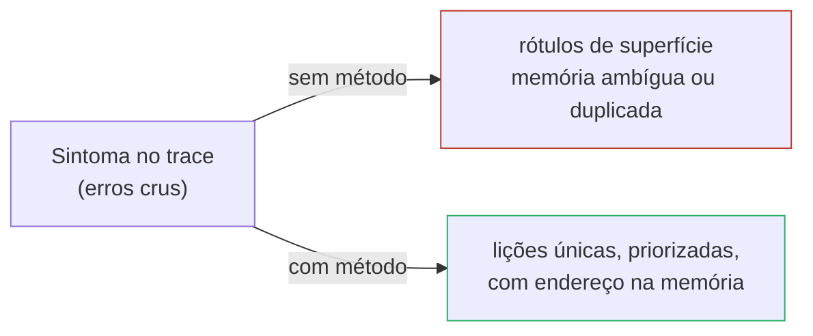
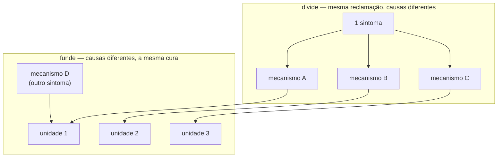
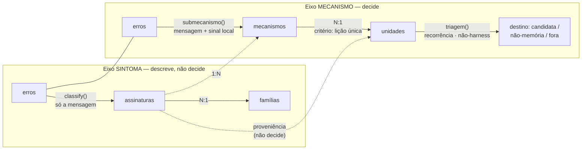
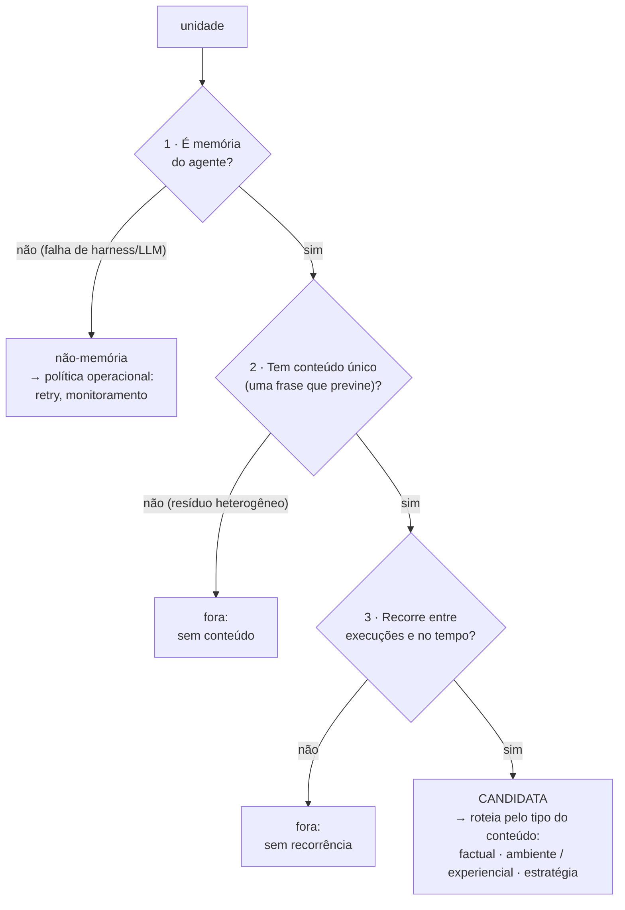
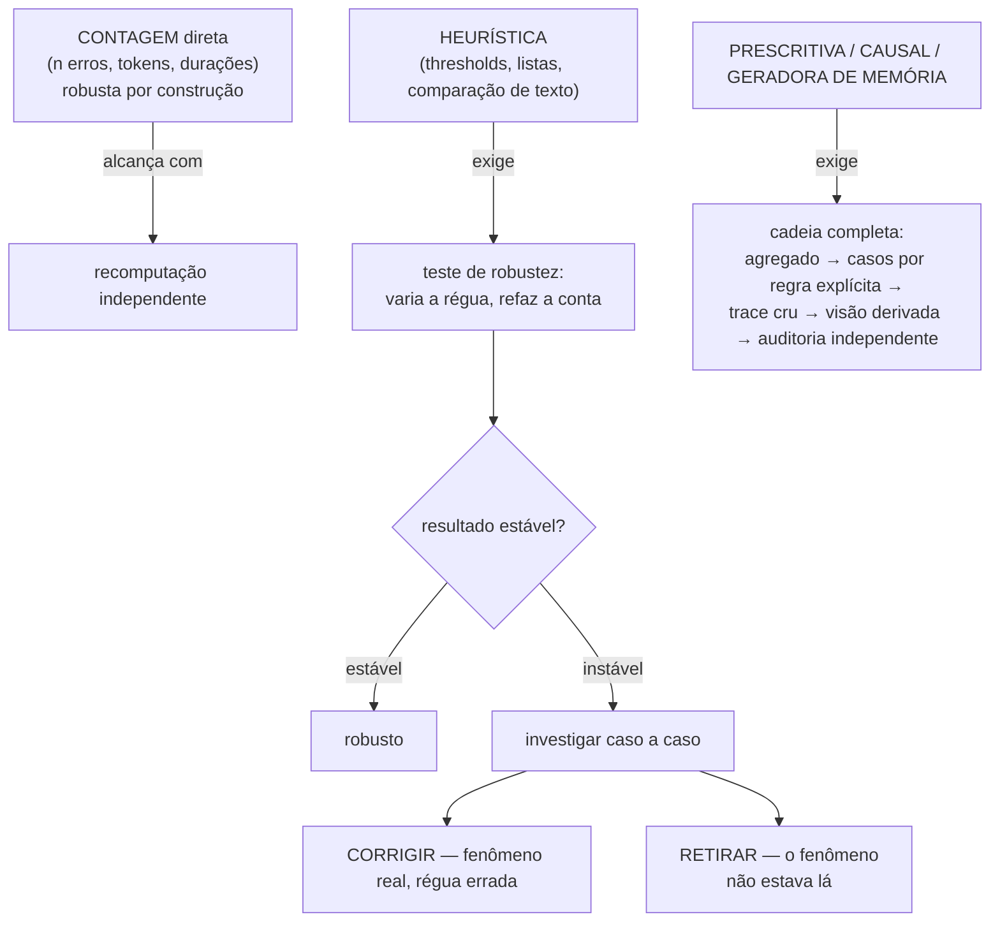
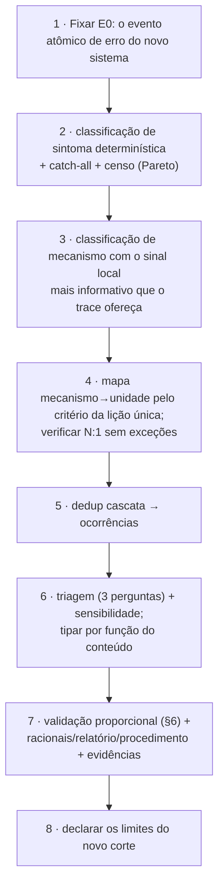

# Metodologia geral — do erro bruto à candidata de memória

**Hipótese de método (big picture).** Este é o documento
*genérico*: abstrai a metodologia de taxonomia de erros em elos, perguntas e
racionais que valem para qualquer análise futura. A *instanciação* concreta no
trace da esteira jurídica (funções, números, gráficos) é o doc 09 da própria
análise:
[`analysis/2026-09-trace-law-flow/docs/09-metodologia-erro-a-memoria.md`](../../../analysis/2026-09-trace-law-flow/docs/09-metodologia-erro-a-memoria.md)
— método aqui, evidência lá.

> **Resumo.** Sistemas de agentes sem memória persistente redescobrem as mesmas
> falhas em cada execução. Transformar falhas registradas em memória útil exige
> uma taxonomia — mas taxonomia boa não é rótulo bonito: é **roteamento**. Este
> documento define um método em cinco elos — granularidade, sintoma, mecanismo,
> unidade, triagem — no qual cada erro bruto é roteado, por regras
> determinísticas e reabíveis no dado cru, até a menor lição reutilizável que o
> evitaria (ou até fora da memória). A contribuição central é a **genealogia de
> erros**: dois eixos paralelos de classificação (o que o sistema reclamou × o
> que o agente fez de errado) que se **dividem** (sintoma 1:N mecanismos) e se
> **fundem** (mecanismos N:1 unidade) até convergir numa decisão de escrita.
> A taxonomia nasce do trace, é testada contra a literatura (não copiada dela),
> e cada afirmação recebe validação proporcional à sua força.

---

## 1. Propósito e pergunta

**Problema.** Um erro bruto (`KeyError: 'quebra_sigilo'`) não é, por si só, uma
lição. Rotular erros pelo que o interpretador reclama produz grupos
heterogêneos que contaminam qualquer memória escrita a partir deles.

**Pergunta-guia** (a mesma do `analysis/README.md`):

> Que conhecimento reutilizável, extraído de falhas repetidas no trace cru,
> deve ser persistido, operacionalizado ou explicitamente mantido fora do
> agente, para que o sistema pare de redescobrir a mesma lição a cada execução?

**Por que isso é hipótese de arquitetura, não só de análise.** A taxonomia é o
elo entre a captura de sinal e a escrita na memória da arquitetura
knowledge-as-infra: é ela que decide **para onde cada falha roteia** (memória
factual, memória experiencial, política de harness, descarte). Sem esse
roteamento, a memória acumula ruído de superfície. (A motivação empírica —
por que o feedback dentro da trajetória não basta sozinho — está na
instanciação, doc 09.)

---

## 2. Por que a ordem de construção importa

A ordem certa **inverte a intuição**: começar pelo trace cru, só depois testar
contra a literatura — não o contrário. Importar uma taxonomia por autoridade
externa esconde o que é específico do sistema estudado; usar a literatura como
**bancada de teste** (nunca como fonte de categorias prontas) é o que permite
dizer onde a taxonomia própria se encaixa, o que ela expõe que a literatura
não previu, e o que falta olhar — em vez de forçar o dado em caixinhas alheias.

Nesse papel, a literatura só faz três coisas: **testa** o mapeamento contra
taxonomias externas, **sugere** análises ainda não rodadas, e **dá vocabulário**
para nomear o que o trace já mostrava. Nunca "dá a taxonomia" pronta — se desse,
o método seria importação, não genealogia. A fundamentação bibliográfica
específica de cada instanciação (quais fontes, o que cada uma testa/sugere/
empresta) fica registrada junto da análise que a usou, não aqui — o método
abstrato não depende de nenhum paper específico.

---

## 3. O núcleo — a genealogia de erros

### 3.1 Cinco elos, cinco perguntas

| Elo | Pergunta que responde | Saída | Papel na memória |
|---|---|---|---|
| **E0 · Granularidade** | O que conta como 1 evento de erro? | eventos extraídos do trace | — (define a base de contagem) |
| **E1 · Sintoma** | O que o sistema reclamou? | família + assinatura | **chave de proveniência/busca** — *não decide* |
| **E2 · Mecanismo** | O que o agente fez de errado? | causa, erro a erro | **diagnóstico** — desambigua o sintoma |
| **E3 · Unidade** | Uma lição só previne todos os erros do grupo? | agrupamento de mecanismos | **conteúdo** — o card em si, um fato/regra por unidade |
| **E4 · Triagem** | Merece persistir? Onde a correção vive? | candidata / não-memória / fora | **decisão** — não é um nível da taxonomia |

### 3.2 Dois eixos paralelos, não uma árvore

Sintoma (E1) e mecanismo (E2) têm **papéis independentes — descrever ×
decidir** —, mas não são duas leituras estatisticamente independentes: numa
instanciação típica, os dois costumam compartilhar a mesma porta de entrada
(o texto da mensagem) e boa parte do dispatch inicial. O que é genuinamente
novo no eixo mecanismo é o **salto de evidência local**: ele lê um sinal a
mais que o sintoma nunca toca (por exemplo, num agente que executa código: a
linha rejeitada pelo parser). É a independência de *papel*, não de código, que
impede fundir os dois — censo e custo se perguntam ao sintoma; conteúdo de
memória se pergunta ao mecanismo. A relação entre os pontos de chegada é
muitos-para-muitos nos dois sentidos; uma árvore não a representaria:

- **Mesmo sintoma → mecanismos diferentes** (divide): a mesma reclamação
  esconde causas com consertos diferentes. Só um sinal local mais fino separa.
- **Mecanismos diferentes → mesma lição** (funde): causas distintas na
  superfície podem denunciar a mesma lacuna — uma memória só previne as duas.

Consequência arquitetural: o eixo sintoma **não alimenta a decisão**. Ele é a
camada de **descrição, proveniência e descoberta** — o censo dos sintomas, a
trilha de auditoria, e o catch-all que flaga erro novo numa extração maior.
Quem decide é o eixo mecanismo.

### 3.3 As cardinalidades — o desenho é dividir, depois fundir

| Aresta | Cardinalidade | Por quê |
|---|---|---|
| sintoma → mecanismo | **1:N** | o mesmo sinal de superfície admite causas diferentes; é o ponto onde a taxonomia se **abre** |
| mecanismo → unidade | **N:1** | causas diferentes com a mesma cura convergem; é o ponto onde a taxonomia se **fecha** |
| unidade → decisão | **N:1** | a triagem decide pela unidade **global**, não por (contexto × unidade) |
| assinatura → família | N:1 (por construção) | a classificação de sintoma é hierárquica por desenho |

A **unidade é o ponto de reconvergência**: o critério de fechamento não é
linguístico nem estatístico — é **operacional** ("uma memória só resolveria
todos?"). É o que torna a taxonomia uma **genealogia** e não uma classificação
ornamental: cada erro tem um caminho único, verificável, até a lição que o
teria evitado.

### 3.4 A genealogia completa, como forma

Essa figura é o *template* dos níveis — a forma que qualquer instanciação
segue. A versão com **contagem real por nó e aresta** (o Sankey de uma
instanciação específica) é *evidência*, não método: está no
[doc 09 da análise](../../../analysis/2026-09-trace-law-flow/docs/09-metodologia-erro-a-memoria.md)
§1.1.

Duas medidas convivem em todos os elos e **não se confundem**: **contagem**
(frequência — o que mais ocorre) × **custo** (o que mais dói — em tokens,
latência, ou a métrica que a instanciação usar). As duas podem discordar sobre
qual unidade priorizar primeiro; ver a instanciação para um exemplo real. Falta
uma terceira medida em geral: **severidade da consequência** do erro, não só
sua frequência ou custo (lacuna declarada em §7).

---

## 4. Cada elo — operação, racional, alternativa rejeitada

### E0 · Granularidade — "o que conta como um erro"

| | |
|---|---|
| **Operação** | Fixar o evento atômico antes de qualquer contagem (ex.: um passo de execução com um campo de erro preenchido) |
| **Racional** | Step ≠ falha ≠ execução: um evento pode ser repetição em cascata de um problema contínuo (§E4b). Contar antes de definir a unidade de contagem fabrica números |
| **Alternativa rejeitada** | Contar execuções com erro (perde a recorrência dentro da trajetória) ou mensagens distintas (perde propagação) |

### E1 · Sintoma — classificação de superfície, determinística

| | |
|---|---|
| **Operação** | Regras sobre o texto da mensagem, em ordem, com balde catch-all |
| **Racional** | Regra determinística é **reabível**: qualquer rótulo se triangula ao caso cru. Sem LLM: classificador neural seria mais uma afirmação a validar, não uma base para validar |
| **Alternativa rejeitada** | LLM-as-judge por erro (adequado para anotação exaustiva com revisão humana; inadequado como fundação de uma taxonomia que precisa ser auditável sem custo por chamada) |
| **Saída extra** | O catch-all é o detector de **erro novo** em extrações futuras — a taxonomia sabe o que não conhece |

### E2 · Mecanismo — a leitura mais fina disponível *no próprio trace*

| | |
|---|---|
| **Operação** | Regras sobre a mensagem **mais o sinal local mais informativo que o trace ofereça**; classifica cada erro individualmente |
| **Racional** | O sintoma é o que o sistema *disse*; o mecanismo exige o que o agente *fez*. Entre os dois há exatamente um salto de evidência — buscar esse salto onde o trace já o registra, sem inferir intenção |
| **Alternativa rejeitada** | Classificar pelo raciocínio do agente (módulo cognitivo de origem). Rejeitado por escopo — o raciocínio é escrito **antes** da ação acontecer, e a pergunta deste método é "que conteúdo evitaria o erro", não "em qual módulo ele nasceu". São lentes compatíveis, não rivais |
| **Racional do nível** | Sem o mecanismo, o mesmo sintoma alimentaria lições contraditórias (§5); com ele, cada erro ganha um diagnóstico contável e falsificável |

### E2b · O resíduo — o que nenhuma regra reconhece, em dois baldes

Todo classificador por regras tem uma sobra. Aqui ela tem **dois baldes**, porque as duas leituras (E1 e E2) podem
falhar de formas diferentes, e cada falha pede um trabalho diferente:

| Balde | Quando | O que pede |
|---|---|---|
| **Sintoma não reconhecido** | nem E1 nem E2 reconhecem a mensagem | a taxonomia não cobre esse erro: alarme de **cobertura**. Escrever regra de sintoma primeiro, depois de causa |
| **Causa não identificada** | E1 reconhece o sintoma, E2 não identifica a causa | metade do caminho feita: escrever só a regra de causa. Inclui o código malformado (sintaxe) — ruído até se provar recorrente |

Cada erro cai em **no máximo um** balde. A combinação das duas leituras acontece num único ponto, o fechamento da
unidade (E3), e **só para o resíduo** — é a única exceção à regra de que o sintoma não decide (§9). "Causa não
identificada" descreve a **regra**, não o erro: não significa que ele aconteceu uma vez só. Ler o tamanho de cada
balde é parte do relato de cobertura de uma instanciação; ambos nunca viram memória por construção, e por isso a
**limitação a corrigir** é que hoje saem da triagem antes do teste de recorrência (E4b) — um erro desconhecido que
se repete muito fica invisível como prioridade.

### E3 · Unidade — a lição como operador de fechamento

| | |
|---|---|
| **Operação** | Mapa função `mecanismo → unidade` (N:1 puro): dois mecanismos se fundem **somente se** a mesma frase de memória previne ambos |
| **Racional** | É o elo que transforma inventário de falhas em catálogo de conhecimento. A pergunta "uma memória só?" é verificável: escreva a frase; se ela precisa de disjunção ("pode ser X ou Y"), não é uma unidade |
| **Exemplo do padrão (fusão)** | dois mecanismos de superfície diferente — um por uso indevido de um recurso, outro pelo mesmo recurso usado sem uma dependência — podem fundir na mesma unidade quando a causa raiz é a mesma lacuna de conhecimento |
| **Tipo vem da função do conteúdo** | factual · ambiente (checável contra o sistema) / experiencial · estratégia (regra destilada) / não-memória (correção fora do agente) |

### E4a · Ocorrência — deduplicar a cascata

| | |
|---|---|
| **Operação** | Erros em passos consecutivos do mesmo contexto formam uma **cascata**; a mesma unidade repetida dentro dela conta **uma ocorrência** |
| **Racional** | Contar erros pune as unidades que o agente repete em laço e infla recorrência aparente. Focar a raiz da cascata, não cada repetição, é o princípio; a operacionalização por consecutividade é uma escolha razoável, não a única possível |
| **Exemplo do padrão** | uma execução com muitos erros seguidos da mesma unidade conta 1 ocorrência, não N votos |

### E4b/E5 · Triagem — três perguntas, na mesma ordem para todas

| Pergunta | Racional do threshold | Custo de errar |
|---|---|---|
| É memória do agente? | Se quem falhou foi o harness/LLM upstream, o agente não tem o que aprender — escrever memória aqui seria ruído | falso positivo: lição irrelevante para o modelo |
| Tem conteúdo único? | Memória é uma frase ensinável; heterogêneo residual não tem uma | memória ambígua, pior que nenhuma |
| Recorre? | Memória **entre** execuções só se justifica se o problema atravessa execuções e tempo (senão é episódico, não estrutural) | escrever para exceções que não voltam |

**Os limiares de recorrência (quantas execuções, quanto tempo) são escolhas
calibradas por instanciação, não constantes do método** — dependem do volume e
do período coberto pelo trace. Testar a sensibilidade do limiar (mover a régua
e refazer a conta) é parte obrigatória da triagem, não um passo opcional.

### E5b · Roteamento final — onde cada correção vive

| Decisão | Rota |
|---|---|
| candidata · factual · ambiente | card de fato do ambiente, **checável contra o sistema** (schema de retorno, assinatura de ferramenta) |
| candidata · experiencial · estratégia | card de regra de ação, validável só observando se o erro para de voltar |
| não-memória | política operacional no harness/infra (retry, circuit breaker, gatilho de monitoramento) |
| fora | nada escrito; registrado só como estatística |

---

## 5. Por que a memória vive na unidade — o argumento central

**Tese:** o nível correto de escrita é a unidade; escrever por sintoma falha em
dois sentidos opostos, simultaneamente.

| Se a memória fosse escrita por... | Defeito |
|---|---|
| ...um **sintoma que se divide em vários mecanismos** | **Ambíguo e diluído**: cobre causas com consertos diferentes — vira checklist ("pode ser X, Y ou Z") em vez de fato ensinável. E a chave é **não-injetiva**: nem roteamento determinístico é possível sem re-rodar o mecanismo |
| ...um **sintoma cujo mecanismo também nasce de outro sintoma** | **Duplicado**: o conserto é o mesmo de outro sintoma — a lição fica escrita em dois cards, com custo dobrado e risco de divergirem |
| ...um **card genérico** ("inspecione antes de agir") | Preveniria tudo — e perderia exatamente o que o trace fornece de único: **os fatos específicos do ambiente**. Conselho genérico é o que a memória já daria **sem dados** |

O valor do método inteiro está nesse equilíbrio: **granular o suficiente para
ser ensinável, fundido o suficiente para ser uma lição só** — e concreto porque
nasce do trace, não de intuição. (O contra-exemplo trabalhado com números
reais está na instanciação, doc 09 §4.)

---

## 6. Validação — profundidade proporcional à força da afirmação

Nem toda afirmação precisa do mesmo pacote de evidência. A régua é a escada:

Três instrumentos transversais:

| Instrumento | O que é |
|---|---|
| **Reabibilidade total** | qualquer número volta ao caso cru por chave estável; derive → escreva → confira contra a linha bruta ao gravar |
| **Fonte autoritativa dentro do próprio trace** | antes de construir uma heurística, perguntar se o próprio dado já declara a resposta em algum outro campo, em vez de estimar por palpite |
| **Corrigir × retirar** | robustez falha tem dois desfechos distintos: corrigir quando o fenômeno é real e a régua estava errada; retirar quando o exame caso a caso mostra que o fenômeno não estava lá |

---

## 7. Limites declarados

O método deve dizer, na frente, o que por construção não vê:

1. **Só entra erro que levanta exceção.** Erros silenciosos (código ou ação que
   roda e entrega resultado errado sem lançar exceção) ficam fora da
   genealogia — são um ponto cego que precisa de detectores próprios, não
   deste método.
2. **O eixo sintoma não é descrição neutra.** Os nomes de família/assinatura já
   carregam alguma interpretação causal — não são rótulo neutro de superfície.
   Ler o eixo sintoma como **descrição assistida**.
3. **Não lê intenção.** Classifica pelo que o trace *mostra* (mensagem + sinal
   local), não pelo raciocínio do agente. Responde "que conteúdo evitaria",
   não "em qual módulo ele nasceu" — lentes complementares, não rivais.
4. **Sem severidade.** Frequência e custo existem; uma medida de gravidade da
   consequência do erro, em geral, não — um erro recuperável frequente pode
   pesar, na priorização por contagem, tanto quanto uma falha rara e grave.
5. **Cascata olha uma janela curta.** Estado perdido vários passos atrás pode
   aparecer como outra unidade; é aproximação declarada.
6. **Thresholds são escolhas com teste de sensibilidade**, não constantes.

---

## 8. Instanciar em um trace novo — o que permanece, o que muda

| Tipo | Permanece igual | Muda por instanciação |
|---|---|---|
| perguntas | as 5 dos elos (§3.1) | — |
| forma | dois eixos paralelos; divide-depois-funde; cardinalidades | — |
| regra | deterministicidade + reabibilidade; catch-all como descoberta | — |
| critério de fechamento | "uma memória só previne?" | — |
| validação | a escada do §6; fonte autoritativa antes de heurística | — |
| material | — | regras de classificação, listas de referência, sinal local (o que o novo trace registra), thresholds, tipos aplicáveis |
| escopo | — | o que o novo trace registra por evento; o ponto cego específico |
| fundamentação | — | quais fontes da literatura testam/sugerem/emprestam para este corte |

---

## 9. Terminologia fixada

| Termo | É | Não é |
|---|---|---|
| família / assinatura | saída do sintoma (E1) — descrição, proveniência, descoberta | não decide candidatas (só separa os dois baldes do resíduo, E2b) |
| mecanismo | saída do diagnóstico (E2) — a causa, erro a erro | ainda não é a lição |
| unidade | agrupamento de mecanismos por lição comum (E3) | não é automaticamente candidata |
| ocorrência | unidade deduplicada dentro da cascata (E4a) | não é "um erro" |
| candidata | unidade que passou a triagem (E5) | **decisão**, não nível da taxonomia |
| não-memória | correção fora do agente (harness/infra/retry) | não é lição descartada — vive em política operacional |
| sintoma não reconhecido | resíduo em que nem E1 nem E2 reconhecem o erro (E2b) | não é erro "pontual": mede cobertura |
| causa não identificada | resíduo em que o sintoma é conhecido e a causa não (E2b) | não quer dizer "aconteceu uma vez" |

Armadilha a evitar: o conjunto de unidades tipicamente inclui agrupamentos que
por construção **nunca** viram memória (harness/infra, resíduo sem conteúdo
único). Em contexto descritivo, ler "unidade" como "tipo de erro agrupado".

---

## Referências

Bibliografia que fundamentou este método (taxonomias de erro de agentes e
tipagem de memória). O que cada fonte testa, sugere ou empresta — e o nível de
leitura de cada uma — fica registrado junto da instanciação que a usou:
[`analysis/2026-09-trace-law-flow/literature/README.md`](../../../analysis/2026-09-trace-law-flow/literature/README.md).

- Cemri et al. — *Why Do Multi-Agent LLM Systems Fail?* (MAST), arXiv 2503.13657, NeurIPS 2025 D&B
- *TRAIL* — arXiv 2505.08638 (Patronus AI)
- *AgentDebug* — arXiv 2509.25370
- ToolScan/SpecTool (Salesforce, ICLR 2025 WS) + ToolFailBench (ICML 2026 WS)
- Hu, Liu et al. — *Memory in the Age of AI Agents* (survey), arXiv 2512.13564, §4
- Zhang et al. (survey) — via nota [`teoria/cross-trial-vs-forgetting-gap.md`](../../teoria/cross-trial-vs-forgetting-gap.md)

*Instanciação completa (pipeline, funções, números, gráficos):*
[`analysis/2026-09-trace-law-flow/docs/09-metodologia-erro-a-memoria.md`](../../../analysis/2026-09-trace-law-flow/docs/09-metodologia-erro-a-memoria.md).
