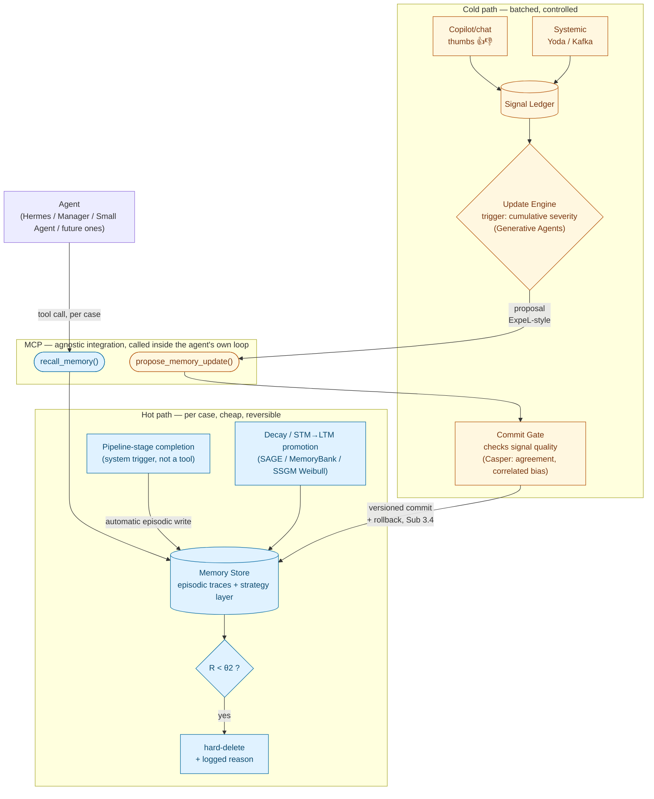

> **Sub-atividade:** 1.6 / 1.7 / 2.2 · **Type:** Architecture hypothesis — not yet validated by POCs · **Logged:** [24/08/2026](../research-diary/diario_campo_2026-08-24.md#24082026)

# A working architecture for the memory mechanism ("knowledge as infra")

## Status — read this before treating anything below as decided

This is a **hypothesis**, not a locked architecture. It's the direct continuation of [`framework-comparison-hermes-smolagents-deepagents.md`](framework-comparison-hermes-smolagents-deepagents.md)'s own closing line — "a starting hypothesis for Sub 1.6/1.7, not a locked-in architecture decision" — now elaborated with the findings from the [24/08 reading sprint](reading-sprint-2026-08-24-queue-papers.md) and worked through with a concrete legal-flow example. It graduates to an actual decision only after the Sub 1.6 minimal-agent POCs and the Sub 1.7 implicit-vs-explicit comparison test it against real behavior — that's where Sub 2.2's formal architecture document gets written. Until then, treat every component below as "the best-grounded guess given what's been read," not as something to defend to the tutor as final.

## The two framing questions this design resolves

**1. "Pluggable/agnostic module" vs. "memory in the agent's loop is more effective" — not actually opposed.** The tension Rafael raised (and that the Hu/Liu survey's §7.2.2 finding, logged 24/08/2026, seemed to sharpen) collapses once "in the loop" is read correctly: it means the agent itself decides to invoke a memory operation as an explicit, auditable tool call — not that the mechanism must be built into one specific framework's proprietary internals. A tool-call interface (MCP, which is already Itaú's standard cross-framework integration layer) is *both* agnostic across the platform's heterogeneous agents (Hermes, the Manager's LangGraph, Small Agent, whatever comes next) *and* loop-native, because the call happens inside the agent's own reasoning trace, not injected silently around it.

**2. "RL after ~100 cases" ≠ "memory update" — they're different cadences, and the Plano already encodes the split.** Sub 3.1 (capture/storage — continuous, per case) and Sub 3.2 (controlled adjustment — batched, gated) are already separate sub-activities. Continuous memory writes are cheap and reversible; changing what the agent does by default is expensive and needs control. Collapsing them would make every single case a candidate to change agent behavior, which is exactly the wrong place to lose control.

## The stack

Six components, each borrowing from a specific reading-sprint finding, none of which alone had everything needed — that's the central point (see "Why no single candidate suffices" below).

### A. Memory Store — continuous, non-parametric, per case

Every case becomes a textual record. Base mechanic: MemoryBank's decay (`R = e^(−Δt/S)`, two auditable integers) or SAGE's richer STM→LTM promotion (entropy-weighted, capacity-constrained). Two-tier, following Hermes' own layering pattern — and, verified 25/08/2026 against the full text of the Hu/Liu survey (§4.1, arXiv:2512.13564; see [`../papers/memory-in-the-age-of-ai-agents-2025.md`](../papers/memory-in-the-age-of-ai-agents-2025.md#full-text-confirmation-25082026-claude-read-directly-from-the-pdf-not-rafael-read)), this two-tier split is exactly the survey's own **episodic-to-semantic processing continuum**, not a coincidence: raw per-case records are **episodic traces**; the Update Engine's ExpeL-style extraction (component C) is precisely the **reflection** step the survey names (citing Park et al. 2023) as what turns episodic traces into a reusable "semantic fact base." What was loosely called a "skill" layer is, in the survey's finer Experiential Memory taxonomy (§4.2: Case-based / Strategy-based / Skill-based), closer to **Strategy-based memory** (a distilled decision heuristic, e.g. "prioritize contestação when biometric signature is validated") than to Skill-based memory in the survey's stricter sense (executable code/API procedures) — a possible v2 addition, not core to v1. This maps cleanly onto the Plano de Trabalho's own Sub 3.2 vocabulary: instruções ≈ strategy-based, exemplos ≈ case-based, contexto operacional ≈ skill-based.

**Alternative considered for A, not adopted for v1: graph-structured storage.** Mem0's graph variant (Mem0g — see [`../papers/mem0-2025.md`](../papers/mem0-2025.md)) structures memory as entities+relationships instead of flat text, with a conflict detector and an update resolver that marks obsolete relationships invalid rather than deleting them — a prototype of exactly what components D and E need. But Mem0g's own LoCoMo ablation shows graph structure only helps on temporal/relational reasoning (F1 51.55 vs. 42.02 flat), *hurts* slightly on single-hop, and gives no gain on multi-hop — not a generic win. Legal reasoning (precedent chains, deadlines counted from other events, appeal hierarchies) is exactly the temporal/relational shape where it helped, which is a real reason to reconsider this later — gated on whether Sub 1.4's actual target flow shows that need, same condition already tracked for GraphRAG/G-Memory in [`../papers/reading-queue.md`](../papers/reading-queue.md#priority-reading-list--rodada-2-19082026). Not v1 material.

### B. Signal capture — dual path, already mapped to the platform

Copilot/chat mode (human present, direct thumbs up/down) and systemic/event-driven mode (no human turn — Yoda API response via Kafka, ex-post annotation derived from case outcome). Both write into the same signal ledger; the Update Engine doesn't need to know which path a signal came from. Casper et al.'s findings apply to both: don't trust a single signal at face value, log disagreement, watch for correlated (not just insufficient-volume) annotator error, anchor to case outcome rather than reviewer satisfaction.

### C. Update Engine — the harness-adjustment layer, batched

Trigger: not a flat N. A hybrid of Generative Agents' cumulative-importance pattern (adapted to error severity — a cluster of severe errors fires review fast) with a max-N safety cap (so the mechanism doesn't stall through a long run of correct, low-severity cases — the 150-case threshold in the source paper is itself unvalidated and would need its own calibration, not a direct port). On trigger: ExpeL-style comparison of success/failure cases produces a natural-language insight — as a **proposal**, not a commit, because ExpeL's own self-vote loop (no human gate, silent overwrite) is exactly the gap this project needs to close, not inherit. A v2 could swap this for a Memento-style trained selection controller (frozen LLM, separate policy) if the Sub 1.7 comparison shows the extra complexity earns its keep — not needed for v1.

### D. Commit Gate — the piece none of the eight read papers have, and the actual contribution

ExpeL overwrites silently with no audit trail. Memento never discards. SCM never discards either and has no versioning. MemoryBank never hard-deletes. This is the specific whitespace the reading sprint confirmed at the mechanism level, not just the survey-table level (see [`cross-trial-vs-forgetting-gap.md`](cross-trial-vs-forgetting-gap.md#first-mechanism-level-confirmation-24082026-claude-read-via-sub-agents-not-rafael-read)): no candidate combines non-parametric content, an external/human signal gate, batched control, versioning+rollback, and real forgetting. The Commit Gate is where that combination actually gets built — a reviewed step (not a single model self-voting) that checks aggregated signal quality (Casper-informed: agreement rate, correlated-error risk, an explicit anti-sycophancy check) before committing a versioned, diffable, rollback-able update (Sub 3.4).

**Formalized 25/08/2026** against the SSGM framework (arXiv:2603.11768, [`../papers/reading-queue.md`](../papers/reading-queue.md#surfaced-from-legal-domain--governance-search-tied-to-the-architecture-hypothesis-25082026)): the Commit Gate's contradiction check can be stated as SSGM's **Write Validation Gate** — a Truth Maintenance System that rejects a candidate update `ΔM` when `ΔM ∧ M_core ⊨ ⊥` (formal NLI-based contradiction check against protected core facts), a more rigorous version of Mem0's simpler `Contradicts(f, M) → DELETE`. **Counter-example worth citing precisely**: "When Rules Learn" (arXiv:2606.17220) shows a real legal-domain system doing rule elimination via the *same LLM* self-consistency-voting on its own rules (no external signal at all) — this is exactly the failure mode the Commit Gate exists to avoid, not a design to imitate.

### E. Forgetting — decay plus a real delete step

SAGE and MemoryBank both contribute the decay math; neither has an actual hard-delete. This layer adds one: below a calibrated retention threshold (`θ2`), a memory is deleted, not just deprioritized in ranking, with a logged reason — the specific thing legal/compliance auditability needs (provable expiry) that no candidate offered natively.

**Sharpened 25/08/2026** via SSGM: its Weibull decay `w(Δτ) = exp(−(Δτ/η)^κ)` is a more expressive alternative to MemoryBank's plain exponential (the shape parameter `κ` lets decay be fast-then-flat or slow-then-steep, tunable per memory class — e.g., a "grande causa"-style threshold fact might warrant a different curve than a case-outcome exemplar), and its language ("pruned... before reaching the agent's context window") is explicitly closer to real deletion than MemoryBank's rank-deprioritization-only behavior. SSGM's **Reversible Reconciliation** principle also answers Sub 3.4's rollback requirement more rigorously than "keep version history": pair an **append-only immutable episodic log** (source of truth) with a **mutable derived layer** (the strategy/skill layer), and recover from drift or a bad commit by *replaying* the mutable layer from the immutable log rather than maintaining hand-rolled diffs.

### Where the episodic write actually comes from — the ADD trigger

Component A's continuous per-case write needs an explicit trigger, distinct from `recall_memory` (read) and `propose_memory_update` (the Update Engine's gated candidate). Resolving this against SSGM's own two-track design (25/08/2026): the **episodic log should be written automatically, by a system-level trigger** (e.g., a pipeline-stage-completion event, the same Kafka signal already used for systemic-mode capture) — **not** an agent-invoked tool call. Reasoning: if writing the raw record depended on the agent choosing to call an `add_memory()`-style tool, a case the agent doesn't flag would leave no record at all — an unacceptable completeness gap for legal auditability. `recall_memory` stays an explicit, agent-invoked tool call (transparency matters for *reading* memory, per the Hu/Liu finding); the raw episodic write does not need that same transparency property, since it isn't a decision that changes agent behavior — only `propose_memory_update` → Commit Gate, the layer that *does* change behavior, needs to be gated and effortful to trigger.

### F. Integration — MCP, loop-native by construction

`recall_memory` and `propose_memory_update` exposed as MCP tools, callable by any of Itaú's agent frameworks without adopting a shared internal memory implementation. The agent decides to call `recall_memory` inside its own reasoning trace (not silent injection) — this is what makes the design simultaneously agnostic (framing question 1) and loop-native in the sense the Hu/Liu finding actually means. The episodic ADD (see above) deliberately sits outside this tool-call surface — it's a system trigger, not an MCP tool an agent decides to invoke.

## Worked example (condensed — full version in the conversation this note distills)

A case: cliente contesta consignado que não reconhece (the tutor's own example). Agent calls `recall_memory`, gets back a skill ("prioritize contestação when biometric signature is validated — 14/16 historical cases won; check the prescriptive deadline first") plus relevant past episodes. The case gets logged into the Memory Store regardless of outcome. A reviewer flags a related case with 👎 ("right argument, wrong deadline cited"); months later, an unrelated case's adverse outcome arrives via Kafka with no human involved. Both land in the signal ledger. Three deadline-related errors accumulate enough severity to cross the Update Engine's threshold well before 100 cases would — it proposes tightening the skill to check the deadline first. The Commit Gate checks whether the same reviewer flagged all three (correlated-error risk) and whether the flags are about substance or style, then commits a new versioned skill with a rollback pointer to the old one. An unrelated, stale skill about an outdated "grande causa" threshold, unused for 90 days, decays past `θ2` and gets hard-deleted with a logged reason.

## Relationship to what already exists, and scope boundaries

Doesn't replace or unify the three memory mechanisms already live on the platform (the Manager's LangGraph checkpoints, Small Agent's per-execution dump, Hermes' native memory) — all three are session/run-scoped; this is the fourth, cross-trial layer any of them could call via the same MCP interface. Explicitly out of scope by prior decision: fast-changing structured business facts (already served by business-rule MCP tools, e.g. "grande causa") and cross-agent memory sharing (not needed — Itaú's own pipeline agents don't talk to each other, confirmed twice, in the 20/08 and 21/08 meetings).

## "Knowledge as infra" / product framing

The differentiation against Mem0 specifically is components D and E — controlled forgetting with a real delete step, plus an externally-gated, versioned update — which is exactly the gap Mem0's own documented critique names (delegates update/delete to the LLM without principled decay or scheduling). A full-text read of Mem0 (24/08/2026, Claude-read, not Rafael-read — see [`../papers/mem0-2025.md`](../papers/mem0-2025.md#full-text-confirmation-24082026-claude-read-directly-from-the-pdf-not-rafael-read)) sharpens exactly how: Mem0's Algorithm 1 only deletes a memory when a *new fact explicitly contradicts it* — there is no time-based decay at all, unlike MemoryBank/SAGE. A memory that's simply outdated but never directly contradicted (the "grande causa" threshold case from the worked example) would never be removed by Mem0's own logic. So the gap this architecture targets isn't "Mem0 forgets carelessly" — it's narrower and sharper: **Mem0 forgets only by logical contradiction, never by obsolescence**, which is precisely the failure mode that matters for stale-but-uncontradicted legal/compliance content. Component E's decay-plus-hard-delete design is what closes that specific gap. Worth keeping as the Sub 5.3 expansion-roadmap pitch, not as a driver of near-term design decisions.

## What has to happen before this becomes Sub 2.2

The Sub 1.6 minimal agents (native closed loop vs. transparent programmatic memory) should test this design's actual claims, not just assume them: does an explicit MCP tool-call recall achieve comparable effectiveness to Hermes' automatic native injection? Does the severity-weighted trigger behave sensibly against real annotated cases, or does it need the same kind of recalibration the source paper's own unvalidated threshold-150 would need? Does the Commit Gate's signal-quality check meaningfully reduce the correlated-error/sycophancy risks Casper et al. names, or is it security theater without real rater diversity? Sub 1.7's implicit-vs-explicit comparison is where this hypothesis either survives contact with a POC or gets revised — see [`open-questions.md`](open-questions.md) for the new open item this creates.
