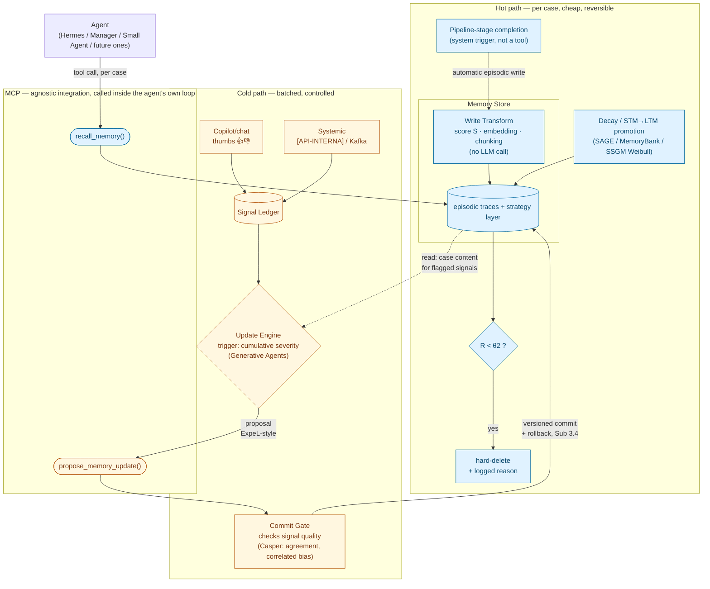
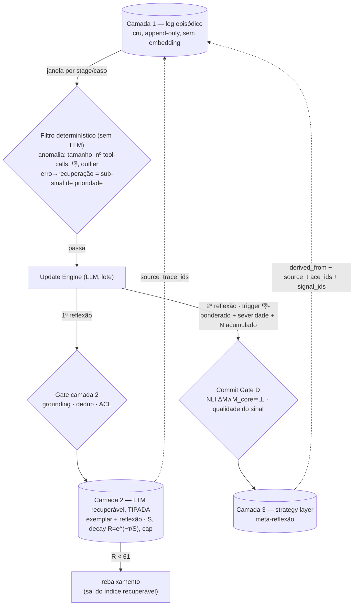

> **Sub-atividade:** 1.6 / 1.7 / 2.2 · **Type:** Architecture hypothesis — not yet validated by POCs · **Logged:** [24/08/2026](../research-diary/Ago/diario_campo_2026-08-24.md#24082026)

# A working architecture for the memory mechanism ("knowledge as infra")

## Status — read this before treating anything below as decided

This is a **hypothesis**, not a locked architecture. It's the direct continuation of [`framework-comparison-hermes-smolagents-deepagents.md`](framework-comparison-hermes-smolagents-deepagents.md)'s own closing line — "a starting hypothesis for Sub 1.6/1.7, not a locked-in architecture decision" — now elaborated with the findings from the [24/08 reading sprint](reading-sprint-2026-08-24-queue-papers.md) and worked through with a concrete legal-flow example. It graduates to an actual decision only after the Sub 1.6 minimal-agent POCs and the Sub 1.7 implicit-vs-explicit comparison test it against real behavior — that's where Sub 2.2's formal architecture document gets written. Until then, treat every component below as "the best-grounded guess given what's been read," not as something to defend to the tutor as final.

## The two framing questions this design resolves

**1. "Pluggable/agnostic module" vs. "memory in the agent's loop is more effective" — not actually opposed.** The tension Rafael raised (and that the Hu/Liu survey's §7.2.2 finding, logged 24/08/2026, seemed to sharpen) collapses once "in the loop" is read correctly: it means the agent itself decides to invoke a memory operation as an explicit, auditable tool call — not that the mechanism must be built into one specific framework's proprietary internals. A tool-call interface (MCP, which is already [EMPRESA]'s standard cross-framework integration layer) is *both* agnostic across the platform's heterogeneous agents (Hermes, the Manager's LangGraph, Small Agent, whatever comes next) *and* loop-native, because the call happens inside the agent's own reasoning trace, not injected silently around it.

**2. "RL after ~100 cases" ≠ "memory update" — they're different cadences, and the Plano already encodes the split.** Sub 3.1 (capture/storage — continuous, per case) and Sub 3.2 (controlled adjustment — batched, gated) are already separate sub-activities. Continuous memory writes are cheap and reversible; changing what the agent does by default is expensive and needs control. Collapsing them would make every single case a candidate to change agent behavior, which is exactly the wrong place to lose control.

## The stack



Six components, each borrowing from a specific reading-sprint finding, none of which alone had everything needed — that's the central point (see "Why no single candidate suffices" below).

**O diagrama acima é a visão por componente (6 caixas). O *fluxo* de escrita — três camadas operacionais, filtro determinístico único antes do Update Engine, gate nos dois caminhos — foi refinado em 01/09; ver o diagrama e a tabela em §"Consolidação 01/09/2026" logo abaixo.**

**SSGM layer mapping, added 27/08/2026:** this architecture implements the same three-layer conceptual structure as the SSGM framework (arXiv:2603.11768, Figure 4) — Cognition Layer → Governance Layer → Memory Layer — but with the governance distributed across the points where it's needed rather than centralized in a single middleware. The mapping:

| SSGM layer | This architecture | Component |
|---|---|---|
| **Cognition Layer** | Update Engine | C |
| **Governance Layer** (Write Validation) | Commit Gate | D |
| **Memory Layer** (immutable log + mutable substrate) | Memory Store | A |

The key adaptation: SSGM's Governance Middleware intercepts *all* memory interactions (read and write) in a single middleware; this design intercepts only the *write to the strategy layer* (cold path, Commit Gate) — the episodic log is ADD-unconditional (no gate, by auditability requirement), and the read path's ACL/freshness filtering is built into `recall_memory` itself (SSGM's retrieval formula, component A), not a separate middleware. Same governance pattern, distributed to the right layers instead of centralized. See the analysis in [the conversation that surfaced this mapping](../research-diary/Ago/diario_campo_2026-08-24.md#27082026). **Update 01/09/2026:** a governança também gateia a escrita da **camada 2** (1ª reflexão do Update Engine) — mecanismo mais leve (grounding, dedup, ACL), não o NLI da strategy layer. Não é *só* a escrita na strategy layer. Ver §"Consolidação 01/09/2026".

**Reading guide per component, added 25/08/2026:** for which paper to read to understand each component below and what to focus on in it, see [`../papers/reading-queue.md#guia-de-leitura-por-componente-da-arquitetura-25082026`](../papers/reading-queue.md#guia-de-leitura-por-componente-da-arquitetura-25082026) — a different cut of the same corpus than the risk-ranked Tier 1–3 checklist in that file.

### Consolidação 01/09/2026 — três camadas operacionais, filtro determinístico unificado, gate nos dois caminhos

Refina §A, §C e §D abaixo. Detalhe e trade-offs em [`promotion-policy-log-to-ltm.md`](promotion-policy-log-to-ltm.md) (seção "Estratégias de promoção em consideração"). Continua hipótese — nada aqui é sign-off; veio de uma rodada longa de design em 01/09 (diário [01/09/2026](../research-diary/Set/diario_campo_2026-08-31.md)), enquanto o SAGE ainda estava em leitura.



**1. Três camadas operacionais dentro do Memory Store** (o "two-tier" de §A colapsava log cru e índice recuperável):

| # | Camada | Conteúdo | Recuperável? | Taxonomia Hu/Liu |
|---|---|---|---|---|
| 1 | Log episódico | trajetórias cruas, append-only, texto puro, sem embedding | não — auditoria + input do Update Engine (sucesso *e* falha) | — (substrato) |
| 2 | LTM recuperável — **tipada** | `exemplar` (trace concreto) + `reflexão` (1ª reflexão do Update Engine); ambos com `S`, decay `R=e^(−τ/S)`, cap | sim | Case-based / reflexão ≈ Strategy-based local |
| 3 | Strategy layer | heurística destilada, 2ª reflexão (meta-reflexão) | sim | Strategy-based |

**2. Filtro determinístico unificado, antes do Update Engine.** A família do filtro de anomalia de §C (tamanho do trace, nº de tool calls, distribuição de 👎, outlier) deixa de servir só o caminho da strategy: passa a ser o **único gate determinístico**, servindo os dois caminhos — promoção → camada 2 e reflexão → camada 3. Uma janela de log cru (inicialmente simples: por stage/caso, sem heurística aprofundada) só vai ao Update Engine se passar nesse filtro. `erro→recuperação` entra como sub-sinal de prioridade (`S` inicial maior), não como o filtro inteiro — senão perde o exemplar limpo de caso raro e o erro-que-continuou-errado. **Decidido 01/09:** há um filtro determinístico antes do Update Engine.

**3. `R ≥ θ1` vira só regra de rebaixamento.** Com o filtro determinístico fazendo a admissão, `R = e^(−τ/S) ≥ θ1` deixa de decidir *entrada* na camada 2 e passa a ser só *permanência/rebaixamento* dentro dela (`τ`-desde-recall e `S→S+1` só existem depois de promovido). Resolve a bifurcação entrada-vs-permanência.

**4. Update Engine gera dois writes, não um.** Além da proposta de strategy (§C), produz a **1ª reflexão** sobre a janela → camada 2. A 2ª reflexão (strategy) é disparada por sinal de qualidade **ponderado pro negativo** (👎, desfecho adverso, severidade cumulativa, N casos similares acumulados); o filtro determinístico da camada 2 usa 👍 *e* 👎. O Update Engine, quando roda, lê sucesso *e* falha como contexto (trigger ≠ input).

**5. Gate de governança nos dois caminhos de escrita, mecanismos diferentes.** SSGM P1 (Write Validation Gate) é trigger-agnóstico. Camada 2 (1ª reflexão): checa *grounding* (a reflexão bate com o trace cru que referencia?), dedup, ACL/PII. Camada 3 (2ª reflexão): o Commit Gate (D) já existente — NLI `∆M ∧ M_core ⊨ ⊥` + qualidade do sinal. Amplia o mapeamento SSGM da linha 66: a governança não intercepta *só* a escrita na strategy layer.

**6. Provenância entre camadas (precondição da Reversible Reconciliation de §E).** Camada 2 → `source_trace_ids` na camada 1. Camada 3 → `derived_from` (camada 2) **e** `source_trace_ids` (camada 1, denormalizado, porque a camada 2 é evictável) **e** IDs do Signal Ledger consumidos. Sem isso, replay do log não reconstrói uma strategy acionada por sinal.

**Ainda em aberto** (herdado + novo): quais campos existem no banco de traces real (bloqueia o `S` DMF-lite e o predicado exato do filtro); `recall_memory` mistura os dois tipos da camada 2 no mesmo ranking ou o agente pede um tipo; `S` inicial de `reflexão` vs. `exemplar` (**lean 02/09: `reflexão` maior**, fundamento `S* > S` do MemorySyntax do SAGE — ver "SAGE reconsidered" abaixo); unidade da janela (stage vs. caso).

### A. Memory Store — continuous, non-parametric, per case (Memory Layer)

Every case becomes a textual record. Base mechanic: MemoryBank's decay (`R = e^(−Δt/S)`, two auditable integers) or SAGE's richer STM→LTM promotion (entropy-weighted, capacity-constrained). Two-tier, following Hermes' own layering pattern — and, verified 25/08/2026 against the full text of the Hu/Liu survey (§4.1, arXiv:2512.13564; see [`../papers/memory-in-the-age-of-ai-agents-2025.md`](../papers/memory-in-the-age-of-ai-agents-2025.md#full-text-confirmation-25082026-agent-read-directly-from-the-pdf-not-rafael-read)), this two-tier split is exactly the survey's own **episodic-to-semantic processing continuum**, not a coincidence: raw per-case records are **episodic traces**; the Update Engine's ExpeL-style extraction (component C) is precisely the **reflection** step the survey names (citing Park et al. 2023) as what turns episodic traces into a reusable "semantic fact base." What was loosely called a "skill" layer is, in the survey's finer Experiential Memory taxonomy (§4.2: Case-based / Strategy-based / Skill-based), closer to **Strategy-based memory** (a distilled decision heuristic, e.g. "prioritize contestação when biometric signature is validated") than to Skill-based memory in the survey's stricter sense (executable code/API procedures) — a possible v2 addition, not core to v1. This maps cleanly onto the Plano de Trabalho's own Sub 3.2 vocabulary: instruções ≈ strategy-based, exemplos ≈ case-based, contexto operacional ≈ skill-based.

**Initial importance score at write time — principle borrowed from DMF, not its implementation (revised 25/08/2026).** MemoryBank/SAGE assume a flat starting value (`S=1`) that only changes on recall; an LLM-judged score (Mem0-style) reintroduces the self-referential-judgment risk this project keeps avoiding. DMF (arXiv:2606.03463, full text read 25/08/2026 — see [`../papers/dmf-2026.md`](../papers/dmf-2026.md) and [`../papers/reading-queue.md`](../papers/reading-queue.md)) shows a third option — a deterministic, multi-channel score computed at write time, zero LLM calls — but its actual implementation is eight layers (a language-specific spaCy rule adapter, an embedding engine, a card-projection subsystem) with 8+ weight constants **calibrated by hand**, not learned by any principled method; porting that whole system to Portuguese legal text would mean building a rule adapter from scratch, not reusing anything. **What's worth adopting is the principle, at a much smaller scale**: a lightweight deterministic score combining 3–4 signals *already produced as structured output by upstream pipeline stages* — e.g., a sketch: `score = w1·is_grande_causa + w2·has_flagged_risk_keyword + w3·pipeline_stage_criticality + w4·source_reliability(copiloto vs. sistêmico)` — no new NLP extraction needed, since the cadastro agent already extracts structured fields from the petition; the score only has to read them. Exact weights are Sub 1.6/1.7 calibration work, not decided here. This replaces MemoryBank's flat `S=1` as the *initial* value that then decays/reinforces normally — auditable (each score traceable to specific structured fields and weights) without inheriting DMF's full engineering footprint.

**Note (25/08/2026):** this section's opening line ("MemoryBank's decay... or SAGE's richer STM→LTM promotion") still frames the two as interchangeable base mechanics, but they're not — SAGE's promotion gate is *selective* (only items clearing a threshold get promoted), while the ADD trigger resolved further down ("Where the episodic write actually comes from") commits to *unconditional* per-case logging. That's a real, unresolved tension, not a stylistic choice — see [component G](#g-consolidation--an-open-gap-in-evolution-not-yet-a-designed-component-added-25082026) for why SAGE is being kept in play over this rather than discarded. **Update 01/09/2026:** resolvido — o split log/LTM já dissolvia a tensão em 27/08 (camada 1 = ADD incondicional; a seleção é no 1→2), e 01/09 fecha *como*: o gate de admissão é o **filtro determinístico de anomalia** (não `R ≥ θ1`), unificado com o trigger de reflexão. Ver §"Consolidação 01/09/2026" acima.

**Retrieval mechanics for `recall_memory` — never precisely locked before, resolved 25/08/2026 by composing what's already adopted elsewhere.** Plain semantic search was never actually the plan, but this is the first time it's stated explicitly: a filter stage borrowed from SSGM's own retrieval formula (`Ct = {μ ∈ Top-K(qt, Mt-1) | ACL(μ, uid) ∧ (w(Δτμ) ≥ θfresh)}`) — semantic top-K similarity, gated by access control and by the **same** Weibull freshness decay already adopted for Forgetting (component E) — a highly-similar-but-stale item can fail this gate even if it's the closest embedding match. Survivors are then ranked using Generative Agents' formula shape (`relevance + importance`, weighted sum) — reusing the **same** DMF-lite write-time importance score already adopted above, not a new signal. No new machinery: this composes the decay function and the importance score the architecture already computes for other purposes, applied to retrieval instead of requiring its own scoring system.

**Open gap, found 26/08/2026: `ACL(μ, uid)` is an imported term, never unpacked for this domain.** The formula's access-control gate is a boolean — does caller `uid` have permission to see item `μ` — but nothing in this project specifies *how* that's decided. SSGM has already been read in full (🔎-tier, via sub-agent — see [`reading-sprint-2026-08-24-queue-papers.md`](reading-sprint-2026-08-24-queue-papers.md)), yet that synthesis has no ACL/ABAC detail in it; the only trace of the concept elsewhere in this doc is a passing mention of SSGM's "ABAC principle" (Attribute-Based Access Control — access decided from attributes of the requester/item, not a fixed list) in the LangSmith Engine discussion below, not a worked-out policy. Concrete questions this project hasn't answered: can an agent from one legal domain (cível) see traces written by an agent from another (trabalhista)? Is access scoped per-case (only agents assigned to that case) or per-domain/squad? Is there an LGPD/privacy dimension given these are real legal cases, independent of domain scoping? A sixth storage/retrieval-mechanics gap, same family as the write-path ones above — not decided, not designed. **Tracked as its own item in [`open-questions.md`](open-questions.md) as of 31/08/2026**, with **Collaborative Memory** (Rezazadeh et al., arXiv:2505.18279 — [`../papers/reading-queue.md`](../papers/reading-queue.md) #44) as the leading candidate access-control model (bipartite user×agent×resource graph, private/shared tiers, immutable provenance for retrospective permission checks; adaptation: "user" → domain/squad). The 28/08 tutor checkpoint's partial lean is domain-scoped access + credentials/RBAC (per-squad, not per-case).

**Where graph-structured retrieval (GraphRAG) would plug in, if ever adopted (25/08/2026 clarification):** specifically the `Top-K(qt, Mt-1)` candidate-generation step above — graph traversal (entities → connected nodes → optionally community summaries) would replace flat vector similarity as *how the candidate set is produced*, while the SSGM-style freshness/ACL gate and the Generative-Agents-style relevance+importance ranking could still run downstream over whatever the graph traversal returns. Not a wholesale replacement of the retrieval pipeline — one swappable stage. Still gated exactly as below: only worth building if Sub 1.4 confirms the target legal flow needs relational/multi-hop navigation between precedents.

**Alternative considered for A, not adopted for v1: graph-structured storage.** Mem0's graph variant (Mem0g — see [`../papers/mem0-2025.md`](../papers/mem0-2025.md)) structures memory as entities+relationships instead of flat text, with a conflict detector and an update resolver that marks obsolete relationships invalid rather than deleting them — a prototype of exactly what components D and E need. But Mem0g's own LoCoMo ablation shows graph structure only helps on temporal/relational reasoning (F1 51.55 vs. 42.02 flat), *hurts* slightly on single-hop, and gives no gain on multi-hop — not a generic win. Legal reasoning (precedent chains, deadlines counted from other events, appeal hierarchies) is exactly the temporal/relational shape where it helped, which is a real reason to reconsider this later — gated on whether Sub 1.4's actual target flow shows that need, same condition already tracked for GraphRAG/G-Memory in [`../papers/reading-queue.md`](../papers/reading-queue.md#priority-reading-list--rodada-2-19082026). Not v1 material.

### Write-path status snapshot for component A (added 26/08/2026)

Consolidating what's actually settled about the episodic write — scattered across the notes above — and naming precisely what still isn't, surfaced by working through it component-by-component in conversation.

**Settled:**
- ADD is unconditional — every case becomes a record, no selection at write time (legal-auditability completeness; see "Where the episodic write actually comes from" below).
- The trigger is a system event, not an agent tool call — pipeline-stage completion (Kafka), not an agent-invoked `add_memory()`. **Confirmed as real, already-live infra, not a proposal**: the cadastro agent already publishes to a Kafka topic on completing its own stage (per [`../docs/checkpoints/checkpoint-2026-08-21-infra-arquitetura.md`](../docs/checkpoints/checkpoint-2026-08-21-infra-arquitetura.md)) — the concrete mechanism the per-stage trigger below hooks into, not something to be built.
- Granularity is per-stage (Rafael's working assumption, 26/08/2026 — not yet tutor-signed-off, see [`open-questions.md`](open-questions.md)) — e.g. cadastro's own completion event fires its own write, independent of subsídios or contestação finishing later.
- **Terminology: trace vs. log are not interchangeable.** "Episodic trace" = one record, produced by one stage-completion event. "Episodic log" = the append-only container holding all traces (component E). Worth keeping distinct — "replay over the log" means all traces; "a trace decaying past θ2" means one record.
- Storage format is flat text, not graph — explicit decision against Mem0g for v1 (its LoCoMo ablation only helps temporal/relational reasoning, not a generic win). **"Flat text" here means 1D** — a linear string, not a graph and not (yet) any richer structured shape. Migrating later to a more structured representation — e.g. a 2D/tabular layout (structured fields alongside the free text) — is a plausible future direction, distinct from the Mem0g graph question already decided against for v1; not designed, not scheduled, just not foreclosed the way graph explicitly was.
- Structure is an append-only immutable log (source of truth), separate from the mutable, derived strategy layer (SSGM's Reversible Reconciliation principle, component E).
- Retrieval requires vector/embedding search (`recall_memory`'s top-K semantic step) — this capability requirement is decided even though the substrate providing it is not (see below).

**Still open, not decided anywhere in this doc:**
- **Exact schema.** No field-by-field spec exists. What can be reconstructed from components A+E: text + an initial score `S` (DMF-lite, see below) + decay parameters (MemoryBank's two integers, or SSGM's Weibull `η, κ`) + an embedding for retrieval. Not written down as an actual schema anywhere.
- **Physical substrate.** Leading candidate is the platform's existing shared Postgres (flagged in the 20/08 checkpoint, confirmed live — one Postgres per account — in the 21/08 infra meeting), reasoned from the same "avoid a new operational dependency" logic already used to rule out git as the live substrate (component F) — but this is inference chaining two other decisions, not a decision made about this component specifically.
- **Vector storage category.** Vector search is required; whether that means a dedicated vector DB product or Postgres plus a vector extension (e.g. pgvector) is unresolved — same inference chain as substrate, not a documented decision.
- **Chunking strategy.** Not mentioned anywhere in the project corpus (checked directly — zero hits for "chunk" outside one unrelated use in the ExpeL notes). Matters specifically here because the write-time score `S` and decay parameters are computed per record — chunking would force a decision about whether those attach to the whole case or per chunk, and it's downstream of the next gap.
- **What an "episodic trace" actually contains — the deepest of these gaps, upstream of the other four.** The project's own term (verified against Hu/Liu §4.1) is "episodic trace," but nowhere does the doc specify whether that means (a) a business-record summary of the case (structured fields + outcome) or (b) a full step-by-step agent trajectory in the ExpeL/ReAct sense (thought→action→observation sequence). The worked example ("the case gets logged into the Memory Store regardless of outcome") doesn't disambiguate. This decides how long the record actually is, which is the real precondition for the chunking question above. Concretely, for the cadastro example above: does the Kafka completion event's payload become the trace as-is (whatever structured fields cadastro already extracts from the petição), or does Transform need to pull additional content from elsewhere to build it? Not specified — the same ambiguity, now anchored to the one trigger mechanism already confirmed as real.

### Should the raw→schema transformation be its own component? (resolved 26/08/2026 — logically yes, operationally no)

**Resolution (Rafael, 26/08/2026):** the transformation is real and worth naming, but it stays *inside* component A rather than being promoted to a new lettered component. Reflected in the stack diagram above as a "Write Transform" stage nested inside the Memory Store subgraph — `PipelineEvent` feeds Transform, Transform feeds the persisted store, both under the same Memory Store boundary. This keeps the logical separation the SSGM-replay argument below motivates, without adding a new operational surface (its own service, its own line in the six/seven-component count) — consistent with the project's repeated preference elsewhere (git-as-substrate, DMF's own 8-layer footprint) for avoiding new operational dependencies when a logical distinction can be kept internal instead.

Surfaced by asking directly where the write-time transformation — assembling the schema record, computing `S`, generating the embedding, deciding chunking — actually executes. Today it has no name and no box: it's implicit inside component A, with `PipelineEvent -->|automatic episodic write| Store` drawn as a single arrow, no intermediate step.

**A real precedent for splitting it out exists in this project's own corpus and its own already-adopted principles, not just borrowed taste:**
- DMF's full 8-layer implementation (see [`../papers/reading-queue.md`](../papers/reading-queue.md)) already separates a **card-projection subsystem** (raw → structured card) from its Scoring Engine and its vector backend — three distinct concerns, three distinct layers, not one.
- More importantly: **this project's own SSGM-derived Reversible Reconciliation principle (component E) already treats "raw" and "derived" as different mutability classes** — the episodic log is immutable source-of-truth, the strategy layer is mutable and replayable from it. `S`, the decay parameters, and the embedding are themselves *derived* outputs computed from the raw text, not the raw text itself. By the same logic already adopted for the strategy layer, treating them as outputs of a distinct, re-runnable transformation step — rather than baked permanently into the write — would mean `S` could be recalibrated, or the embedding model swapped, later by *replaying* the transformation over the immutable raw log, without re-triggering `PipelineEvent` or touching the raw record. Bundling the transformation inside "Store" as currently drawn doesn't obviously support that replay path.

**Counter-consideration, not resolved:** the transformation itself is currently small (four weighted signals, no LLM call, per the cost discussion above). Formalizing it as a full separate component risks the kind of premature machinery this design has otherwise avoided — see the repeated rejection of DMF's own 8-layer footprint and of git-as-substrate, both on "avoid a new operational dependency" grounds. The replay argument justifies the transformation being *logically* distinct; it doesn't by itself require it to be *operationally* distinct (its own service/deploy) rather than a clearly-scoped internal function of component A.

**If adopted:** sits on the hot path, between `PipelineEvent` and `Store`, and must inherit the same constraint already established for the rest of the hot path — no generative LLM call, to preserve the documented cost profile ("the hot path carries no expensive generative LLM call"). Whether this becomes a new lettered component (e.g. component H) or stays a named internal stage of A is a Sub 1.6/1.7 implementation decision, not something to resolve at the hypothesis stage.

### B. Signal capture — dual path, already mapped to the platform

Copilot/chat mode (human present, direct thumbs up/down) and systemic/event-driven mode (no human turn — [API-INTERNA] API response via Kafka, ex-post annotation derived from case outcome). Both write into the same signal ledger; the Update Engine doesn't need to know which path a signal came from. Casper et al.'s findings apply to both: don't trust a single signal at face value, log disagreement, watch for correlated (not just insufficient-volume) annotator error, anchor to case outcome rather than reviewer satisfaction.

### Signal Capture — status snapshot (added 26/08/2026)

Closed out working through it in conversation, same format as component A's snapshot above.

**Settled:**
- Two capture paths, both writing into the same **Signal Ledger** — a data store separate from the Memory Store (component A); the Update Engine doesn't need to know which path a signal came from.
- Copilot path: a human evaluates the agent's result directly, thumbs up/down, during the interaction.
- Systemic path: no human turn — ex-post annotation derived from case outcome, transported via the [API-INTERNA] API's Kafka response topic (confirmed real infra, the same mechanism already validated for component A's write trigger).
- **Neither path is exposed as an MCP tool — same reasoning already established for the episodic ADD (component A).** MCP is reserved for actions the *agent* decides to invoke inside its own reasoning trace. Neither a human's thumbs click nor a system Kafka event is an agent decision, so both sit outside the MCP surface by design, not by gap — the same category of "trigger external to the agent's loop" as the episodic write, just triggered by a human UI action or a system event instead of a pipeline-stage completion.
- The Signal Ledger and the Memory Store only connect indirectly: the Update Engine reads from the Ledger, and — only after Commit Gate approval — writes into the Memory Store's **strategy layer**. Signal Ledger content never becomes part of the episodic traces.

**Still open:**
- **Exact schema/structure of the Signal Ledger** — not defined, same class of gap as component A's storage mechanics (see the write-path status snapshot above).
- **Transport mechanism for the copilot path is not documented.** The systemic path's transport ([API-INTERNA]/Kafka) is confirmed real infra; the copilot path's transport — plausibly a direct API call from the chat UI, since a synchronous human click doesn't need an async event bus — is inference, not a decision recorded anywhere.
- **What exactly gets captured in systemic mode, beyond "the outcome,"** is still open (see [`open-questions.md`](open-questions.md)).
- **No rater redundancy.** Only one signal per case is captured on either path — no mechanism exists for deliberately getting a second, independent opinion on a sample of cases, which the Commit Gate's "agreement rate" check needs in order to be computable at all (already flagged under the Commit Gate's own open gaps, component D).

### Signal Capture — additions from the 28/08/2026 tutor checkpoint

Three inputs from the tutor (reflections [`checkpoint-2026-08-28-reflections.md#2`](checkpoint-2026-08-28-reflections.md), [`#3`](checkpoint-2026-08-28-reflections.md)), all still open, none designed:

- **Thumbs is asymmetric, and it composes rather than triggers.** The tutor independently reached "thumbs is one signal to compose, not a trigger" (second convergence, after 20/08's batch-review one) and added a prior: thumbs-*up* is near-worthless (*"muito mais comum sempre darem up"*), thumbs-*down* is strong (*"pra dar down, deu ruim mesmo"*). Consistent with Casper's sycophancy finding. Carry as a fixed assumption for this component, separate from the v2 adaptive path-weighting.
- **Outcome-signal latency is agent-type-dependent — the single systemic path is too coarse.** Cadastro: a usable signal in ~1–2 months, and it is a **third systemic signal type** the doc doesn't name — *downstream human correction / reclassification*, detectable as a diff on the record (not thumbs, not a Kafka case-outcome). Contestação: case-outcome median ~13 months, so the online outcome signal is near-useless for it on the fellowship horizon; its near-term primary signal has to be the deterministic trace-shape one (component C's first filter), not outcome. Component B needs a **per-agent-type signal-latency model**.
- **Prefer querying the existing trace store over a dedicated Signal Ledger.** The tutor's cadence is *"puxa do banco os traces de um período"* and *actively pulling* "cases that now have an outcome I haven't used yet" — plus a **trace ID + a consumed-list** so one case can't drive multiple updates. Folds into the "reuse vs. build the Signal Ledger" open question, hard toward reuse.

### C. Update Engine (Cognition Layer) — the harness-adjustment layer, batched

**Update 01/09/2026 — o Update Engine produz dois writes, não um.** Além da proposta de strategy descrita abaixo (2ª reflexão / meta-reflexão → camada 3, via Commit Gate D), ele produz uma **1ª reflexão** sobre a janela de traces filtrada → camada 2 (tipada: `exemplar` + `reflexão`), via um gate de governança mais leve (grounding/dedup/ACL). O filtro de anomalia descrito na nota de 28/08 abaixo é reposicionado como o **único gate determinístico**, *antes* do Engine, servindo os dois caminhos. Ver §"Consolidação 01/09/2026" e [`promotion-policy-log-to-ltm.md`](promotion-policy-log-to-ltm.md).

**Note added 27/08/2026 — the Update Engine is the highest-intelligence-density component of the mechanism and warrants the most design care.** It's where the cold path's actual LLM call lives — the ExpeL-style comparison of success/failure cases that produces the natural-language insight. Every other component is either storage (A, B), gating (D), or deterministic mechanics (E); the Update Engine is the only one that *generates* content. Two consequences flow from this: (1) the reflection it produces is a **proposal, not a commit** — by design, because ExpeL's own self-vote loop (no human gate, silent overwrite) is exactly the gap the Commit Gate (component D) closes, not something to inherit; (2) it's the natural candidate for a **v2 self-improvement** scope expansion — proposing harness changes (prompt edits, grader rubric updates, tool-config adjustments), not just strategy-layer content. That v2 direction is explicitly out of scope for v1 (the Engine's output today is strategy content only — never system prompts, never trigger parameters, never signal-capture design; see "Scope clarification: what the Update Engine never touches" below), but is recorded as the forward path so the v1 design doesn't foreclose it. Any v2 harness-change proposals would go through the same Commit Gate as strategy content — versioned, gated, rollback-able — not silently applied (the same gap LangChain's own Loop 4 "hill-climbing" leaves open, per [`framework-comparison-hermes-smolagents-deepagents.md`](framework-comparison-hermes-smolagents-deepagents.md)). See also the open question on whether the Engine's reflection step should have access to a context source beyond the episodic traces it already reads — [`open-questions.md`](open-questions.md).

**Tutor corroboration, 28/08/2026 ([`../docs/checkpoints/checkpoint-2026-08-28-tutor.md`](../docs/checkpoints/checkpoint-2026-08-28-tutor.md), reflections [`checkpoint-2026-08-28-reflections.md#1`](checkpoint-2026-08-28-reflections.md)).** Presented this component's shape for the first time, the tutor — reasoning from operational cost, not the reading corpus — independently landed on the same design and elaborated it: (1) he explicitly rejected the event-per-case trigger as a known-bad path (*"o lance do evento toda hora"* — ~300k contestação runs/year → ~1,000 updates/day, and ~90% of cases have nothing to learn); (2) his default trigger is a **scheduled batch scan** (daily-to-weekly) with the **deterministic heuristics as the first filter** — trace length, tool-call count, thumbs distribution, outlier vs. within-distribution — before any LLM call; (3) he added a **human-initiated trigger** the doc didn't have (an operator interface that fires the curator on specific cases/agents after a real-world incident); (4) he described the curator itself as **coordinator + map-reduce workers** (one small LLM per case, a consolidator on top) — which the cost discussion below should account for, since it currently treats the cold-path LLM call as singular. None of this is a formal sign-off (Sub 1.6/1.7 still governs), but it's the third independent convergence on the batched harness-adjustment shape. Tracked in [`open-questions.md`](open-questions.md) (Update Engine trigger-paths sub-item).

Trigger: not a flat N. A hybrid of Generative Agents' cumulative-importance pattern (adapted to error severity — a cluster of severe errors fires review fast) with a max-N safety cap (so the mechanism doesn't stall through a long run of correct, low-severity cases — the 150-case threshold in the source paper is itself unvalidated and would need its own calibration, not a direct port). On trigger: ExpeL-style comparison of success/failure cases produces a natural-language insight — as a **proposal**, not a commit, because ExpeL's own self-vote loop (no human gate, silent overwrite) is exactly the gap this project needs to close, not inherit. A v2 could swap this for a Memento-style trained selection controller (frozen LLM, separate policy) if the Sub 1.7 comparison shows the extra complexity earns its keep — not needed for v1.

**Missing input, found 26/08/2026 and fixed in the diagram: the Update Engine needs case content, not just the signal.** The stack diagram only drew `Ledger → Engine` — but an ExpeL-style comparison of success/failure *cases* needs to know what actually happened in each flagged case, not just that it was flagged. The Signal Ledger holds the correction signal (thumbs, outcome); the case content that signal is *about* lives in the Memory Store's episodic traces. Confirmed against the worked example: identifying "three deadline-related errors" as a common thread requires reading what happened in those three cases, not just that they were each flagged once. The diagram now shows a second, read-only edge `Store -.-> Engine` alongside `Ledger --> Engine` — the Update Engine reads both inputs to build its proposal. This sharpens two gaps already on record rather than opening a third: whether the Signal Ledger's schema (still undefined) stores a case-ID reference back to the relevant trace(s) or duplicates content, and whether an episodic trace (still undefined, see the write-path snapshot above) is actually rich enough to support this kind of cross-case comparison.

**Write granularity, 09/09/2026 — one memory unit per cascade, at the root, not one per error step.** When the flagged window contains a failure cascade, the Engine's proposal should be anchored to the *earliest* error that explains the downstream chain, not written once per surface error. Empirical backing borrowed from AgentDebug (arXiv:2509.25370, ablation §1, verbatim): *"focusing on root-cause errors, rather than attempting to fix every surface-level mistake, is key to efficient debugging and meaningful performance gains"* — measured on their benchmarks (ALFWorld/WebShop/GAIA), **not** on the esteira, so cited as borrowed justification with the domain caveat. Concrete effect on the first trace analysis: ~498 error steps collapse to ~150–250 cascade roots (fewer after dedup by signature) — bounded memory growth for free. Depends on a step-level, causally-differentiated view of error (initiator vs. follower) — see the cascade items in [`../analysis/2026-09-trace-law-flow/docs/04-roadmap.md`](../analysis/2026-09-trace-law-flow/docs/04-roadmap.md) ("Fundamentação emprestada do AgentDebug"). Project-specific caveat: the esteira's own central finding diverges from AgentDebug's *"fix the root → trajectory flips to success"* — here a cascade is more often "expensive but recovered" than "derailed" (37% of good-content answers had errors along the way), so the initiator→follower structure transfers for **cost and memory-unit scoping**, not for the "flip to success" framing. Sharper still: AgentDebug's *critical error* is **defined** by `Eval(τ) = fail` and its benchmark is failed trajectories only; the esteira has almost none (`0 of 1,550` end in error, 99.3% deliver a content answer), and no firm success label either (DB status unreliable, groundedness unmeasured). So that construct does not port — the operational anchor for **which error becomes a memory unit** is **cost** (which initiator starts the token-expensive cascade) and **recurrence** (which signature reappears across executions over 8–9 months), not task failure — and not the fichamento's `P(fail | first_err_type)` observational proxy, which is itself weak here because the outcome barely varies (see [`../analysis/2026-09-trace-law-flow/literature/agentdebug-2509.25370.md`](../analysis/2026-09-trace-law-flow/literature/agentdebug-2509.25370.md) §B addendum).

**AgentDebug as the closest published analogue to the *v2* scope, 09/09/2026.** The 27/08 note above records harness-change proposals (prompt edits, rubric updates, tool-config) as the deferred v2 direction. AgentDebug (arXiv:2509.25370) is the nearest worked example of that loop: **Stage 1** classifies every step against a module taxonomy (memory/reflection/planning/action/system); **Stage 2** isolates the single earliest *critical* step and emits `root_cause` + `correction_guidance` (an imperative fix) + `cascading_effects`; **Stage 3** injects `correction_guidance` into the agent's context at that step, re-runs from there, and checks `Eval(τ)` to see whether the trajectory flipped. Mapping onto this design:

- **Stage 1+2 = the diagnostic front-end** — reusable at v1 *or* v2; it turns a raw flagged trace into `(module, critical step, root cause, proposed fix)`. Its `correction_guidance` field is a concrete shape for what a v2 harness-change proposal looks like entering the Commit Gate.
- **Stage 3 = the v2-distinctive move** — changing the thing the agent runs and verifying it, rather than writing a durable strategy unit for future runs.

Two caveats carry over unchanged from the v1 read ([`../analysis/2026-09-trace-law-flow/literature/agentdebug-2509.25370.md`](../analysis/2026-09-trace-law-flow/literature/agentdebug-2509.25370.md)):

1. **No gate.** AgentDebug applies its correction with no human review — ExpeL's self-vote loop, the exact gap component D exists to close. Adopt the diagnostic + correction-generation machinery, not the silent apply.
2. **No automatic reward, no environment reset in the esteira.** Stage 3's "re-run and check `Eval(τ)`" only works because ALFWorld/WebShop/GAIA return an immediate score and are resettable to step `t*`. A legal workflow's outcome is sparse, delayed, human-judged, and its side effects are real (ofícios expedidos) — so even at v2 the verification of a harness change stays **cross-execution** (did signature `S` for role `R` recur after the change?), not re-rollout.

**Push vs. pull, resolved 26/08/2026 by reading the source mechanism directly, not by inference.** The push/pull question above turns out to already be answered inside Generative Agents (arXiv:2304.03442) — the paper this project's trigger is explicitly adapted from — at a level of detail the architecture doc hadn't pulled out before. Per the full-text read ([`reading-sprint-2026-08-24-queue-papers.md#generative-agents-arxiv230403442--the-adaptive-trigger-candidate`](reading-sprint-2026-08-24-queue-papers.md#generative-agents-arxiv230403442--the-adaptive-trigger-candidate)): reflection "fires when the cumulative sum of importance scores for recent events exceeds a threshold... [then pulls] the 100 most recent records" to generate the reflection itself. That's **push for monitoring** (the cumulative sum is updated reactively as each new event lands, checked at that moment — not a scheduled poll) and **pull for generation** (once triggered, a fixed window of recent records is fetched to actually write the insight). This maps directly onto this project's own two-phase split — phase 1 (cheap, continuous severity tracking) is push; phase 2 (the ExpeL-style comparison) is the pull step, which is exactly what the `Store -.-> Engine` edge added above represents. Treat as strongly evidenced, not just inferred — though still not literally decided by Rafael/the tutor for this project's own implementation.

**One number does *not* transfer: the "150" threshold is Generative Agents' own, on their own 1–10 poignancy scale, and isn't portable.** Confirmed 26/08/2026 in conversation: this project's trigger sums **case-error-severity scores**, not a count of cases — a small number of high-severity cases can cross the threshold as easily as a large number of low-severity ones (e.g. 3 severe errors vs. dozens of minor ones), which is the entire point of adapting the mechanism this way rather than using a flat N. But the *value* 150 belongs to Generative Agents' social/personal-life-calibrated poignancy scale (ratings like "brushing teeth" vs. "a break-up") — it has no defined relationship to whatever severity scale this project ends up scoring legal case errors on. Already flagged once above ("the 150-case threshold in the source paper is itself unvalidated") — worth restating precisely now that the shape of the mechanism is confirmed: the *shape* (sum-crosses-threshold, not count-crosses-N) transfers from Generative Agents; the *number* does not, and needs its own Sub 1.6/1.7 calibration from scratch.

### D. Commit Gate (Governance Layer) — the piece none of the eight read papers have, and the actual contribution

**Update 01/09/2026 — a governança gateia os dois caminhos de escrita, com mecanismos diferentes.** O que está descrito nesta seção é o gate da **camada 3** (escrita na strategy layer): NLI `∆M ∧ M_core ⊨ ⊥` + qualidade do sinal. A escrita da **camada 2** (1ª reflexão do Update Engine) também passa por um gate — mais leve: *grounding* (a reflexão bate com o trace cru que referencia?), dedup, ACL/PII. Mesma camada de governança (SSGM P1, trigger-agnóstica), dois mecanismos. Ver §"Consolidação 01/09/2026".

ExpeL overwrites silently with no audit trail. Memento never discards. SCM never discards either and has no versioning. MemoryBank never hard-deletes. This is the specific whitespace the reading sprint confirmed at the mechanism level, not just the survey-table level (see [`cross-trial-vs-forgetting-gap.md`](cross-trial-vs-forgetting-gap.md#first-mechanism-level-confirmation-24082026-agent-read-via-sub-agents-not-rafael-read)): no candidate combines non-parametric content, an external/human signal gate, batched control, versioning+rollback, and real forgetting. The Commit Gate is where that combination actually gets built — a reviewed step (not a single model self-voting) that checks aggregated signal quality (Casper-informed: agreement rate, correlated-error risk, an explicit anti-sycophancy check) before committing a versioned, diffable, rollback-able update (Sub 3.4).

**Tutor corroboration, 28/08/2026 (reflections [`checkpoint-2026-08-28-reflections.md#1`](checkpoint-2026-08-28-reflections.md)).** Rafael pitched this component as a governance layer — a memory change enters as a tool call, passes a gate with parameters + a score → accept/reject, with a review loop and a record of how the curator LLM is behaving (each added LLM is one more thing to monitor). The tutor's response was *"faz bastante sentido… você chamar um LLM para fazer uma coisa XPTO não tem problema, é factível — o ponto é a gente ter como controlar isso, e tem."* First tutor-side positive read on the piece the project is treating as its actual contribution. Still not a sign-off — the differentiation-vs-Mem0 framing (this component + E) wasn't tested against a direct "why not use Mem0" question this time.

**Formalized 25/08/2026** against the SSGM framework (arXiv:2603.11768, [`../papers/reading-queue.md`](../papers/reading-queue.md#surfaced-from-legal-domain--governance-search-tied-to-the-architecture-hypothesis-25082026)): the Commit Gate's contradiction check can be stated as SSGM's **Write Validation Gate** — a Truth Maintenance System that rejects a candidate update `ΔM` when `ΔM ∧ M_core ⊨ ⊥` (formal NLI-based contradiction check against protected core facts), a more rigorous version of Mem0's simpler `Contradicts(f, M) → DELETE`. **Counter-example worth citing precisely**: "When Rules Learn" (arXiv:2606.17220) shows a real legal-domain system doing rule elimination via the *same LLM* self-consistency-voting on its own rules (no external signal at all) — this is exactly the failure mode the Commit Gate exists to avoid, not a design to imitate.

### Two open implementation gaps in the Commit Gate (25/08/2026)

Surfaced by working through exactly which steps are LLM-judged vs. deterministic — neither is resolved yet, both need a decision before Sub 2.2 locks:

- **No rater redundancy designed.** The signal-quality check (Casper-informed: agreement rate, correlated-error risk) only makes sense if at least a sample of cases has more than one independent reviewer. The current design captures one signal per case (one thumbs, or one outcome event) — there's no mechanism yet for deliberately getting a second, independent opinion on any subset of cases, so "agreement rate" isn't actually computable as designed today.
- **NLI contradiction check: dedicated model vs. LLM, undecided.** The Write Validation Gate's logical-consistency check (SSGM's `ΔM ∧ M_core ⊨ ⊥`) can be implemented either with a small dedicated NLI classifier (fast, cheap, deterministic-ish, auditable against a fixed benchmark score) or a general LLM prompted to judge contradiction (more flexible for subtle legal-domain nuance, but slower, costlier, and reintroduces the self-referential-judgment risk this design otherwise avoids). Not decided — see the cost discussion below for why this choice matters beyond just accuracy.

### Is the LLM-call cost of this design a concern? (25/08/2026)

Worth mapping precisely rather than assuming: **the hot path carries no expensive generative LLM call.** `recall_memory` is embedding-based similarity search, not generation; the automatic episodic ADD needs only an embedding to index; the DMF-inspired initial score (component A) is fully deterministic. **The cold path is where real generative calls live** — the Update Engine's proposal (comparing success/failure cases, writing the candidate insight) and the Commit Gate's substance-vs-style check are genuine LLM calls — but both only fire when the severity-weighted trigger crosses threshold, i.e. per batch, not per case. If the NLI contradiction check (see the open gap above) is implemented as a dedicated classifier rather than an LLM call, the cold path's cost drops further.

This isn't a coincidence: the trigger was batched for *control* reasons (avoid letting a single case change agent behavior), not for cost — but the side effect is that the expensive part of the pipeline ends up confined to exactly where it was already meant to be rare. For comparison, Mem0 (read in full — [`../papers/mem0-2025.md`](../papers/mem0-2025.md)) makes an LLM call on *every conversation turn* (extraction + ADD/UPDATE/DELETE/NOOP decision combined) — this design is already structurally cheaper than the most "production" reference in the corpus, without having optimized for that directly. Cost scales with **update frequency** (how often the trigger fires), not **case volume** — so it stays bounded even as the platform's own agent count grows from ~2 today toward the tutor's own 6→20+ trajectory. Worth adding token/cost as an explicit Sub 3.6 metric alongside taxa de sucesso/estabilidade/latência, following Mem0's own precedent of treating token consumption as a first-class evaluation axis, not an afterthought.

### E. Forgetting — decay plus a real delete step

SAGE and MemoryBank both contribute the decay math; neither has an actual hard-delete of a *persistent, audited* store (SAGE's `R < θ2 → discard` drops an item from its working `M_S`, not from a source-of-truth log). This layer adds one: below a calibrated retention threshold (`θ2`), a memory is deleted, not just deprioritized in ranking, with a logged reason — the specific thing legal/compliance auditability needs (provable expiry) that no candidate offered natively. SAGE's `< θ2` discard branch *does* map cleanly onto **this design's camada 2 cap-eviction** (a real removal from the retrievable index), which stays safe precisely because camada 1 is never deleted — see the linguistic-optimization bullet under "SAGE reconsidered" (component G) and [`promotion-policy-log-to-ltm.md`](promotion-policy-log-to-ltm.md) item 5.

**Sharpened 25/08/2026** via SSGM: its Weibull decay `w(Δτ) = exp(−(Δτ/η)^κ)` is a more expressive alternative to MemoryBank's plain exponential (the shape parameter `κ` lets decay be fast-then-flat or slow-then-steep, tunable per memory class — e.g., a "grande causa"-style threshold fact might warrant a different curve than a case-outcome exemplar), and its language ("pruned... before reaching the agent's context window") is explicitly closer to real deletion than MemoryBank's rank-deprioritization-only behavior. SSGM's **Reversible Reconciliation** principle also answers Sub 3.4's rollback requirement more rigorously than "keep version history": pair an **append-only immutable episodic log** (source of truth) with a **mutable derived layer** (the strategy/skill layer), and recover from drift or a bad commit by *replaying* the mutable layer from the immutable log rather than maintaining hand-rolled diffs.

**Open refinement (27/08/2026, from reading MemoryBank §2.3 — see [`../papers/memorybank-2023.md`](../papers/memorybank-2023.md)).** MemoryBank confirms that decay-only forgetting lets storage grow without bound (an item at `R ≈ 0` is invisible in retrieval but is never removed). This architecture already adds a hard-delete to fix that — but *where the delete decision lives* is worth reconsidering. As drawn in the stack diagram, `R < θ2 → hard-delete` sits on the **hot path**, fired automatically by the store. Alternative raised by Rafael: the **Memory Store only decays; it never deletes**. Crossing `θ2` produces a *deletion candidate*, picked up by a management component (the Update Engine, or the Consolidation component G) and routed through a **review gate** — "delete this stale item? (Y/N + logged reason)" — the same human-in-the-loop pattern as the Commit Gate, reused for removal instead of update. This fits tier 1's immutability better (deletion becomes an explicit, logged, external act rather than the store editing itself) and gives compliance a human sign-off on every expiry, not just a threshold crossing. Trade-off: a heavier, slower delete path and another gated flow to operate. Not decided — see [`open-questions.md`](open-questions.md).

### G. Consolidation — an open gap in Evolution, not yet a designed component (added 25/08/2026)

Checked against Hu/Liu's own Dynamics axis (Formation / Evolution / Retrieval — [`../literature-review/visual-synthesis/README.md`](../literature-review/visual-synthesis/README.md), lines 130-139): Evolution splits into **Consolidation** (merging redundant memory — same concept as Zhang et al.'s "Merging redundant info," per [`zhang-vs-hu-taxonomy-reconciliation.md`](zhang-vs-hu-taxonomy-reconciliation.md)), **Updating**, and **Forgetting**. This architecture designs Updating (component C) and Forgetting (component E) explicitly, but has **no dedicated Consolidation mechanism** — nothing here merges or deduplicates overlapping memory (two strategy-layer entries independently distilled from different cases that say functionally the same thing, or near-duplicate episodic traces). Left unaddressed, redundant content only ever gets pruned by Forgetting's staleness logic, never by a redundancy check at write or update time.

**Possible expansion of this component's remit (27/08/2026).** If the decay-to-hard-delete path is reframed as gated rather than automatic (see the open refinement under [component E](#e-forgetting--decay-plus-a-real-delete-step)), Consolidation is the natural owner of it: one batched "memory housekeeping" component that periodically scans the store for both (a) redundant / near-duplicate entries to merge and (b) decay-expired entries to propose for deletion — both routed through the same review gate the Update Engine uses. That widens G from a pure merge mechanism to "dedup + expiry proposals." Still contingent on G being built at all.

**SAGE reconsidered — the 25/08/2026 Tier-3 downgrade in [`../papers/reading-queue.md`](../papers/reading-queue.md) is reversed, not confirmed.** Two things argue against discarding it:

- **The MemorySyntax promotion gate is a genuine selective-Formation mechanism, not just a naming convention.** Full formalization (Appendix A.1, per the [reading sprint](reading-sprint-2026-08-24-queue-papers.md#sage-arxiv240900872--does-it-threaten-the-central-finding)): retention `R(I,τ) = e^(−τ/S)` checked against two thresholds θ1 > θ2 — `R ≥ θ1` keeps an item in STM, `θ2 ≤ R < θ1` promotes it to LTM, `R < θ2` discards it — where `S(Iₜ) = H(Iₜ)/f(t)` is entropy-weighted and constrained by a capacity cap. That's a real, formalized answer to "what signal decides STM→LTM promotion" — in tension with this architecture's own choice to write every case unconditionally (see the note on component A above). Worth an actual read to decide whether SAGE's selective gate should be adopted for something *other* than the legally-required complete episodic log — e.g., as the mechanism deciding what gets promoted into the strategy layer, a role currently played only by the batched, severity-triggered Update Engine (component C).
- **The "Checker" / iterative-feedback mechanism is ambiguous, not resolved.** The earlier downgrade called this "agent loop design, not memory, out of scope" — but that verdict was never actually backed by a documented analysis in this repo; the cross-reference to one "in this file" was a dangling pointer with no corresponding content. Undetermined until SAGE gets a real read: is the Checker a consolidation mechanism operating on stored memory content, or a reward-based policy-refinement loop that never touches memory (in which case the original out-of-scope call would stand after all)? Flagged for investigation, not decided either way.

- **MemorySyntax é otimização *linguística*, não só um gate de roteamento (02/09/2026) — três coisas aproveitáveis.** A curva de Ebbinghaus no SAGE não decide só *onde* um item mora: ela reescreve a unidade de memória para uma versão de força maior (`S* > S`) antes do decay, sob a premissa "conceito claro e resumido retém e recupera melhor que log cru ou texto confuso". Mapeamento no desenho atual: **(a)** o tipo `reflexão` da camada 2 (§"Consolidação 01/09/2026") **é** a nossa instância dessa otimização — não reescrevemos o `exemplar` verbatim (auditoria + Reversible Reconciliation), mas a 1ª reflexão do Update Engine pareada ao exemplar cru é a versão destilada, e vive no cold path, nunca no gate determinístico de promoção; **(b)** `S` inicial de `reflexão` **>** `S` inicial de `exemplar` — o `S* > S` é o fundamento citável para a linha "Ainda em aberto" da §"Consolidação 01/09/2026"; **(c)** a faixa `R < θ2 → descarta` do MemorySyntax mapeia na **eviction por cap da camada 2** ([componente E](#e-forgetting--decay-plus-a-real-delete-step) / [`promotion-policy-log-to-ltm.md`](promotion-policy-log-to-ltm.md) item 5) como remoção real do índice recuperável, segura porque a camada 1 continua consultável — **não** na camada 1 imutável. **Não aproveitado:** reescrita do conteúdo armazenado (quebra replay/auditoria); `S` por entropia (`H(Iₜ)/f(t)` — usamos DMF-lite; só a metade `f(t)` sobrevive, como `S→S+1` no recall); a regra literal de 3 faixas (sem tier STM próprio → 1 limiar `θ1` + rebaixamento). Detalhe em [`../papers/sage-2026.md`](../papers/sage-2026.md).
- **Leitura concluída do Rafael (02/09/2026) — ressonância e divergências vs. a arquitetura de 3 camadas.** A `M_L` do SAGE é implicitamente **tipada por caminho de escrita**: Time trigger deposita `I*ₜ` (episódico **processado/comprimido** pelo MemorySyntax, `S* > S`, notação com asterisco no paper — **não** a trajetória crua); Content trigger deposita `rₜ` (lição destilada). **Ressoa** com camada 1 crua → camada 2 *consolidada* do cru → camada 3 meta-reflexão: o `Iₜ → I*ₜ` do SAGE é a camada 2 guardando uma forma processada da camada 1. **Divergências:** (a) a nossa camada 2 é tipada e guarda também o `exemplar` **verbatim** (cru + campos, replay/auditoria) — o SAGE não retém cópia crua na LTM; (b) a nossa camada 3 (2ª ordem, Commit Gate NLI) está **além** do SAGE (`rₜ` é 1ª ordem, escrito sem gate); (c) "episódico/semântico" é rótulo da nossa taxonomia (Hu/Liu), não do SAGE. **Ressalva:** o algoritmo do `Iₜ → I*ₜ` não está no texto primário. Repo do SAGE: link "Code" da project page dá 404 (verificado 02/09/2026) — sem repositório oficial.

**Mem0's UPDATE — a live candidate, not discarded.** Already read in full ([`../papers/mem0-2025.md`](../papers/mem0-2025.md)): when a new fact is extracted, Mem0 retrieves the `s=10` most similar existing memories and has the LLM choose ADD/UPDATE/DELETE/NOOP — UPDATE is, functionally, a one-fact-at-a-time consolidation/merge. It's the only working consolidation mechanism already confirmed in this project's corpus. Same caveat already flagged for every other LLM-judged step this architecture otherwise avoids (component A's write-time score, the Commit Gate's contradiction check): 100% LLM judgment per item, no deterministic or principled merge criterion, self-referential-judgment risk. A candidate to *adapt* — LLM-judged merge, gated through something like the Commit Gate rather than fired unsupervised per message the way Mem0 does it — not to copy wholesale.

**Three more candidates surfaced by searching this project's own corpus (25/08/2026), none read past bibliographic verification yet:**

- **A-Mem** (arXiv:2502.12110, NeurIPS 2025 — [`../papers/a-mem-2025.md`](../papers/a-mem-2025.md)): Zettelkasten-style linked notes with a "memory evolution" step that retroactively refines/strengthens existing notes when a new one is added — a genuinely different consolidation shape (linking/refining in place) than merge-or-discard. Reports large token-efficiency gains (85–93% reduction vs. MemGPT/MemoryBank/ReadAgent baselines on LoCoMo) — worth checking whether that's specifically from consolidation or from the linking structure overall.
- **ReasoningBank** (arXiv:2509.25140, ICLR 2026 — [`../papers/reasoningbank-2025.md`](../papers/reasoningbank-2025.md)): names its own loop retrieve→construct→**consolidate** — the only paper in the corpus using that exact term for its own mechanism. A natural next read specifically *because* it claims to address this exact gap by name.
- **Memp** (arXiv:2508.06433, ACL 2026 Findings — [`../papers/memp-2025.md`](../papers/memp-2025.md)): studies Build/Retrieval/Update strategies for procedural memory with a regimen that "corrects and deprecates" — closer to Updating+Forgetting than pure Consolidation, but its Update study may still bear on redundancy handling.
- **MemGPT** (arXiv:2310.08560 — [`../papers/memgpt-2023.md`](../papers/memgpt-2023.md)), cautionary contrast only: its own note already flags "compression is append-then-summarize, not homeostatic" — a documented real system doing something consolidation-shaped without a principled criterion, the same cautionary role "When Rules Learn" plays for the Commit Gate.

None of this is decided — it's parked here so Consolidation doesn't quietly stay a blind spot. See [`../papers/reading-queue.md#guia-de-leitura-por-componente-da-arquitetura-25082026`](../papers/reading-queue.md#guia-de-leitura-por-componente-da-arquitetura-25082026) for where these fit in reading priority.

### Where the episodic write actually comes from — the ADD trigger

Component A's continuous per-case write needs an explicit trigger, distinct from `recall_memory` (read) and `propose_memory_update` (the Update Engine's gated candidate). Resolving this against SSGM's own two-track design (25/08/2026): the **episodic log should be written automatically, by a system-level trigger** (e.g., a pipeline-stage-completion event, the same Kafka signal already used for systemic-mode capture) — **not** an agent-invoked tool call. Reasoning: if writing the raw record depended on the agent choosing to call an `add_memory()`-style tool, a case the agent doesn't flag would leave no record at all — an unacceptable completeness gap for legal auditability. `recall_memory` stays an explicit, agent-invoked tool call (transparency matters for *reading* memory, per the Hu/Liu finding); the raw episodic write does not need that same transparency property, since it isn't a decision that changes agent behavior — only `propose_memory_update` → Commit Gate, the layer that *does* change behavior, needs to be gated and effortful to trigger.

### Scope clarification: what the Update Engine never touches (25/08/2026)

Made explicit after a question exposed this was only implicit before: a committed update writes **only** to the Memory Store's strategy layer — never to an agent's system prompt directly, and never to the Update Engine's own trigger parameters or the Signal Capture mechanism itself. Reasoning: (1) editing a system prompt would mean writing into whichever of the ~130 per-agent repos owns it, breaking the MCP-based agnosticism this design is built around; (2) baking learned content into an ever-growing prompt reintroduces the token-bloat problem external memory exists to solve, and breaks the progressive-disclosure principle (only the relevant skill loads per case, not everything always-on); (3) it would scatter auditable content across N repos instead of keeping it in the one place the Commit Gate controls. A "universal" rule that should apply to every case doesn't need special prompt treatment either — it's just a skill with a broad-match retrieval profile, same single mechanism as any other skill. Self-tuning the trigger threshold or signal-capture design based on experience would be architecture-level meta-evolution (MemEvolve's territory) — explicitly out of scope for v1.

**Correction (25/08/2026): "SKILL.md" was the wrong word here, and worth fixing before it propagates.** "Skill" means genuinely different things across the frameworks this project cites: Hu/Liu's Skill-based Memory means *executable* procedural capacity (code, API protocols) — something a program calls, not something an agent reads. What this project's strategy layer actually is stays what an earlier correction already established (in the [reading sprint's Hu/Liu confirmation](../papers/memory-in-the-age-of-ai-agents-2025.md#full-text-confirmation-25082026-agent-read-directly-from-the-pdf-not-rafael-read)): **Strategy-based Memory** — a distilled decision heuristic in plain text, retrieved via the same `recall_memory` call as any episodic exemplar, read and interpreted by the agent, which still decides what to do. It is never invoked or executed on its own. Hermes' own `SKILL.md` file format is a reasonable *storage/delivery* precedent to borrow (separate file, progressive disclosure, loaded via retrieval, not baked into the prompt) — but calling the content itself a "skill" invites exactly the confusion this correction is fixing. **Refined further (25/08/2026):** the real dividing line isn't "text vs. executable" — a strategy-layer entry can legitimately bundle both instructional text *and* a reference to an already-registered, already-vetted MCP tool ("confirm the prescriptive deadline using `check_prazo_prescricional` before submitting") without any architectural change: that's still plain text, still delivered via `recall_memory`, still reviewed as text by the Commit Gate — the agent just decides to call a tool the platform already exposes because the retrieved strategy recommended it. This is in scope for v1. What stays out of scope is the Update Engine **synthesizing new executable code or tool logic itself** (Voyager's compiled/verified skill library is the reference case for that) — that needs a fundamentally different review bar (code review, not text review), sandboxing, and dynamic tool registration/discovery instead of retrieval — a real v2 direction, not part of this design.

**Checked whether LangChain's Deep Agents "interpreters" feature closes that gap (25/08/2026, docs.langchain.com/oss/python/deepagents/interpreters) — it doesn't.** Interpreters are a QuickJS sandbox for the agent to write/run throwaway JavaScript within a single task (the documented use case is parallel tool-call orchestration, e.g. batched web searches) — not a persistent, reusable skill library. Three concrete reasons it doesn't substitute for a type-(b) mechanism: (1) snapshots only persist serializable *data* across turns — "functions and classes become inaccessible artifacts after restore," so code written this way can't reliably survive as a reusable skill; (2) no test/verification step before code executes; (3) most importantly, the docs state PTC (Programmatic Tool Calling) calls bypass LangChain's own `interrupt_on` human-approval mechanism entirely — even their existing governance tooling doesn't cover this path. Net effect: this doesn't make type-(b) self-improvement easier or safer to adopt — if anything it confirms that persistent, human-reviewed executable-skill accumulation remains a genuinely unsolved problem, not something off-the-shelf tooling (LangChain's included) already handles. The git-mirror idea for the Commit Gate still holds regardless of naming: if the strategy layer is stored as versioned Markdown files, the audit-trail mirror is that file's git history.

### F. Integration — MCP, loop-native by construction

`recall_memory` and `propose_memory_update` exposed as MCP tools, callable by any of [EMPRESA]'s agent frameworks without adopting a shared internal memory implementation. The agent decides to call `recall_memory` inside its own reasoning trace (not silent injection) — this is what makes the design simultaneously agnostic (framing question 1) and loop-native in the sense the Hu/Liu finding actually means. The episodic ADD (see above) deliberately sits outside this tool-call surface — it's a system trigger, not an MCP tool an agent decides to invoke.

**Plugging into a LangChain Deep Agent specifically (25/08/2026)** — see [`framework-comparison-hermes-smolagents-deepagents.md`](framework-comparison-hermes-smolagents-deepagents.md) for the source: LangChain's own "loop engineering" model (Agent / Verification / Event-Driven / Hill-Climbing loops) maps cleanly onto this stack — Loop 1 (agent tool-calling) is where `recall_memory` sits; Loop 2 (`RubricMiddleware`, rubric-graded retry) is a candidate implementation vehicle for Signal Capture's copilot-mode structured acerto/erro signal (richer than a bare thumbs up/down); Loop 3 (event-driven, webhook/schedule/message triggers) is structurally the same shape as the [API-INTERNA]/Kafka systemic path already mapped for this project. Loop 4 (hill-climbing: traces → analysis agent → proposed harness change) is close to the Update Engine but **not sufficient alone**.

**LangSmith Engine, checked directly (25/08/2026, two primary sources — the product page and docs.langchain.com/langsmith/engine, not just the blog post above):** this is the actual shipped product instrumenting Loop 4, and it's a **stronger match on the Commit Gate specifically than the general blog post suggested** — human review via GitHub PR is confirmed **mandatory** in both sources checked, not optional as the earlier "loop engineering" post implied; Engine also generates its own ground-truth examples from production traces, so it doesn't require a pre-built eval suite to start. Two things this project's description of Engine assumed but neither source confirmed: (a) no documented step where Engine re-runs evals to validate a fix *before* opening the PR (the flow is detect → diagnose → propose PR → track later, not detect → fix → re-verify → PR) — worth a deeper check (changelog, technical blog) if this matters for a build-vs-buy call; (b) no mention of memory specifically — Engine's documented scope is prompts and code, not memory-bank content. A useful side-finding, **revised 25/08/2026 after weighing the trade-offs**: because Engine works via PRs, versioning and rollback come free from git — but a fully git-native strategy layer has real costs that rule out a wholesale swap: no native semantic retrieval (would need a parallel vector index kept in sync — duplication, not simplification); a frequency mismatch between rare, gated content changes (fits git) and frequent, automatic decay/reinforcement metadata updates like SAGE/MemoryBank's `S → S+1` on recall (doesn't — would mean a commit per recall); PR review doesn't parallelize as agent count scales toward the tutor's own 2→6→20+ trajectory; coarser access control than a DB's row-level scoping (relevant to SSGM's ABAC principle); GitHub's PR/diff UX is a real friction point for a non-engineer legal/compliance reviewer; and it's a new operational dependency the platform doesn't already run, versus the existing agent-config Postgres DB flagged in the 20/08 checkpoint as a candidate memory store. **Resolution**: git as an audit-trail *mirror* of each Commit Gate event (the rare, human-reviewed rule-content change), not as the live read-path substrate — `recall_memory` keeps reading from a fast DB/vector index; decay/reinforcement metadata stays there too; only the commit event itself also lands as a readable git diff, giving the audit/diff benefit without inheriting git's weaknesses for high-frequency writes, semantic search, or multi-repo (~130 repos) distribution. **Verdict**: not a full substitute for the Update Engine + Commit Gate — it independently validates the mandatory-human-gate design choice (a third, product-level data point after the tutor's own words and the general loop-engineering framing) and could plausibly host the PR/versioning mechanics if the strategy layer is file-based, but the severity-weighted trigger and the Casper-informed signal-quality checks (agreement rate, correlated-error, anti-sycophancy) would still need to be built as a layer in front of it — Engine doesn't do that analysis.

## Worked example (condensed — full version in the conversation this note distills)

A case: cliente contesta consignado que não reconhece (the tutor's own example). Agent calls `recall_memory`, gets back a skill ("prioritize contestação when biometric signature is validated — 14/16 historical cases won; check the prescriptive deadline first") plus relevant past episodes. The case gets logged into the Memory Store regardless of outcome. A reviewer flags a related case with 👎 ("right argument, wrong deadline cited"); months later, an unrelated case's adverse outcome arrives via Kafka with no human involved. Both land in the signal ledger. Three deadline-related errors accumulate enough severity to cross the Update Engine's threshold well before 100 cases would — it proposes tightening the skill to check the deadline first. The Commit Gate checks whether the same reviewer flagged all three (correlated-error risk) and whether the flags are about substance or style, then commits a new versioned skill with a rollback pointer to the old one. An unrelated, stale skill about an outdated "grande causa" threshold, unused for 90 days, decays past `θ2` and gets hard-deleted with a logged reason.

## Relationship to what already exists, and scope boundaries

Doesn't replace or unify the three memory mechanisms already live on the platform (the Manager's LangGraph checkpoints, Small Agent's per-execution dump, Hermes' native memory) — all three are session/run-scoped; this is the fourth, cross-trial layer any of them could call via the same MCP interface. Explicitly out of scope by prior decision: fast-changing structured business facts (already served by business-rule MCP tools, e.g. "grande causa") and **cross-agent *case-substance* memory sharing** (not needed — [EMPRESA]'s own pipeline agents don't hand case content to each other, confirmed twice, in the 20/08 and 21/08 meetings).

**Scope-boundary revision, 28/08/2026 (reflections [`checkpoint-2026-08-28-reflections.md#4`](checkpoint-2026-08-28-reflections.md)).** The out-of-scope line above was previously phrased as a blanket "cross-agent memory sharing" — narrowed here to *case-substance* sharing, because the 28/08 tutor checkpoint put a different class back on the table. The tutor distinguished (a) **task-private / *modus operandi*** memory (CPF format, name not abbreviated, process-number normalization — one agent type, not reusable) from (b) **operational memory reusable across agent *types*** — his example: an AWS API change that broke a query, found by one agent, that any agent should find before hitting the same wall — read/written through a common pool partitioned by domain + RBAC (Rafael's "mega brain with granularity"). Class (b) is cross-agent *knowledge* sharing via a shared store, not direct agent-to-agent messaging, and the tutor is interested in it (*"a ideia do mega cérebro eu gosto"*). Not designed, not decided — tracked as an open question in [`open-questions.md`](open-questions.md); interacts with the still-unresolved `ACL(μ, uid)` gap in component A (the tutor's access model is domain-scoped + credentials/RBAC, leaning per-squad rather than per-case).

## "Knowledge as infra" / product framing

The differentiation against Mem0 specifically is components D and E — controlled forgetting with a real delete step, plus an externally-gated, versioned update — which is exactly the gap Mem0's own documented critique names (delegates update/delete to the LLM without principled decay or scheduling). A full-text read of Mem0 (24/08/2026, agent-read, not Rafael-read — see [`../papers/mem0-2025.md`](../papers/mem0-2025.md#full-text-confirmation-24082026-agent-read-directly-from-the-pdf-not-rafael-read)) sharpens exactly how: Mem0's Algorithm 1 only deletes a memory when a *new fact explicitly contradicts it* — there is no time-based decay at all, unlike MemoryBank/SAGE. A memory that's simply outdated but never directly contradicted (the "grande causa" threshold case from the worked example) would never be removed by Mem0's own logic. So the gap this architecture targets isn't "Mem0 forgets carelessly" — it's narrower and sharper: **Mem0 forgets only by logical contradiction, never by obsolescence**, which is precisely the failure mode that matters for stale-but-uncontradicted legal/compliance content. Component E's decay-plus-hard-delete design is what closes that specific gap. Worth keeping as the Sub 5.3 expansion-roadmap pitch, not as a driver of near-term design decisions.

## Static vs. adaptive memory — where each component could become adaptive, and where it shouldn't (added 27/08/2026)

SSGM frames a distinction between **static memory systems** (Generative Agents, MemoryBank — content changes but operations are fixed rules) and **adaptive memory systems** (MemGPT, Memory-R1 — the operations themselves are learned policies). This architecture is **static by design** — all operations are fixed, auditable, deterministic rules. See the analysis in [`../papers/ssgm-2026.md`](../papers/ssgm-2026.md) (the "Static vs. adaptive memory" section) for why static is the right choice for this domain (auditability, predictability, legal compliance). This section maps where each component *could* become adaptive in a v2, and where it explicitly should not.

**Governing principle: adaptive can calibrate parameters, never change rules.** Where the mechanism decides "how much" (thresholds, weights, decay rates), adaptive can learn. Where the mechanism decides "whether" (delete or not, validate or not, capture or not), it must remain fixed and governed.

### Per-component adaptive map (v2 direction, not v1)

**A. Memory Store (Memory Layer):**
- **Adaptive OK — score `S` weights (w1, w2, w3, w4):** the DMF-lite weights could auto-adjust based on which features correlate with flagged errors. Regression online: if `is_grande_causa` cases tend to be flagged more, w1 rises. Calibration, not rule change.
- **Adaptive OK — SAGE gate `θ1`/`θ2`:** auto-calibrate based on LTM hit rate. If LTM is empty (too few promoted), lower θ1; if LTM is noisy (too many trivial trajectories), raise θ1. The gate still exists — its threshold learns, its rule doesn't.
- **Adaptive OK — decay `κ` per memory class:** each class (prazo fact, jurisprudência, case exemplar) learns its own `κ`. Prazo facts decay faster than consolidated jurisprudência — `κ` captures that automatically. Needs volume per class for statistical significance.
- **Adaptive with caution — retrieval ranking weights (relevance vs. importance vs. freshness):** could adjust based on which retrievals the agent actually used. Risk: changing how the agent sees memory without it knowing is subtle and hard to audit. Lowest priority.

**B. Signal Capture:**
- **Adaptive OK — `outcome_type → severity` mapping:** the severity of each outcome type adjusts based on correlation with final case outcome. If "deadline missed" cases tend to have adverse final outcomes, severity of "deadline missed" rises. Learns from the signal the system already collects.
- **Adaptive OK — path weighting (copilot vs. systemic):** learns which path is more reliable per case type. If systemic signals are more predictive than copilot thumbs for trabalhista cases, weights diverge. Needs volume.
- **Adaptive NO — "what counts as a signal" threshold:** silently stopping capture of certain signal types could recreate the completeness gap the design avoids in the log. Never adaptive.

**C. Update Engine (Cognition Layer):**
- **Adaptive OK — trigger threshold:** auto-calibrates based on Commit Gate approval rate. If many triggers produce rejected proposals, threshold is too low; if real patterns are missed, too high. Already has the feedback signal (approval rate).
- **Adaptive OK — window size (how many recent cases to pull):** learns how many cases are needed to see a pattern. If quality insights come from 5 cases, no need for 100.
- **Adaptive with caution — reflection strategy:** learns which comparison axes (by error type, by pipeline stage, by case domain) produce more useful insights. This is where adaptive starts becoming a black box — "why did the Engine compare by error type instead of stage?" has no deterministic answer. Useful but needs explainability safeguards.
- **Adaptive NO — the fact that it produces a proposal (not a commit):** this is a rule, not a parameter. The Engine always proposes, the Gate always decides. Never adaptive.

**D. Commit Gate (Governance Layer) — minimal or zero adaptive:**
- **Adaptive with caution — NLI model:** fine-tune on legal-domain contradiction pairs. The model improves, but remains deterministic/auditable against a fixed benchmark. Only the model's accuracy improves, not the rule of "always check contradiction."
- **Adaptive NO — signal quality thresholds (agreement rate minimum, correlated-error threshold):** these are compliance/policy decisions, not optimization targets. "How many reviewers must agree" is a governance rule, not a parameter to tune.
- **Adaptive NO — which checks run:** silently dropping a check is exactly the drift the Gate exists to prevent.
- **Adaptive NO — human review requirement:** if this becomes adaptive, the Gate loses its purpose. The guard cannot learn to be more lenient.

**E. Forgetting:**
- **Adaptive OK — `κ` per class:** same as component A — each memory class learns its decay shape.
- **Adaptive OK — `θ2` (hard-delete candidate threshold):** auto-calibrates based on storage pressure + retrieval miss rate. But the actual deletion remains gated (human review) — only the *candidate generation* is adaptive, not the *decision*.
- **Adaptive OK — log retention policy:** learns how long each trace type needs to stay before archiving. Grande causa traces get longer retention than simple cadastro.
- **Adaptive NO — deleting without the gate:** the hard-delete decision must remain human-reviewed. Adaptive can surface candidates; humans approve deletion.

**F. MCP Integration:**
- **Adaptive OK — query rewriting:** before searching, rewrites the agent's query to be more effective. If "consignado contestado" returns few results, expands to "consignado + contestação + prescrição." Retrieval optimization, not policy change.
- **Adaptive OK — pre-fetching:** pre-loads memories the agent will likely need. If cadastro agent always recalls after step 3, pre-fetch at step 2.
- **Adaptive NO — the MCP interface/contract itself:** `recall_memory()` and `propose_memory_update()` are the integration contract. Changing them breaks agnosticism. Never adaptive.

### Summary: the adaptive/static boundary

```
ADAPTIVE OK (calibrate parameters, keep rules):
├── A: score S weights, SAGE θ1/θ2, decay κ per class
├── B: outcome_type → severity mapping, path weighting
├── C: trigger threshold, window size
├── E: decay κ per class, θ2 candidate threshold, log retention
└── F: query rewriting, pre-fetching

ADAPTIVE WITH CAUTION (improve model, keep rules):
├── D: NLI model fine-tune (accuracy up, rule fixed)
└── C: reflection strategy (black-box risk, needs explainability)

ADAPTIVE NO (would undermine the design):
├── D: validation rules, human review requirement, which checks run
├── B: stopping signal capture (completeness gap)
├── F: MCP interface/contract
├── E: deleting without gate
└── C: proposal-not-commit (the Engine always proposes, never commits)
```

This is a **v2 direction, explicitly out of scope for v1** — v1 is fully static (all parameters calibrated manually in Sub 1.6/1.7). The value of recording it now is to ensure the v1 design doesn't foreclose the v2 path: parameters should be externalized (config, not hardcoded) so they can be learned later without architectural change. See also the [v2 harness-change direction](#c-update-engine-cognition-layer--the-harness-adjustment-layer-batched) recorded in component C's header note.

## What has to happen before this becomes Sub 2.2

The Sub 1.6 minimal agents (native closed loop vs. transparent programmatic memory) should test this design's actual claims, not just assume them: does an explicit MCP tool-call recall achieve comparable effectiveness to Hermes' automatic native injection? Does the severity-weighted trigger behave sensibly against real annotated cases, or does it need the same kind of recalibration the source paper's own unvalidated threshold-150 would need? Does the Commit Gate's signal-quality check meaningfully reduce the correlated-error/sycophancy risks Casper et al. names, or is it security theater without real rater diversity? Sub 1.7's implicit-vs-explicit comparison is where this hypothesis either survives contact with a POC or gets revised — see [`open-questions.md`](open-questions.md) for the new open item this creates.
