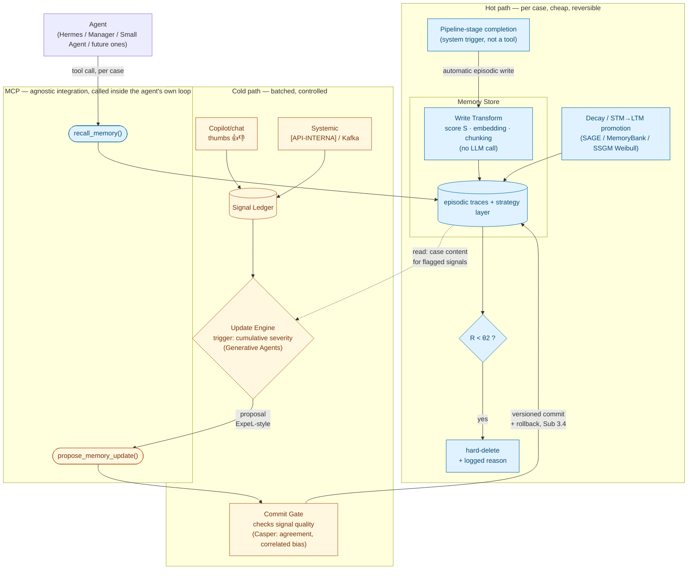

<!-- Fragmento verbatim de ../knowledge-as-infra-architecture-hypothesis.md — versão canônica (mantém todos os links de entrada do repo). Índice: ./README.md — editar a canônica, não este fragmento. -->

> **Sub-atividade:** 1.6 / 1.7 / 2.2 · **Type:** Architecture hypothesis — not yet validated by POCs · **Logged:** [24/08/2026](../../research-diary/Ago/diario_campo_2026-08-24.md#24082026)

# A working architecture for the memory mechanism ("knowledge as infra")

## Status — read this before treating anything below as decided

This is a **hypothesis**, not a locked architecture. It's the direct continuation of [`framework-comparison-hermes-smolagents-deepagents.md`](../framework-comparison-hermes-smolagents-deepagents.md)'s own closing line — "a starting hypothesis for Sub 1.6/1.7, not a locked-in architecture decision" — now elaborated with the findings from the [24/08 reading sprint](../reading-sprint-2026-08-24-queue-papers.md) and worked through with a concrete legal-flow example. It graduates to an actual decision only after the Sub 1.6 minimal-agent POCs and the Sub 1.7 implicit-vs-explicit comparison test it against real behavior — that's where Sub 2.2's formal architecture document gets written. Until then, treat every component below as "the best-grounded guess given what's been read," not as something to defend to the tutor as final.

## The two framing questions this design resolves

**1. "Pluggable/agnostic module" vs. "memory in the agent's loop is more effective" — not actually opposed.** The tension Rafael raised (and that the Hu/Liu survey's §7.2.2 finding, logged 24/08/2026, seemed to sharpen) collapses once "in the loop" is read correctly: it means the agent itself decides to invoke a memory operation as an explicit, auditable tool call — not that the mechanism must be built into one specific framework's proprietary internals. A tool-call interface (MCP, which is already [EMPRESA]'s standard cross-framework integration layer) is *both* agnostic across the platform's heterogeneous agents (Hermes, the Manager's LangGraph, Small Agent, whatever comes next) *and* loop-native, because the call happens inside the agent's own reasoning trace, not injected silently around it.

**2. "RL after ~100 cases" ≠ "memory update" — they're different cadences, and the Plano already encodes the split.** Sub 3.1 (capture/storage — continuous, per case) and Sub 3.2 (controlled adjustment — batched, gated) are already separate sub-activities. Continuous memory writes are cheap and reversible; changing what the agent does by default is expensive and needs control. Collapsing them would make every single case a candidate to change agent behavior, which is exactly the wrong place to lose control.

## The stack

Six components, each borrowing from a specific reading-sprint finding, none of which alone had everything needed — that's the central point (see "Why no single candidate suffices" below).

**O diagrama acima é a visão por componente (6 caixas). O *fluxo* de escrita — três camadas operacionais, filtro determinístico único antes do Update Engine, gate nos dois caminhos — foi refinado em 01/09; ver o diagrama e a tabela em §"Consolidação 01/09/2026" logo abaixo.**

**SSGM layer mapping, added 27/08/2026:** this architecture implements the same three-layer conceptual structure as the SSGM framework (arXiv:2603.11768, Figure 4) — Cognition Layer → Governance Layer → Memory Layer — but with the governance distributed across the points where it's needed rather than centralized in a single middleware. The mapping:

| SSGM layer | This architecture | Component |
|---|---|---|
| **Cognition Layer** | Update Engine | C |
| **Governance Layer** (Write Validation) | Commit Gate | D |
| **Memory Layer** (immutable log + mutable substrate) | Memory Store | A |

The key adaptation: SSGM's Governance Middleware intercepts *all* memory interactions (read and write) in a single middleware; this design intercepts only the *write to the strategy layer* (cold path, Commit Gate) — the episodic log is ADD-unconditional (no gate, by auditability requirement), and the read path's ACL/freshness filtering is built into `recall_memory` itself (SSGM's retrieval formula, component A), not a separate middleware. Same governance pattern, distributed to the right layers instead of centralized. See the analysis in [the conversation that surfaced this mapping](../../research-diary/Ago/diario_campo_2026-08-24.md#27082026). **Update 01/09/2026:** a governança também gateia a escrita da **camada 2** (1ª reflexão do Update Engine) — mecanismo mais leve (grounding, dedup, ACL), não o NLI da strategy layer. Não é *só* a escrita na strategy layer. Ver §"Consolidação 01/09/2026".

**Reading guide per component, added 25/08/2026:** for which paper to read to understand each component below and what to focus on in it, see [`../papers/reading-queue.md#guia-de-leitura-por-componente-da-arquitetura-25082026`](../../papers/reading-queue.md#guia-de-leitura-por-componente-da-arquitetura-25082026) — a different cut of the same corpus than the risk-ranked Tier 1–3 checklist in that file.
