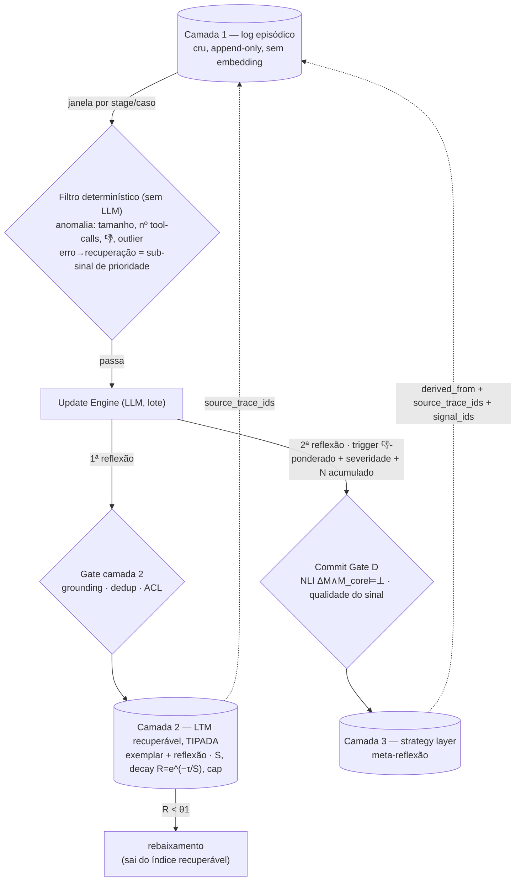

<!-- Fragmento verbatim de ../knowledge-as-infra-architecture-hypothesis.md — versão canônica (mantém todos os links de entrada do repo). Índice: ./README.md — editar a canônica, não este fragmento. -->

### Consolidação 01/09/2026 — três camadas operacionais, filtro determinístico unificado, gate nos dois caminhos

Refina §A, §C e §D abaixo. Detalhe e trade-offs em [`promotion-policy-log-to-ltm.md`](../promotion-policy-log-to-ltm.md) (seção "Estratégias de promoção em consideração"). Continua hipótese — nada aqui é sign-off; veio de uma rodada longa de design em 01/09 (diário [01/09/2026](../../research-diary/Set/diario_campo_2026-08-31.md)), enquanto o SAGE ainda estava em leitura.

**1. Três camadas operacionais dentro do Memory Store** (o "two-tier" de §A colapsava log cru e índice recuperável):

| # | Camada | Conteúdo | Recuperável? | Taxonomia Hu/Liu |
|---|---|---|---|---|
| 1 | Log episódico | trajetórias cruas, append-only, texto puro, sem embedding | não — auditoria + input do Update Engine (sucesso *e* falha) | — (substrato) |
| 2 | LTM recuperável — **tipada** | `exemplar` (trace concreto) + `reflexão` (1ª reflexão do Update Engine); ambos com `S`, decay `R=e^(−τ/S)`, cap | sim | Case-based / reflexão ≈ Strategy-based local |
| 3 | Strategy layer | heurística destilada, 2ª reflexão (meta-reflexão) | sim | Strategy-based |

**2. Filtro determinístico unificado, antes do Update Engine.** A família do filtro de anomalia de §C (tamanho do trace, nº de tool calls, distribuição de 👎, outlier) deixa de servir só o caminho da strategy: passa a ser o **único gate determinístico**, servindo os dois caminhos — promoção → camada 2 e reflexão → camada 3. Uma janela de log cru (inicialmente simples: por stage/caso, sem heurística aprofundada) só vai ao Update Engine se passar nesse filtro. `erro→recuperação` entra como sub-sinal de prioridade (`S` inicial maior), não como o filtro inteiro — senão perde o exemplar limpo de caso raro e o erro-que-continuou-errado. **Decidido 01/09:** há um filtro determinístico antes do Update Engine.

**3. `R ≥ θ1` vira só regra de rebaixamento.** Com o filtro determinístico fazendo a admissão, `R = e^(−τ/S) ≥ θ1` deixa de decidir *entrada* na camada 2 e passa a ser só *permanência/rebaixamento* dentro dela (`τ`-desde-recall e `S→S+1` só existem depois de promovido). Resolve a bifurcação entrada-vs-permanência.

**4. Update Engine gera dois writes, não um.** Além da proposta de strategy (§C), produz a **1ª reflexão** sobre a janela → camada 2. A 2ª reflexão (strategy) é disparada por sinal de qualidade **ponderado pro negativo** (👎, desfecho adverso, severidade cumulativa, N casos similares acumulados); o filtro determinístico da camada 2 usa 👍 *e* 👎. O Update Engine, quando roda, lê sucesso *e* falha como contexto (trigger ≠ input).

**5. Gate de governança nos dois caminhos de escrita, mecanismos diferentes.** SSGM P1 (Write Validation Gate) é trigger-agnóstico. Camada 2 (1ª reflexão): checa *grounding* (a reflexão bate com o trace cru que referencia?), dedup, ACL/PII. Camada 3 (2ª reflexão): o Commit Gate (D) já existente — NLI `∆M ∧ M_core ⊨ ⊥` + qualidade do sinal. Amplia o mapeamento SSGM da linha 66: a governança não intercepta *só* a escrita na strategy layer.

**6. Provenância entre camadas (precondição da Reversible Reconciliation de §E).** Camada 2 → `source_trace_ids` na camada 1. Camada 3 → `derived_from` (camada 2) **e** `source_trace_ids` (camada 1, denormalizado, porque a camada 2 é evictável) **e** IDs do Signal Ledger consumidos. Sem isso, replay do log não reconstrói uma strategy acionada por sinal.

**Ainda em aberto** (herdado + novo): quais campos existem no banco de traces real (bloqueia o `S` DMF-lite e o predicado exato do filtro); `recall_memory` mistura os dois tipos da camada 2 no mesmo ranking ou o agente pede um tipo; `S` inicial de `reflexão` vs. `exemplar` (**lean 02/09: `reflexão` maior**, fundamento `S* > S` do MemorySyntax do SAGE — ver "SAGE reconsidered" abaixo); unidade da janela (stage vs. caso).
