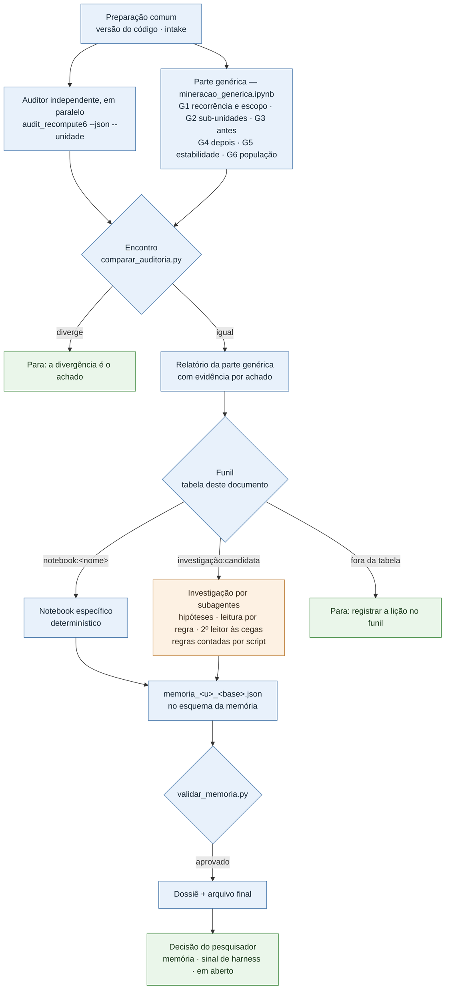
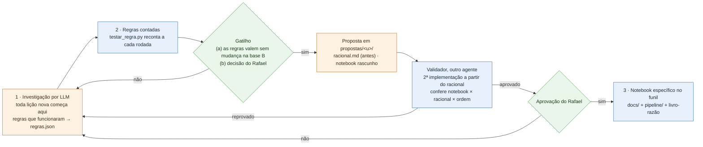

# A mineração de uma candidata — como funciona

Cópia dos diagramas do procedimento da análise (`docs/*procedimento-mineracao-candidatas*.md`, § "Como funciona"), para
quem usa a skill ver as etapas sem abrir os docs. **A fonte é o procedimento**: se os dois divergirem, vale ele.

Legenda: azul = determinístico (`[conferido]`); laranja = LLM (`[assistido]`, vale como hipótese); verde = decisão do
pesquisador.

## Uma rodada

- **A parte genérica** é a mesma para todas as lições. Ela descreve a lição (recorrência, sub-unidades, antes, depois,
  estabilidade) e grava a população. Ela não escreve a lição.
- **O funil** é uma tabela do procedimento: para cada lição, `notebook:<nome>` ou `investigação:candidata`.
- **O arquivo final** segue o esquema da análise (`analysis/esquema-memoria.json`). Cada campo diz se é `checado`
  (com o comando), `hipotese` ou `pendente`.

## O ciclo de vida da parte específica

- **Toda lição nova começa na investigação.** As regras que funcionam vão para o `regras.json` e são recontadas a cada
  rodada.
- **Um notebook específico só nasce pela regra de criação do procedimento:** as regras confirmadas sem mudança numa
  segunda base, ou uma decisão do pesquisador. Ele nasce como proposta em `propostas/<u>/`, com o racional escrito
  antes, e passa pelo laudo do validador e pela aprovação do pesquisador.
