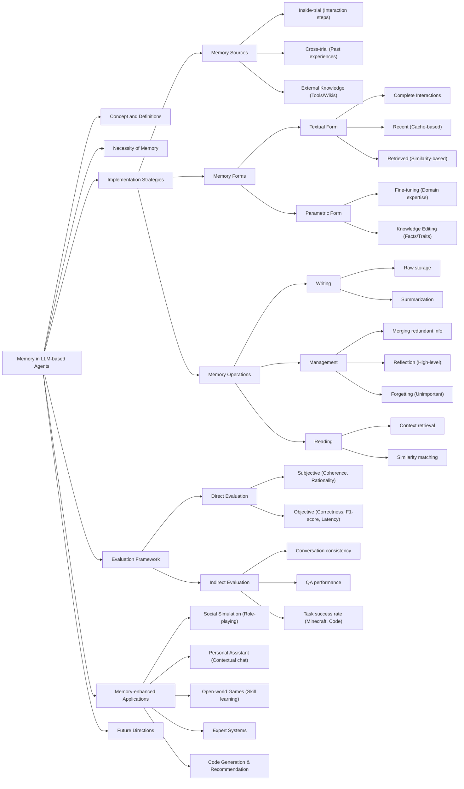
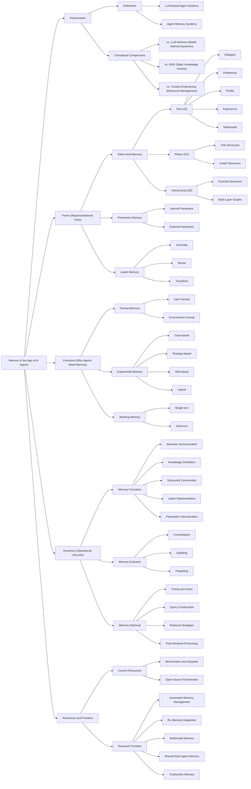
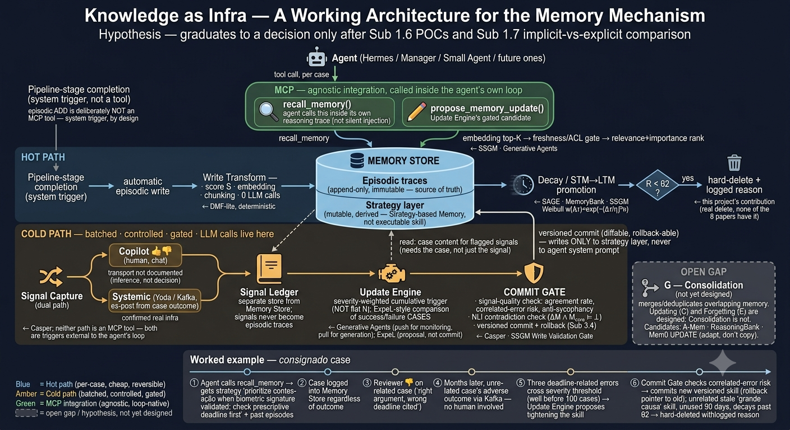
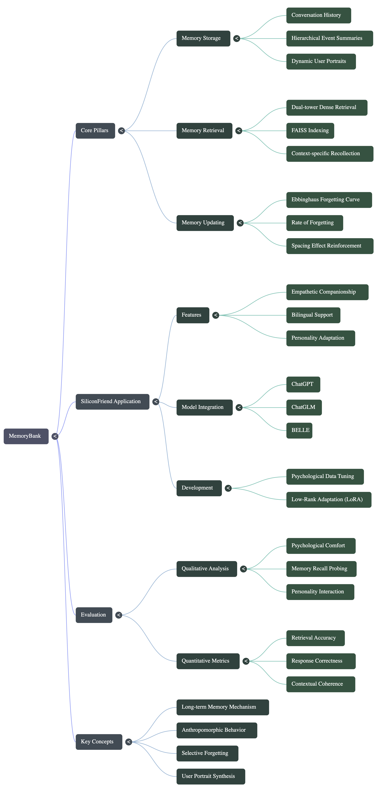
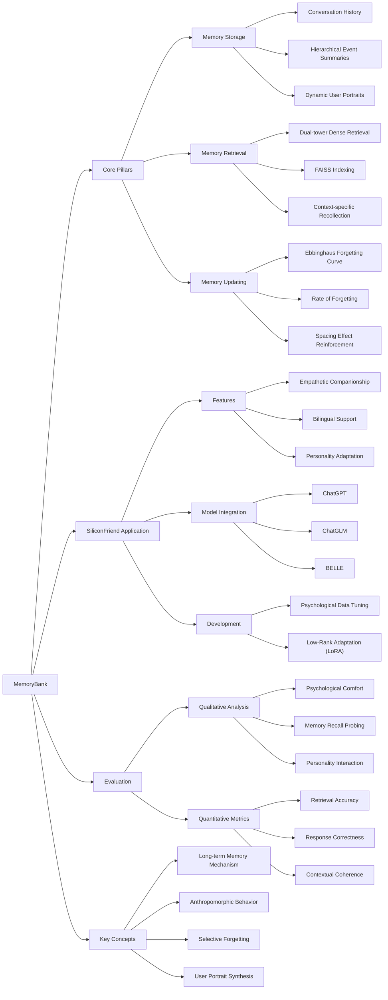

# Visual Resources — Mind Maps & Architecture Diagrams

Visual syntheses that accompany the project's literature reviews and architecture hypothesis. The mind maps ship in two forms: a rendered **PNG** (real image file, for pasting into docs/slides or viewing outside GitHub) and a **Mermaid source** (`source/*.mmd`, a few KB of text, edit and re-render with `mmdc -i source/<file>.mmd -o <file>.png`, or just paste the block into any Mermaid live editor) — for the two survey maps the PNG is rendered straight from that Mermaid; for the MemoryBank map the PNG is a NotebookLM render and the Mermaid is a faithful transcription of its structure. The architecture infographic is an AI-generated image accompanied by its text prompt (`source/*.prompt.txt`) rather than Mermaid source — it is not regenerable from a deterministic source the way the mind maps are, so the prompt is the closest thing to "source" for it. Each visual is a redrawn recreation / generation of something shared in conversation or produced from a prompt — faithful to the structure and labels intended, but not a pixel copy of an authoritative original. If a branch/label looks off to you, it's worth a quick correction rather than assuming it's exactly right.

## 1. Memory in LLM-Based Agents

Synthesizes *"A Survey on the Memory Mechanism of Large Language Model based Agents"* (Zhang et al., 2024/2025 — see [`../memory-in-ai-agents.md`](../memory-in-ai-agents.md#theme-4-highlighted-first--survey--review-papers-on-memory-in-llm-agents) and the atomic note at [`../../papers/zhang-2025-memory-survey.md`](../../papers/zhang-2025-memory-survey.md)). Logged: diary entry [18/08/2026](../../research-diary/Ago/diario_campo_2026-08.md#18082026), Sub-atividade 1.1.


<details>
<summary>Mermaid source (click to expand)</summary>



</details>

**Reading note:** this maps directly onto the **Sources → Forms → Operations** structure used throughout [`../memory-in-ai-agents.md`](../memory-in-ai-agents.md) and the [sub-activity map](../../docs/sub-activity-map.md) — the "Implementation Strategies" branch above is the same taxonomy behind [the cross-trial × forgetting gap finding](../../discussion/cross-trial-vs-forgetting-gap.md).

## 2. Memory in the Age of AI Agents

Synthesizes *"Memory in the Age of AI Agents"* (Hu, Liu, et al., Dec 2025, arXiv:2512.13564 — see [`../../papers/memory-in-the-age-of-ai-agents-2025.md`](../../papers/memory-in-the-age-of-ai-agents-2025.md)), the survey behind the project's three-axis vocabulary: **Forms, Functions, Dynamics**.


<details>
<summary>Mermaid source (click to expand)</summary>



</details>

**Reading note:** the **Dynamics → Memory Evolution (Consolidation / Updating / Forgetting)** branch is exactly the project's sub-topic — see [`../../papers/memory-in-the-age-of-ai-agents-2025.md`](../../papers/memory-in-the-age-of-ai-agents-2025.md) for why this survey's axis maps onto the project. **Research Frontiers → RL-Memory Integration** is the direct link to Sub 1.3.

## 3. Knowledge as Infra — Memory Layer Architecture (hypothesis)

Visualizes the working architecture hypothesis for the memory-update mechanism — the six/seven-component stack (Memory Store, Signal Capture, Update Engine, Commit Gate, Forgetting, MCP Integration, plus the open Consolidation gap) laid out as a hot-path/cold-path diagram with the worked consignado example. Derived directly from [`../../discussion/knowledge-as-infra-architecture-hypothesis.md`](../../discussion/knowledge-as-infra-architecture-hypothesis.md). Sub-atividades 1.6 / 1.7 / 2.2. (Diary entry for 26/08/2026 not yet logged — see [`../../research-diary/`](../../research-diary/) for the current state.)



<details>
<summary>Image-generation prompt (click to expand)</summary>

Unlike the two mind maps above, this is an AI-generated image (Gemini, 26/08/2026), not a Mermaid render — so the "source" is the text prompt that produced it, kept at [`source/knowledge-as-infra-architecture.prompt.txt`](source/knowledge-as-infra-architecture.prompt.txt). Reproduction is non-deterministic: the same prompt yields a different image each run. Pasted here for inline reading.

```
INFOGRAPHIC: "Knowledge as Infra — Memory Layer Architecture (hypothesis)"

Style: modern clean technical infographic, flat vector with subtle isometric depth, dark-navy background, crisp thin connecting arrows, short legible labels rendered sharply and spelled correctly. Engineering-diagram aesthetic. Color-coded legend bottom-left. This is a HYPOTHESIS — not a locked architecture — state that visibly.

Title (top, centered): "Knowledge as Infra — A Working Architecture for the Memory Mechanism". Subtitle: "Hypothesis — graduates to a decision only after Sub 1.6 POCs and Sub 1.7 implicit-vs-explicit comparison".

=== TOP: the Agent + MCP bridge ===
A robot icon node: "Agent (Hermes / Manager / Small Agent / future ones)".
Below it, a green rounded bridge labeled "MCP — agnostic integration, called inside the agent's own loop" containing two tool cards:
  • "recall_memory()" — magnifying glass — "agent calls this inside its own reasoning trace (not silent injection)"
  • "propose_memory_update()" — pencil — "Update Engine's gated candidate"
Arrow: Agent → recall_memory (labeled "tool call, per case").
Small node to the side: "Pipeline-stage completion (system trigger, not a tool)" — with a note: "episodic ADD is deliberately NOT an MCP tool — system trigger, by design".

=== CENTER-LEFT: HOT PATH — light-blue lane ===
Header: "HOT PATH — per case · cheap · reversible · no LLM call". Left-to-right rounded blue nodes:
1. "Pipeline-stage completion (system trigger)" → "automatic episodic write"
2. "Write Transform — score S · embedding · chunking · 0 LLM calls" (tag: ← DMF-lite, deterministic)
3. "MEMORY STORE" — the visual centerpiece, larger — a database icon with TWO internal layers drawn:
     • top layer: "Episodic traces (append-only, immutable — source of truth)"
     • bottom layer: "Strategy layer (mutable, derived — Strategy-based Memory, not executable skill)"
   (tag: ← SSGM Reversible Reconciliation; Hu/Liu episodic-to-semantic continuum)
4. "Decay / STM→LTM promotion" — fading clock — tag "← SAGE · MemoryBank · SSGM Weibull w(Δτ)=exp(−(Δτ/η)^κ)"
5. Decision diamond: "R < θ2 ?" → yes → "hard-delete + logged reason" (trash icon) — tag "← this project's contribution (real delete, none of the 8 papers have it)"
recall_memory reads from the Memory Store (arrow labeled "embedding top-K → freshness/ACL gate → relevance+importance rank", tags ← SSGM · Generative Agents).

=== CENTER-RIGHT: COLD PATH — amber lane ===
Header: "COLD PATH — batched · controlled · gated · LLM calls live here". Left-to-right amber nodes:
6. "Signal Capture (dual path)" — split icon — two sub-branches feeding one ledger:
     • "Copilot 👍👎 (human, chat)" — tag "transport not documented (inference, not decision)"
     • "Systemic (Yoda / Kafka, ex-post from case outcome)" — tag "confirmed real infra"
   (tag: ← Casper; neither path is an MCP tool — both are triggers external to the agent's loop)
7. "Signal Ledger" — book icon — "separate store from Memory Store; signals never become episodic traces"
8. "Update Engine" — engine/gears — "severity-weighted cumulative trigger (NOT flat N); ExpeL-style comparison of success/failure CASES" — tag "← Generative Agents (push for monitoring, pull for generation); ExpeL (proposal, not commit)"
   Dashed READ-ONLY arrow from Memory Store → Update Engine labeled "read: case content for flagged signals (needs the case, not just the signal)".
9. "COMMIT GATE" — gate/shield icon — second visual emphasis, slightly larger — "signal-quality check: agreement rate, correlated-error risk, anti-sycophancy · NLI contradiction check (ΔM ∧ M_core ⊨ ⊥) · versioned commit + rollback (Sub 3.4)" — tag "← Casper · SSGM Write Validation Gate · THE actual contribution — no candidate paper has this combination".
PROMINENT arrow: Commit Gate → UP into Memory Store's strategy layer, labeled "versioned commit (diffable, rollback-able) — writes ONLY to strategy layer, never to agent system prompt".
Arrow: Update Engine → propose_memory_update (the MCP tool) → Commit Gate.

=== FLOATING (dashed gray border, bottom-right): OPEN GAP ===
"G — Consolidation (not yet designed)" — merge/question icon — "merges/deduplicates overlapping memory. Updating (C) and Forgetting (E) are designed; Consolidation is not. Candidates: A-Mem · ReasoningBank · Mem0 UPDATE (adapt, don't copy)."

=== BOTTOM STRIP: "Worked example — consignado case" ===
Numbered horizontal micro-flow, 6 framed steps:
① Agent calls recall_memory → gets strategy "prioritize contestação when biometric signature validated; check prescriptive deadline first" + past episodes
② Case logged into Memory Store regardless of outcome
③ Reviewer 👎 on related case ("right argument, wrong deadline cited")
④ Months later, unrelated case's adverse outcome via Kafka — no human involved
⑤ Three deadline-related errors cross severity threshold (well before 100 cases) → Update Engine proposes tightening the skill
⑥ Commit Gate checks correlated-error risk → commits new versioned skill (rollback pointer to old); unrelated stale "grande causa" skill, unused 90 days, decays past θ2 → hard-deleted with logged reason

=== LEGEND (bottom-left) ===
• Blue = Hot path (per-case, cheap, reversible)
• Amber = Cold path (batched, controlled, gated)
• Green = MCP integration (agnostic, loop-native)
• Dashed gray = open gap / hypothesis, not yet designed

Visual emphasis: Memory Store = largest node (centerpiece); Commit Gate = second emphasis (the project's actual contribution — the piece none of the 8 read papers have). Make the "versioned commit" arrow looping from Commit Gate back UP into the strategy layer visually prominent — it shows the closed control loop. The two framing tensions this design resolves should be implied by the layout: (1) "agnostic module" vs "loop-native" collapse because MCP is both; (2) "RL after ~100 cases" vs "memory update" are different cadences — continuous writes (hot) vs batched gated updates (cold). Keep every label short so text renders crisply in the image.
```

</details>

**Reading note:** this is the visual companion to [`../../discussion/knowledge-as-infra-architecture-hypothesis.md`](../../discussion/knowledge-as-infra-architecture-hypothesis.md) — every labeled component in the infographic corresponds 1:1 to a section of that note (A. Memory Store, B. Signal Capture, C. Update Engine, D. Commit Gate, E. Forgetting, F. MCP Integration, G. Consolidation open gap). The "← paper" tags preserve the note's central point: each component borrows from a specific reading-sprint finding, none of which alone had everything needed. **Status:** hypothesis, not a locked architecture — graduates to a decision only after the Sub 1.6 minimal-agent POCs and the Sub 1.7 implicit-vs-explicit comparison test it against real behavior (per the note's own "Status" header).

## 4. MemoryBank — Mind Map

Mind map of *"MemoryBank: Enhancing Large Language Models with Long-Term Memory"* (Zhong et al., 2023/2024, arXiv:2305.10250 — see the atomic note at [`../../papers/memorybank-2023.md`](../../papers/memorybank-2023.md)). The PNG was generated by NotebookLM, 27/08/2026; the Mermaid source below (`source/memorybank-mind-map.mmd`) is a faithful transcription of that render's structure and labels — editable and re-renderable the same way as the two survey maps above. Sub-atividade 1.1.



<details>
<summary>Mermaid source (click to expand)</summary>



</details>

**Reading note:** this is a single-paper mind map, not a survey-level synthesis — it maps the internal structure of one of the project's priority reads (Tier 1, #3 in [`../../papers/reading-queue.md`](../../papers/reading-queue.md)). The paper is the canonical forgetting/decay reference for the architecture's component E (Forgetting) and contributes the decay math `R = e^(−Δt/S)` to component A (Memory Store). Rafael read §2.1 Storage, §2.2 Retrieval, and §2.3 Forgetting on 27/08/2026 (partial — see the paper note's "Read by Rafael" header); experiments/eval sections remain unread but do not block any architecture decision. Two design ideas Rafael derived from this reading are recorded in the paper note: (a) hard-delete by threshold should be gated and reviewed, not automatic; (b) the Memory Store only decays, it does not delete — deletion governance belongs to another component (propagated to the architecture note's components E and G).
