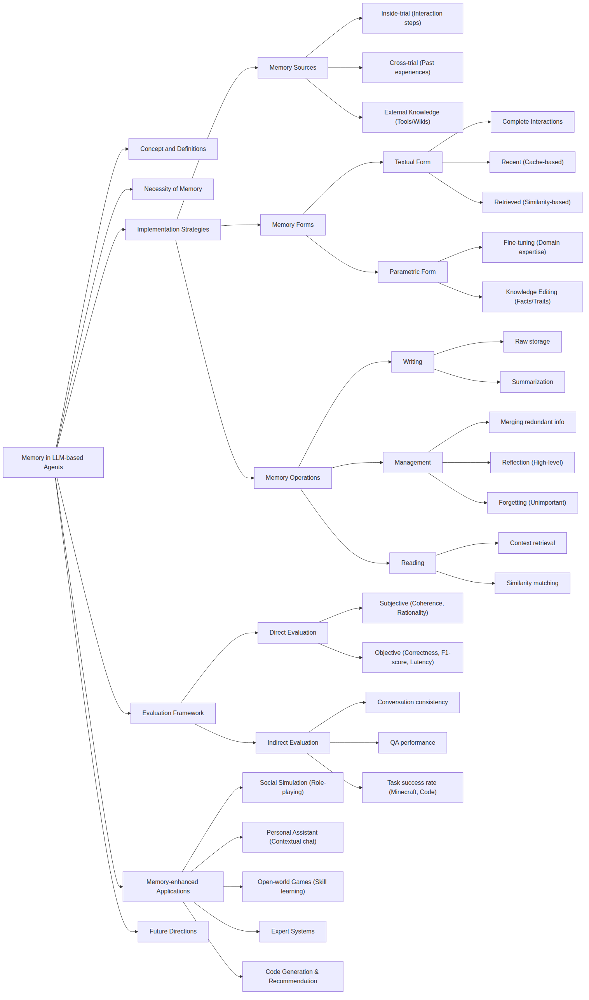
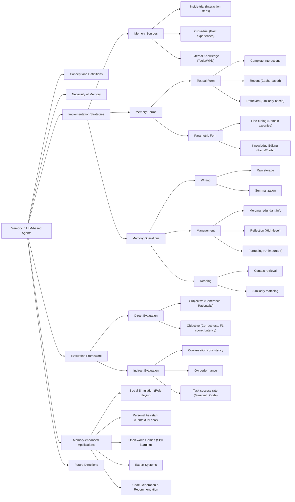
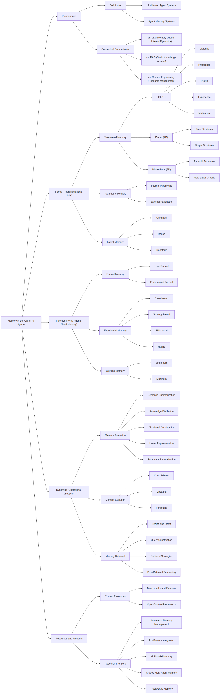
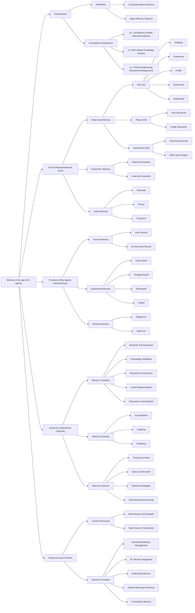

# Visual Resources — Mind Maps

Two mind maps of the field's anchor surveys. Each ships in two forms: a rendered **PNG** (real image file, for pasting into docs/slides or viewing outside GitHub) and the **Mermaid source** it was generated from (`source/*.mmd`, a few KB of text, edit and re-render with `mmdc -i source/<file>.mmd -o <file>.png`, or just paste the block into any Mermaid live editor). Both replace the earlier 17MB PDF export. Each is a redrawn recreation of a mind map shared in conversation — faithful to the structure and labels shown, but not a pixel copy of an original image file. If a branch/label looks off to you, it's worth a quick correction rather than assuming it's exactly right.

## 1. Memory in LLM-Based Agents

Synthesizes *"A Survey on the Memory Mechanism of Large Language Model based Agents"* (Zhang et al., 2024/2025 — see [`../memory-in-ai-agents.md`](../memory-in-ai-agents.md#theme-4-highlighted-first--survey--review-papers-on-memory-in-llm-agents) and the atomic note at [`../../papers/zhang-2025-memory-survey.md`](../../papers/zhang-2025-memory-survey.md)). Logged: diary entry [18/08/2026](../../research-diary/diario_campo_2026-08.md#18082026), Sub-atividade 1.1.

Mermaid source (click to expand)

**Reading note:** this maps directly onto the **Sources → Forms → Operations** structure used throughout [`../memory-in-ai-agents.md`](../memory-in-ai-agents.md) and the [sub-activity map](../../docs/sub-activity-map.md) — the "Implementation Strategies" branch above is the same taxonomy behind [the cross-trial × forgetting gap finding](../../discussion/cross-trial-vs-forgetting-gap.md).

## 2. Memory in the Age of AI Agents

Synthesizes *"Memory in the Age of AI Agents"* (Hu, Liu, et al., Dec 2025, arXiv:2512.13564 — see [`../../papers/memory-in-the-age-of-ai-agents-2025.md`](../../papers/memory-in-the-age-of-ai-agents-2025.md)), the survey behind the project's three-axis vocabulary: **Forms, Functions, Dynamics**.

Mermaid source (click to expand)

**Reading note:** the **Dynamics → Memory Evolution (Consolidation / Updating / Forgetting)** branch is exactly the project's sub-topic — see [`../../papers/memory-in-the-age-of-ai-agents-2025.md`](../../papers/memory-in-the-age-of-ai-agents-2025.md) for why this survey's axis maps onto the project. **Research Frontiers → RL-Memory Integration** is the direct link to Sub 1.3.
